# Текущая архитектура omoba

Этот документ описывает, **как устроен код сейчас**, после завершения программы
рефакторинга (шаги 1–15 и 9b, пункты отчёта O1–O30 и Q1–Q9, где они сделаны).
Сначала идёт обзор на одну страницу, потом подробности по крейтам. Все
утверждения сверены с кодом ветки `main` (коммит `c391ac3`, версия workspace
`0.23.0-rc.6`). Если документ расходится с кодом, прав код.

Соседние документы:
- [ARCHITECTURE.md](ARCHITECTURE.md): англоязычная карта для тех, кто меняет код, и дорожная карта;
- [ARCHITECTURE_REPORT.md](ARCHITECTURE_REPORT.md): отчёт «было → стало», метрики и список улучшений O1–O30;
- [REFACTORING.md](REFACTORING.md): трекер шагов и правила процесса;
- [ui-kit.md](ui-kit.md): API UI-кита клиента;
- [features.md](features.md), [../RUNBOOK.md](../RUNBOOK.md): возможности и эксплуатация.

---

## 1. Кратко

- **Восемь крейтов в одном workspace** (Rust 2024, toolchain 1.94.1, Bevy 0.18).
  Общая модель и протокол живут в `shared`. Авторитетный сервер `server` —
  обычный Rust-бинарник без Bevy. Клиент `client` — игра на Bevy. Вокруг них
  стоят `passport` (Ekza-паспорт и аватары), `career-store` (Postgres),
  `account-api` (HTTP на axum), `harness` (black-box тесты по UDP) и
  `arena-sync` (CLI).
- **Один протокол.** Все типы, которые идут по сети, объявлены в
  `shared::protocol` (`wire.rs`). Байты закреплены golden-тестами. Для каждого
  enum на проводе есть политика эволюции (`wire_enums.rs`, 44 enum), она
  привязана к `PROTOCOL_VERSION = 2`.
- **Сервер = один цикл тиков над `GameWorld`.** Весь ввод-вывод идёт через три
  порта: `Transport`, `Clock` и `CareerPort`. Правила режима собраны в
  `MatchRules`. Состояние героя хранится в серверных структурах `Hero`,
  `HeroEconomy`, `HeroTimers` и `StatModifiers`. `PlayerState` на проводе —
  только view: `owner_view` для самого игрока, `public_view` для остальных.
- **Клиент собран из групп плагинов**: `NetPlugins`, `UiPlugins`,
  `GameplayPlugins`, `DebugPlugins`, `PresentationPlugins` и `QaPlugins` (за
  feature `qa`). Снапшот применяется цепочкой стадий `SnapshotApply`.
  Изменения сессии приходят как сообщения `SessionEvent`.
- **Один UI-кит** (`client/src/ui/`). Нажатие превращается в `UiAction<T>`,
  затем в `Activated<T>`, затем в обработчик. Реестр модалок `ModalStack`
  пропускает ввод только к верхней модалке. Размеры для телефона и десктопа
  задаёт `theme::metric`. QA-харнессы нажимают кнопки по `TestId`.
- **Контент задаётся данными.** Герои и предметы описаны в
  `shared/assets/catalog/*.json` и проверяются при старте. Ростер аватаров и
  корень ассетов принадлежат `passport`, в `shared` нет I/O.
- **Семейство debug-команд одно** (`shared::debug`). Что разрешено, сервер
  сообщает в каждом снапшоте через `Snapshot.debug_access`.
- **Гейт качества** — `make check` плюс харнесс. CI запускает шесть джобов:
  rust, harness, postgres, android и scripts на каждый push/PR и ночью,
  iOS-проверку раз в неделю.

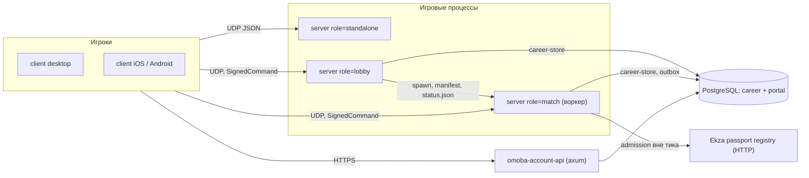

---

## 2. Карта крейтов

| Крейт (package) | Роль | Основные зависимости | Строк `.rs` |
| --- | --- | --- | ---: |
| `shared` (MPL) | Общая модель игры: классы героев и наборы умений, рост героя, предметы, карта и навигация, **wire-протокол**, prematch/драфт, контракты career/social/account, debug-команды, протокол Combat Test, планировщики ботов, каталоги JSON. Без Bevy, без I/O, без Ekza SDK | `serde`, `serde_json` | 8 410 |
| `server` (AGPL) | Авторитетная симуляция и UDP-endpoint: жизненный цикл матча, боты, бой, магазин, карьера, публичный транспорт с подписью, lobby и воркеры. Только бинарники (`server`, `migrate-career`) | shared, passport, career-store, ekza-bevy-sdk (без default features), tokio, ed25519-dalek; `sqlx` только в dev | 32 603 |
| `client` (MPL) | Игра на Bevy: сеть, предсказание, 2D- и 3D-представление, UI-кит, мобильный ввод, offline practice, QA-харнессы (feature `qa`, включена по умолчанию) | shared, passport, bevy 0.18, ekza-bevy-sdk, winit, crossbeam-channel | 87 271 |
| `omoba-passport` (MPL) | Контракт Ekza-паспорта: тикеты, аккаунты устройств и веба, допуск store-аватаров; корень ассетов (`assets`), ростер аватаров (`avatars`), выдача прав (`entitlements`) | shared, ekza-bevy-sdk (`http`), reqwest, sha2 | 3 468 |
| `omoba-career-store` (AGPL) | Хранение карьеры в Postgres, миграции, политика ограниченной очереди матчмейкинга | shared, sqlx, tokio | 3 307 |
| `omoba-account-api` (AGPL) | HTTP-сервис на axum поверх career-store: портал, устройства, supporter-биллинг | shared, career-store, axum, sqlx, reqwest, ring | 4 947 |
| `harness` | Black-box UDP-боты и сценарии, которые запускают настоящий бинарник сервера; `bin/bots.rs` для ручных матчей | shared, serde | 5 189 |
| `arena-sync` | CLI: забирает аватары Ekza Arena и сливает их в manifest | reqwest, sha2, base64 | 371 |

Строки посчитаны командой `git ls-files -z '<crate>/*.rs' | xargs -0 cat | wc -l`
(тесты входят в счёт). Весь workspace — около 146 тыс. строк Rust.

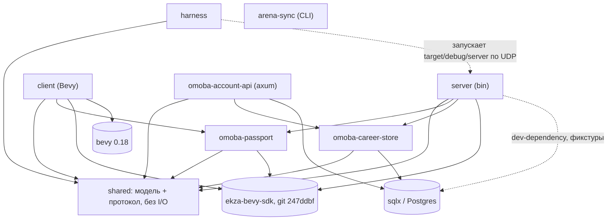

Правила, которые следуют из карты:

- Всё, о чём клиент и сервер должны договориться, живёт в `shared`. Копий
  wire-структур в других крейтах нет. Харнесс тоже декодирует общими типами
  (`harness/src/protocol.rs` реэкспортирует `shared::wire`).
- `shared` не зависит от Bevy и Ekza SDK и не читает ни env, ни файлы во время
  работы. Свои данные (`shared/assets/`) он встраивает через `include_str!`.
- Env читают бинарники при старте: `RosterSource::from_env()` вызывают
  `server/src/runtime/mod.rs::run` и `client/src/lib.rs::main`.
- Ревизия SDK закреплена один раз в `[workspace.dependencies]`, каждый крейт
  включает нужные ему features.

---

## 3. Протокол (`shared::protocol`)

### 3.1 Файлы

| Файл | Что внутри |
| --- | --- |
| `shared/src/protocol.rs` | `PROTOCOL_VERSION = 2`, `SnapshotMeta { protocol_version, server_epoch, match_id, snapshot_tick }`, `JoinRejection`, `SnapshotOrder` (отбрасывает дубликаты и снапшоты прошлых раундов и эпох) |
| `shared/src/protocol/wire.rs` | `ClientPacket` (18 вариантов), `ServerPacket` (`Social`, `Career`, `Snapshot`), `PlayerState`, `StructureState`, `MinionState`, `NeutralState`, `ProjectileState`, `GameState`, `CharacterChoice`, `TargetId`; golden-тесты |
| `shared/src/protocol/wire_enums.rs` | Политика эволюции enum (только `cfg(test)`) |
| `shared/src/transport.rs` | Фрейминг больших снапшотов: магия `OMB1`, датаграммы ≤ 1200 байт, снапшот ≤ 65 507 байт, сборка фрагментов с TTL 2 с (`encode_snapshot`, сборщик с `push`/`expire`) |
| `shared/src/public_transport.rs` | Датаграммы публичных ролей: `PublicClientDatagram { TransportProbe, TransportProof, TransportBootstrap, SignedCommand }`, `PublicServerDatagram::TransportChallenge` |
| `shared/src/debug.rs` | `DebugCommand` (без serde) и `DebugAccess` (serde, передаётся по сети) |
| `shared/src/sandbox.rs`, `career.rs`, `social.rs`, `prematch.rs`, `match_service.rs` | Вложенные протоколы: Combat Test, карьера, чат и реакции, драфт, очередь |

### 3.2 Семейства пакетов

| Семейство | Клиент → сервер (`ClientPacket`) | Сервер → клиент |
| --- | --- | --- |
| Сессия | `Hello { protocol_version }`, `Ping`, `Join {..}`, `Leave`, `RequestRematch` | `Snapshot` (с `join_error`, `your_id`, `game_state`, `rematch_in_secs`) |
| Геймплей | `Transform {x,y,z,yaw,dash_sequence}`, `Cast {target, slot}`, `BasicAttack`, `Utility`, `UpgradeSkill`, `BuyItem` | `Snapshot.players / projectiles / structures / minions / neutrals / team_buffs / forest_pickups / combat_events` |
| Prematch | `Prematch { request }` (`Select`, `Lock`, `Loaded`) | `Snapshot.prematch` |
| Карьера и социальное | `Career { request }`, `Social { request }` | `ServerPacket::Career`, `ServerPacket::Social` |
| Debug | `SetGodMode`, `SetSpeedBoost`, `Practice { command }` | `Snapshot.debug_access` |
| Combat Test | `Sandbox { request }` | `Snapshot.sandbox` |
| Публичный транспорт | `SignedCommand` поверх любого из пакетов выше (роли lobby и match) | `TransportChallenge` |

Защита от повторов: `BasicAttack`, `Utility` и `BuyItem` несут `server_epoch`,
`match_id` и монотонный `request_id`. `Cast` их не несёт, повтор каста
отсекают кулдаун, восстановление и мана. `Transform` ограничен бюджетом
времени (`HeroTimers::movement_slack`, пункт O3). Поэтому частые пакеты не
ускоряют героя.

### 3.3 Golden-тесты и эволюция

- В `wire.rs` лежат строки `GOLDEN_SNAPSHOT`, `GOLDEN_JOIN`,
  `GOLDEN_TRANSFORM`, `GOLDEN_BASIC_ATTACK`, `GOLDEN_SET_GOD_MODE` и
  `GOLDEN_SOCIAL`. Тесты проверяют round-trip байт в байт и совместимость со
  старыми формами. Серверные байты `PlayerState` дополнительно закреплены в
  `server/src/tests/player_view.rs`.
- **Совместимые изменения — только аддитивные.** Новое поле получает
  `#[serde(default)]`. Если поле почти всегда пустое, добавляется ещё
  `skip_serializing_if = "Option::is_none"`, чтобы байты старых пакетов не
  менялись. Пример — `Snapshot.debug_access`: с `None` golden-снапшот
  побайтно тот же.
- **Политика enum (`wire_enums.rs`, пункт O10).** Макрос `wire_enums!`
  перечисляет все 44 enum, достижимые из пакетов, с их вариантами и
  исчерпывающим `match` без `_`. Новый вариант не скомпилируется, пока его
  не внесут в список. Внесение в список и есть решение:
  - `Strict` (например, `ClientPacket`, `ServerPacket`, `Team`, `ItemId`):
    старый пир отбросит незнакомое значение вместе со всей датаграммой.
    Нужен bump `PROTOCOL_VERSION`, либо enum сначала делают терпимым в более
    раннем релизе;
  - `Tolerant` (`HeroClass`, `PracticeCommand`, `PlayerActionKind`,
    `CombatEntityKind`, `ProjectileStyle`, `MinionKind`): неизвестное значение
    декодируется в запасной вариант, новый вариант аддитивен.
- Тест `policy_matches_the_protocol_version` падает при bump версии, пока
  список не пересмотрят. Тест `every_serde_enum_in_shared_is_classified`
  падает на любом новом serde-enum в `shared`, пока его не отнесут либо к
  wire, либо к `NOT_UDP_WIRE` (HTTP-контракты, файлы данных).
- `PROTOCOL_VERSION` проверяется на `Hello`. Пир с другой версией получает
  `JoinRejection::ProtocolMismatch`, а `SnapshotOrder::accept` не применяет
  его снапшоты.

### 3.4 Жизнь соединения: от подключения до конца матча

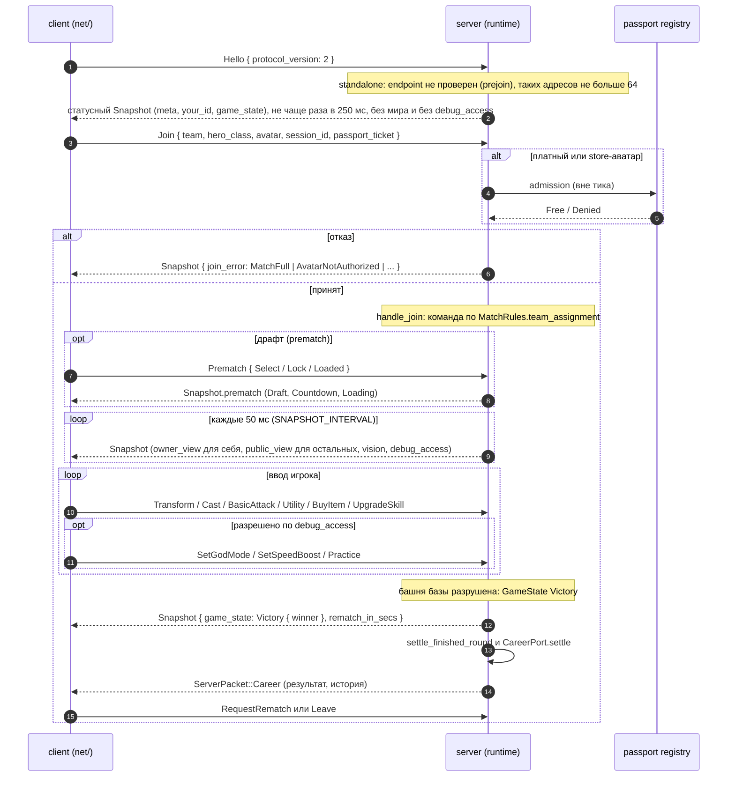

Состояния матча на проводе (`shared::wire::GameState`):

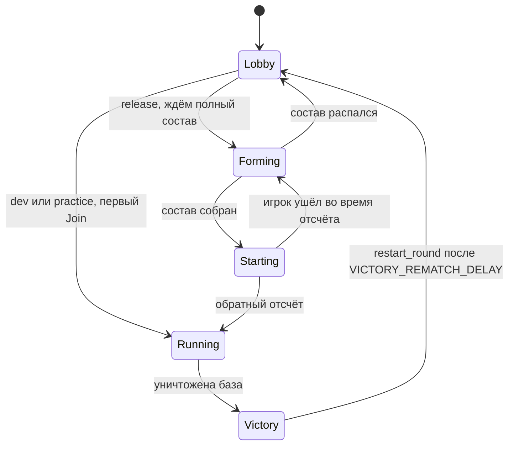

---

## 4. Сервер (`server/`)

### 4.1 Карта модулей

`main.rs` содержит только список модулей и `fn main() { runtime::run() }`.
Глобальных реэкспортов из корня крейта нет, каждый модуль сам импортирует то,
что ему нужно.

| Группа | Модули | Назначение |
| --- | --- | --- |
| Runtime | `runtime/mod.rs` (`ServerRuntime`, `run`), `runtime/dispatch.rs`, `runtime/tick.rs`, `runtime/prejoin.rs`, `runtime/ports.rs` | Цикл, приём пакетов, тик, защита prejoin, порты |
| Обработчики | `runtime/handlers/{join,movement,combat,utility,shop,session,tools}.rs` | По одному `ServerRuntime::handle_<variant>` на вариант пакета, возвращают `ControlFlow<()>` |
| Мир | `game_world.rs` (`GameWorld`, `TickCtx { now, dt }`), `entities.rs` (`ConnectedPlayer`, `Structure`, `Minion`, `Neutral`, `Projectile`), `world.rs` (загрузка карты, волны) | Единственная копия состояния, ECS на сервере нет |
| Герой | `hero.rs`, `hero_timers.rs`, `hero_stats.rs`, `progression.rs` | Авторитетное состояние героя и формулы |
| Симуляция | `sim/{mod,cast,minions,towers,projectiles,neutrals}.rs`, `basic_attack.rs`, `neutrals.rs`, `forest_pickups.rs`, `utility.rs`, `shop.rs`, `session.rs` (респауны, раунды) | Правила боя и экономики |
| Правила режима | `match_rules.rs` (`MatchMode`, `MatchConfig`, `MatchRules`), `formation.rs` | Одна точка, где режим превращается в решения |
| Снапшоты и видимость | `snapshot.rs` (`build_players_snapshot`, `broadcast_snapshots`), `vision.rs` | Своя выборка для каждого получателя, обрезка по размеру UDP |
| Боты | `bots.rs` (`simulate_bots`, `auto_rank_skills`, `auto_shop`, `spawn_bot`, `place_dummy`) | Боты — обычные `ConnectedPlayer` на неуказанных IPv6-адресах |
| Debug | `debug/{mod,toggles,practice}.rs`, `sandbox.rs` (Combat Test), `targeting_qa.rs` | `debug_access`, `handle_debug`, Combat Test |
| Карьера | `career_port.rs` (trait), `career_backend.rs` (конечный автомат + воркер Postgres), `career_runtime.rs`, `match_stats.rs` | Аккаунты, результаты, рейтинг |
| Матчмейкинг | `match_service.rs` (`Standalone` / `Lobby` / `Worker`), `match_pool.rs` (пул воркеров с `flock`), `match_allocation.rs` (manifest, `status.json`) | Публичные роли |
| Прочее | `prematch.rs` (драфт), `social.rs`, `public_transport.rs`, `passport_admission.rs`, `combat_feedback.rs`, `balance.rs` | |

### 4.2 Роли процесса

`OMOBA_SERVER_ROLE` выбирает `MatchService`:

- `standalone` (по умолчанию): LAN, dev, practice, `0.0.0.0:4000`;
- `lobby`: координатор. Держит очередь, запускает воркеров через `match_pool`
  (порты с `OMOBA_MATCH_FIRST_PORT`, по умолчанию 41000), корень пула защищён
  `flock`;
- `match`: воркер одного матча. Читает manifest из `OMOBA_MATCH_ALLOCATION`,
  после рестарта восстанавливается с `OMOBA_MATCH_RECOVERY=1`.

Режим матча (`OMOBA_MATCH_MODE=release|dev|practice`, `OMOBA_TEAM_SIZE`)
становится `MatchConfig`, из него `MatchRules::for_mode` выводит решения:
`team_assignment`, `start`, `prematch_roster`, `fills_with_bots`,
`debug_commands`, `combat_sandbox_allowed`, `career_credit`, `local_results`
и `career_flow`. Таблица значений по режимам закреплена тестом
`match_rules::tests::rules_table_per_mode`.

### 4.3 Один тик

`runtime::run` — простой цикл с шагом `SIMULATION_STEP_SLEEP = 10 мс`:
`prepare_tick()`, затем `tick(now, dt)`, затем сон до конца шага. Это **не**
фиксированный шаг: `dt` равен реально прошедшему времени и ограничен 100 мс.
В Combat Test `dt` заменяют виртуальные часы песочницы (можно масштабировать
и ставить на паузу).

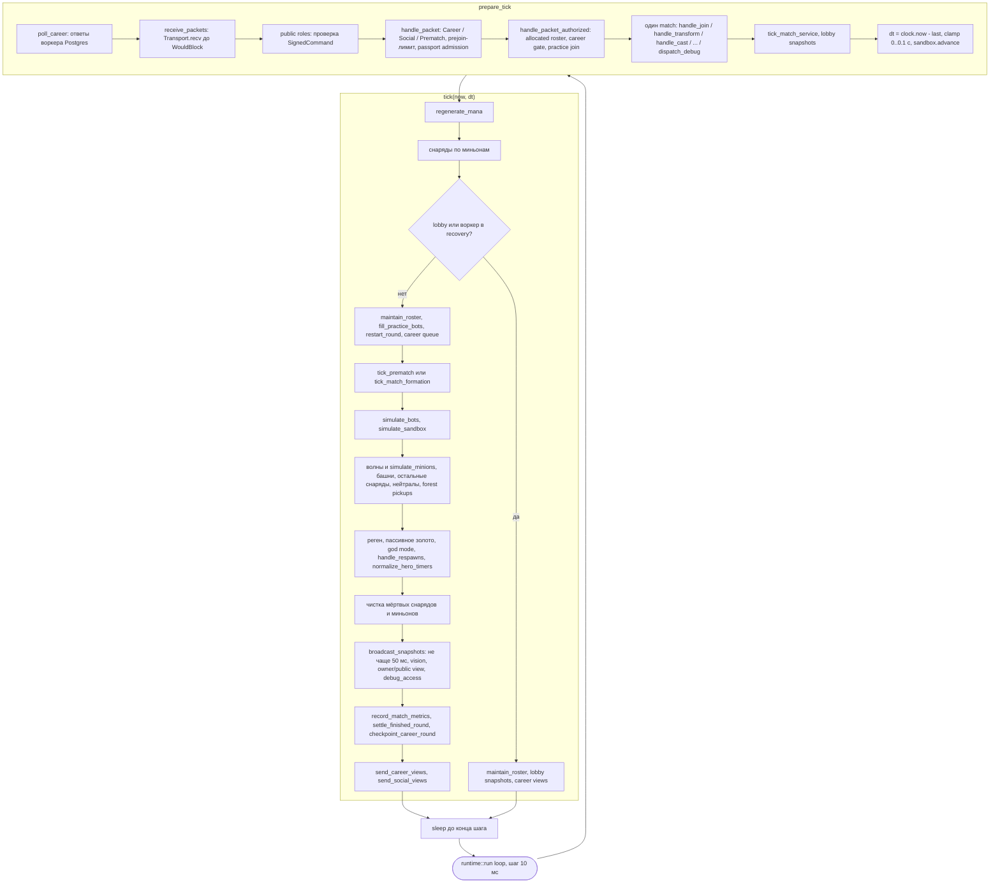

Обработчик возвращает `ControlFlow`. `Continue` запускает общий хвост
диспетчера: отметку endpoint, ростер песочницы, practice-ботов, prematch,
старт раунда и регистрацию участника карьеры. `Break` хвост пропускает.

### 4.4 Модель героя и views

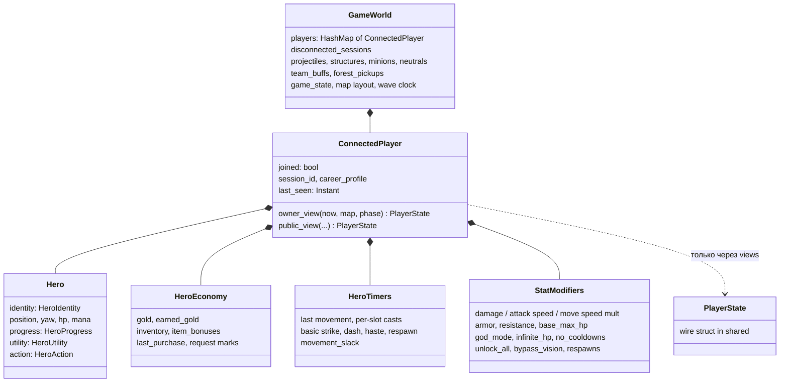

- `hero.rs`: `HeroIdentity` (id, бот, команда, класс, персонаж, аватар,
  спрайт, аура) задаётся при join и симуляцией не меняется.
- `hero_timers.rs`: все игровые моменты времени и чистые функции чтения
  (`basic_attack_remaining`, `skill_cooldown_remaining`, `dash_remaining`,
  ...). `normalize_hero_timers` — единственное место, где моменты очищаются по
  производным условиям (смерть, `no_cooldowns`); вызывается раз за тик.
- `hero_stats.rs`: `StatModifiers` — одна надстройка над классом, уровнем и
  снаряжением (`Default` означает обычную игру). Там же все формулы
  эффективных статов: `basic_attack_damage`, `ability_cooldown`,
  `move_speed`, `movement_envelope`, `max_hp`, `max_mana`, `mitigate`.
  Combat Test (`sandbox::apply_actor`) и debug-переключатели пишут только
  сюда.
- **Views.** `owner_view` отдаёт игроку всё о его герое. `public_view` —
  тот же view, но с пустой приватной экономикой (gold, earned_gold,
  inventory, item_bonuses, last_purchase) и обнулёнными request id. Его
  получают все остальные, включая союзников.
  `snapshot::build_players_snapshot(world, recipient, now)` выбирает view
  для каждого получателя.

### 4.5 Порты: почему сервер тестируется без сети

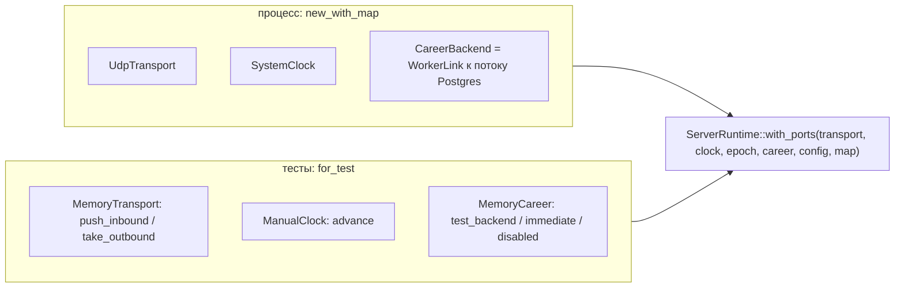

- `trait Transport { recv, send_to, local_addr }` (`runtime/ports.rs`): при
  `WouldBlock` цикл приёма заканчивается;
- `trait Clock { now }`: источник времени тика. Листовые функции получают
  `now` параметром;
- `trait CareerPort` (`career_port.rs`): ровно те методы, которые runtime
  вызывает у хранилища (`handle`, `poll`, `start`, `checkpoint`, `settle`, ...),
  плюс хуки `test_*` под `cfg(test)`.

Тест собирает `ServerRuntime::for_test(MemoryTransport, ManualClock,
MemoryCareer, config)`, кладёт датаграммы, двигает часы и читает исходящие
байты. Сокет и база не нужны. Пример —
`tests::sessions::runtime_on_memory_transport_and_manual_clock_times_out_a_silent_endpoint`.
Серверных тестов около 300: 298 и ещё 3 ignored, которым нужен Postgres.

### 4.6 Prejoin и debug на сервере

- **Prejoin (`runtime/prejoin.rs`, O4).** На standalone-сервере непроверенных
  endpoint-ов не больше `MAX_PREJOIN_ENDPOINTS = 64`. Пока адрес не сделал
  join и не прошёл аутентификацию в карьере, мир ему не отправляется. Он
  получает маленький статусный снапшот, не чаще раза в
  `PREJOIN_STATUS_INTERVAL = 250 мс` и только в ответ на свою датаграмму.
  У публичных ролей свой допуск на транспортном уровне.
- **Debug (`debug/`).** `ServerRuntime::debug_access()` возвращает
  `DebugAccess { toggles: rules.debug_commands, practice: rules.fills_with_bots }`,
  если нет аллокации воркера. `handle_debug(addr, DebugCommand, now)` — одна
  точка входа: `toggles.rs` включает god mode и ускорение, `practice.rs`
  управляет ростером, dummy и дуэлью 1v1. Каждый мировой снапшот для
  присоединившегося игрока несёт `debug_access` (`snapshot_debug_access`).
  Статусный prejoin-ответ и lobby-снапшот его не несут.
- **Combat Test** (`sandbox.rs`, `handlers/tools.rs`) — отдельный протокол:
  подтверждения, номера последовательности, привязка к эпохе. Работает только
  в dev на loopback (`OMOBA_COMBAT_SANDBOX=1`).

---

## 5. Клиент (`client/`)

### 5.1 Запуск и группы плагинов

`client/src/lib.rs::main` делает по порядку:
1. `shared::catalog::ensure_loaded()`;
2. `RosterSource::from_env()` и `init_avatar_roster`;
3. при feature `qa` — `OMOBA_ANIMATION_QA` (запуск вместо игры);
4. `sandbox::validate_launch`, `passport::initialize`;
5. `DefaultPlugins` с корнем ассетов из passport;
6. `PlayerVisualMode::from_environment()`;
7. группы плагинов из `client/src/plugins.rs`.

| Группа | Плагины |
| --- | --- |
| `NetPlugins` | `ClientPersistencePlugin`, `NetworkingPlugin`, `MatchServicePlugin`, `CareerIdentityPlugin` |
| `UiPlugins` | `UiKitPlugin` → `MobileControlsPlugin` → `MobileUiPlugin` (именно в этом порядке: build-time чтения `UiPlatform`), `FrontendPlugin`, `TeamSelectPlugin`, `GameStateUiPlugin`, `MatchHudPlugin`, `EdgeHudPlugin`, `MinimapPlugin`, `ShopPlugin`, `HelpOverlayPlugin`, `PauseMenuPlugin`, `SocialPlugin`, `CareerPlugin`, `SupporterPlugin`, `SupporterStoreKitPlugin` |
| `GameplayPlugins` | `MapsPlugin`, `InputContextPlugin`, `PlayerPlugin`, `CombatPlugin` |
| `DebugPlugins` | `SandboxPlugin` (панель Combat Test), `DebugAccessPlugin`, `PracticeSandboxPlugin`, `GodModePlugin`, `DebugConsolePlugin` |
| `PresentationPlugins` | общие: `CameraPlugin`, `SetupPlugin`, `ModelScalePlugin`, `CombatVisualsPlugin`, `CombatFeedbackPlugin`, `GameVfxPlugin`, `ReactionVisualsPlugin`, `TeamVisionPlugin`, `GameAudioPlugin`, `MapVisualsPlugin`; 2D: `SpriteVisualsPlugin`, `Presentation2dPlugin`, `World2dPlugin`; 3D: `Presentation3dPlugin`, `Verdant3dPlugin`, `DecorPlugin`, `JungleVisualsPlugin`, `MinionVisualsPlugin`, `BossesPlugin`, `ProjectileVisualsPlugin`, `BattlefieldAtmospherePlugin` |
| `QaPlugins` (только с `qa`) | `FrontendQaPlugin`, `VisualQaPlugin`, `SocialQaPlugin`, `SupporterQaPlugin`, `TeamVisionQaPlugin`, `AudioQaPlugin`, `OfflineQaPlugin`, `CareerVisualQaPlugin`, `MapQaPlugin`, `CombatQaPlugin`, `ForestPickupQaPlugin`, `TargetingQaPlugin` |

Порядок групп задаёт только порядок `Plugin::build`. Порядок систем в кадре
задают наборы систем (раздел 5.3).

### 5.2 Модули

| Папка / файл | Содержимое |
| --- | --- |
| `domain/` | Общие для net, геймплея и представления типы: `RoundId`, `Team`, `CombatStats`/`MAX_HP`, маркеры `Player`, `PlayerBody`, `RemotePlayer`, `VerticalVelocity`, `MovementTarget`/`MovementRoute`. Старые пути реэкспортируют их |
| `net/` | `transport` (UDP-поток, фрейминг, декодирование, каналы), `session` (`ClientSession`, `SessionEvent`, повтор join, reconnect), `commands` (`NetworkCommand` → пакеты), `ingest`, `apply` (стадии `SnapshotApply`), `interpolate`, `components` (`GameStateSnapshot`), `status_ui`, `offline` (practice без сокета), `public_transport` |
| `combat/` | `selection` (`TargetState`), `cast` (`PendingCast`), `cooldown`, `targeting`, `hotbar`, `bars`, `marker`, `mobile`, `feedback`, `round_reset` |
| `player/` | `input` (движение, маршруты, выбор в viewport), `motion` (движение, прыжок, коллизии), `animation`, `respawn_ui` |
| `ui/` | UI-кит (раздел 6) |
| `debug/` | `ClientDebugAccess`, `DebugToggles`, `tools_page.rs`, `hud.rs` (`OMOBA_DEBUG_UI`), `console.rs` |
| `frontend/` | Экраны: home, draft, loading, searching, collection, postmatch, preview, card |
| `sandbox/` | Панель Combat Test и её пресеты |
| `qa/` | Харнессы за feature `qa` |
| Прочее | `input_context.rs`, `sprite.rs`/`sprite_roster.rs`, `presentation2d.rs`, `presentation3d.rs`, `world.rs`, `world2d.rs`, `verdant3d.rs`, `career*.rs`, `social.rs`, `shop.rs`, `platform/`, `game_audio/`, `humanoid/`, `map_visuals/` |

### 5.3 Порядок кадра (`Update`)

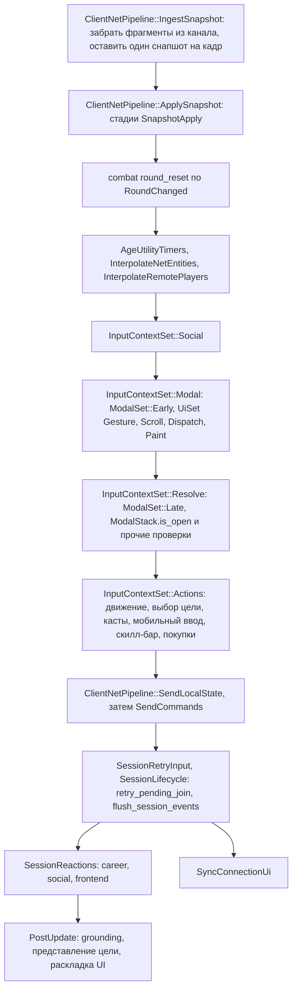

### 5.4 Применение снапшота

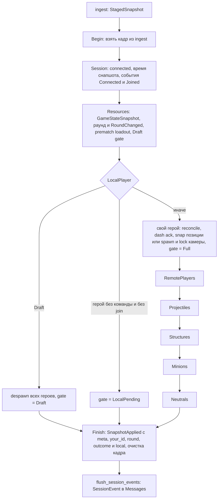

- Стадии объявлены в `client/src/net/mod.rs` (`SnapshotApply`), системы —
  в `apply::snapshot_apply_systems()`. Все стадии входят в
  `ClientNetPipeline::ApplySnapshot`, поэтому любой читатель с
  `.after(ApplySnapshot)` видит применение целиком. Bevy применяет Commands
  после каждой стадии.
- Пять стадий мира (`RemotePlayers` … `Neutrals`) идут только при
  `gate == Full`, у каждой свои отфильтрованные запросы.
- **`SessionEvent`** (`net/session.rs`): `TransportStarted`, `Connected`,
  `Joined`, `Rejected`, `JoinExhausted`, `Disconnected`, `Left`,
  `ServerScopeReset`, `RoundChanged`. `net` кладёт событие в outbox
  `ClientSession` в том месте, где случился переход. Очередь сбрасывается в
  сообщения в конце `ApplySnapshot` и в конце `SessionLifecycle`.

| Событие | Кто читает |
| --- | --- |
| `RoundChanged` | `combat::round_reset::reset_round_input_state`, `mobile_controls::read_mobile_controls` |
| `ServerScopeReset` | `career::clear_account_on_scope_reset`, `social::clear_on_scope_reset` (`SessionReactions`) |
| `Left` | `frontend::return_home_on_leave` (`SessionReactions`) |

Поля `ClientSession` закрыты внутри `net`. Снаружи доступны только методы
чтения (`state()`, `is_connected()`, `join_confirmed()`, `join_in_flight()`,
`is_offline()`, ...) и одна запись, `abandon_join()`.

Offline practice (`net/offline.rs`) — симуляция без сокета. Она говорит теми
же пакетами через те же каналы, поэтому остальной клиент не знает, что игра
идёт без сервера.

### 5.5 Debug на клиенте

- `ClientDebugAccess` пересчитывается каждый кадр в `sync_debug_access`
  (`DebugAccessSet`). До подтверждённого join он пуст. Потом берётся
  `snapshot.debug_access`, а если сервер старый и не прислал его —
  `DebugAccess::for_match_mode(match_mode)`. В Combat Test переключатели не
  предлагаются, ими управляет конфиг актёра.
- `DebugToggles { god_mode, speed_boost }` — единственная клиентская копия.
  Когда переключатели запрещены, она сбрасывается в «выключено».
  `resend_debug_toggles` повторяет их каждые 0,5 с.
- Все команды проходят как `NetworkCommand::Debug(DebugCommand)` и кодируются
  через `to_packet()`. Offline исполняет их в `Simulation::debug`.
- Страница «Debug tools» в меню паузы (`tools_page.rs`), HUD и клавиши
  F2/F3/F8 (`hud.rs`, только при `OMOBA_DEBUG_UI`), экранный лог
  (`console.rs`).

### 5.6 Feature `qa`, бэкенды рендера, контекст ввода

- **`qa`** (`client/Cargo.toml`: `default = ["qa"]`). Харнессы лежат в
  `client/src/qa/` и спят, пока не задана их переменная окружения
  (`OMOBA_VISUAL_QA_DIR`, `OMOBA_FRONTEND_QA_OUTPUT`,
  `OMOBA_OFFLINE_SMOKE_DIR`, ...). Код, который читают только харнессы,
  помечен `#[cfg(feature = "qa")]`, код для харнессов и тестов —
  `#[cfg(any(test, feature = "qa"))]`. Сборку без `qa` проверяет
  `make check-no-qa` (clippy, в CI тоже).
- **Бэкенды рендера.** `PlayerVisualMode` выбирается один раз: `Models3d` по
  умолчанию или `Sprite2d` при `OMOBA_PLAYER_VISUAL_MODE=sprite2d`
  (`make game2d`). Плагины добавляются всегда. Системы бэкендов стоят под
  `sprite::in_models3d()` / `sprite::in_sprite2d()`
  (`resource_exists_and_equals`). Симуляция всегда в XZ, 2D проецирует её в
  XY.
- **`input_context.rs`**: наборы `InputContextSet::{Social, Modal, Resolve,
  Actions}`, а также `CombatPointerInputSet` и `WorldMovementInputSet`.
  `register_modals` регистрирует шесть модалок. `Resolve` решает, пропускать
  ли игровой ввод: смотрит `ModalStack::is_open()` и проверки, которые не
  относятся к модалкам (help в матче, sandbox, social, экраны front-end,
  выбор героя, ориентация телефона).
- **Платформы.** Android собирается как NativeActivity (свой набор features
  Bevy в `client/Cargo.toml`), iOS — через Swift-оболочку `mobile/ios/`.
  Различия задаются через `cfg(target_os)` (46 мест) и
  `platform::ui_profile()` → `UiPlatform`.

---

## 6. UI-кит (`client/src/ui/`)

| Файл | Строк | Что даёт |
| --- | ---: | --- |
| `theme.rs` | 533 | `UiTheme` (цвета, шрифт), `panel_node`, `text`; модуль `metric` — одна политика размеров для телефона и десктопа (`Form`, `menu_font`, `menu_control_height`, `pause_panel_height`, таблица шрифтов для телефона) |
| `gesture.rs` | 447 | `Pressable` (effective interaction, `blocked`, `touch_mode`, `activated`), распознаватель тапов `recognize_presses`, `SyntheticPress`, `GestureEpoch` |
| `action.rs` | 112 | `UiAction<T>` (компонент), `Activated<T>` (сообщение), `dispatch_actions::<T>`, `app.add_ui_action::<T>()` |
| `widgets.rs` | 496 | `ButtonStyle`/`ButtonKind` (в том числе `Skill`, `SkillUpgrade`, `ShopItem`, `Debug`), `paint_pressables`, `button`, `icon_button`, `toggle_row`, `adjust_row`, `screen_button`, `screen_tile` |
| `scroll.rs` | 803 | `ScrollArea` и одна система `scroll_areas` (колесо, шаг страницы, порог перетаскивания задаются параметрами) |
| `modal.rs` | 254 | `ModalId`, `ModalStack` (упорядочен по слою отрисовки), `ModalRoot`, `register_modal`, `ModalSet::{Early, Late}` |
| `test_id.rs` | 220 | `TestId` (стабильный ключ), `NodeKey`, помощники для тестов (`press`, `find`, `drain_actions`) |

Порядок внутри `InputContextSet::Modal`: `ModalSet::Early`, затем цепочка
`UiSet::Gesture → Scroll → Dispatch → Paint`.

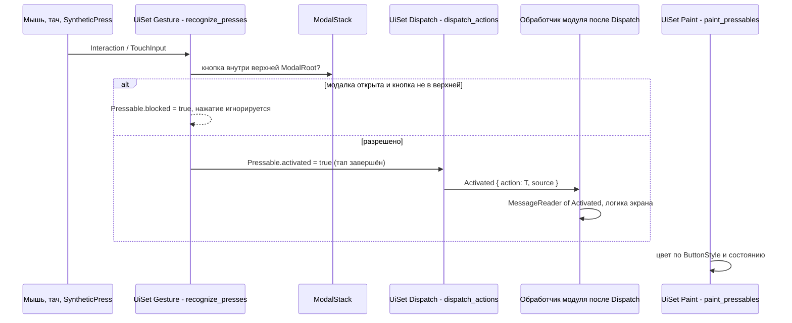

- **Модалки.** `app.register_modal::<R>(ModalId, |r| r.open)` держит
  `ModalStack` в соответствии с флагом ресурса дважды за кадр (`Early` и
  `Late`). Регистрируются шесть модалок: `Pause`, `Career`, `Shop`,
  `Supporter`, `Scoreboard`, `ServerEntry`. Пока открыта хоть одна, на
  нажатия и прокрутку реагируют только элементы под верхней `ModalRoot`.
  Порядок слоёв задаёт `ModalId::layer()` (Shop 45, Scoreboard 90, Pause 100,
  Career 120, ServerEntry 150, Supporter 1300).
- **`TestId` в QA.** Каждая кнопка кита получает `TestId`. QA-харнессы
  нажимают кнопки по нему (`crate::qa::TestIdPresses`) и выгружают дерево
  через `QaName`. Зеркала `TestId → Name` больше нет. Юнит-тесты кита
  используют `test_id::press`/`drain_actions` на `kit_app()`.
- Все кнопки клиента сделаны на ките: меню паузы, экраны front-end, выбор
  героя, карьера, social, supporter, панель Combat Test, help, магазин,
  скилл-бар, телефонная панель, scoreboard, Retry соединения, debug HUD.
  `Interaction` напрямую читают только места, которым нужно не пропустить
  клик в мир (`combat::selection`, `player::input`), и звук клика
  (`game_audio`).

---

## 7. Данные и контент

### 7.1 Каталоги героев и предметов (`shared/assets/catalog/`)

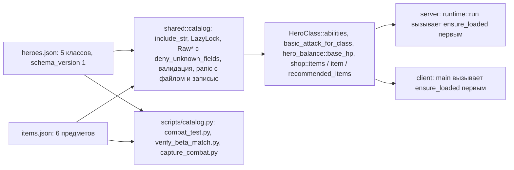

- Данными задаётся то, что различается у классов и предметов: базовое HP,
  пределы роста, базовая атака, четыре умения Q/W/E/R, стиль снаряда,
  рекомендуемые предметы, стоимость и бонусы. Одинаковое для всех остаётся
  кодом: кривая роста, скорость, мана, респаун и пороги XP в
  `shared::hero_balance`, ориентация в `shared::math`, серверные числа
  миньонов, башен и нейтралов в `server/src/balance.rs`.
- Данные встроены в оба бинарника, переопределения во время работы нет:
  клиент и сервер обязаны совпадать. `cargo test -p shared` проверяет покрытие
  enum и порядок, форму набора умений, диапазоны значений и стартовый бюджет.
- Карта: `shared/assets/maps/verdant.json` (расстановка и статы структур,
  см. [map-customization.md](map-customization.md)),
  `verdant-collision.json`, `reactions.json`.

### 7.2 Ростер аватаров и ассеты (`passport`)

- `omoba_passport::assets::client_asset_root()` — корень ассетов клиента.
- `omoba_passport::avatars`: `RosterSource { manifest_override
  (OMOBA_AVATAR_MANIFEST), asset_root }`. Кандидаты: override, затем
  `<asset_root>/avatars/manifest.json`, затем встроенная копия. Поиска
  относительно рабочей директории нет (O30). Бинарники печатают при старте
  размер ростера и источник.
- Записи со slug `ekza-` или с границей passport обязаны пройти правило
  `register_store_avatar`. Иначе запись пропускается с предупреждением (O5,
  половина «при загрузке»).
- `omoba_passport::entitlements::grant_verified_avatar` выдаёт реакции
  компаньона. Store-аватары ставятся в отдельный asset source
  (`passport::initialize_store`).
- Спрайтовые персонажи: в `shared` только `SPRITE_CHARACTER_IDS` и
  `normalize_sprite_character_id`. Схема, manifest и fallback лежат в
  `client/src/sprite_roster.rs`.

---

## 8. Карьера и аккаунты

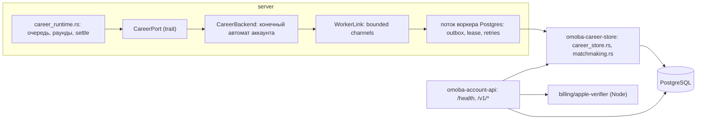

- **`career-store`** — доверенное хранилище: профили, результаты, рейтинг,
  друзья, ключи устройств, supporter-леджеры. Миграции лежат в
  `career-store/migrations/postgres/` (`001_career`, `002_player_handles`,
  `003_device_keys`) под advisory lock. `matchmaking.rs` — политика
  ограниченной очереди. Его линкуют и сервер, и account-api, Bevy для этого
  не нужен.
- **Сервер** обращается к базе только через `CareerPort`. Производственная
  реализация — `CareerBackend<WorkerLink>` с отдельным потоком Postgres и
  outbox на диске. Восстановление outbox вынесено в чистую `recover_outbox`
  (O29). `cargo run -p server --bin migrate-career` — миграция только для
  игры.
- **`account-api`** (axum 0.8.9): `GET /health/live`, `/health/ready`,
  остальное — `/v1/{*path}` с явной маршрутизацией: `auth/devices/*`,
  `auth/pairings/*`, `me/devices*`, `me/supporter*`, `supporter/native`,
  `supporter/apple/notifications`, `players/*`, `releases`. Для чувствительных
  маршрутов есть rate limit. Команда `omoba-account-api migrate` применяет
  career v1–v3 и portal v1–v3 (свои миграции в `account-api/migrations/`).
  Права ролей задаёт `account-api/ops/grants.sql`. Контракт описан в
  `account-api/docs/openapi.json`. Ни один HTTP-endpoint не может закрыть
  матч или изменить награды.
- Postgres-тесты: 15 ignored в career-store, 17 в account-api и 3 в server.
  Они запускаются через `scripts/postgres_tests.py` (`make test-postgres`,
  CI-джоб `postgres`, сервис `postgres:16`), который мигрирует базу, создаёт
  ограниченные роли и гоняет тесты с `--include-ignored`.

---

## 9. Тестирование и CI

### 9.1 Слои тестов

| Слой | Где | Сколько (примерно) | Как запускать |
| --- | --- | ---: | --- |
| Юнит-тесты shared (модель, каталоги, протокол) | `shared/src/**` | 94 | `cargo test -p shared` |
| Golden и политика enum | `shared/src/protocol/wire.rs`, `wire_enums.rs` | входят в 94 | то же |
| Сервер (симуляция, views, порты в памяти, правила режима) | `server/src/tests/`, `*_tests.rs`, `mod tests` | 298 + 3 ignored (Postgres) | `cargo test -p server` |
| Клиент (Bevy `App` без окна, стадии снапшота, UI-кит, debug) | `client/src/**` | 609 (lib) | `cargo test -p client --lib` |
| passport | `passport/src/tests.rs`, `passport/tests/` | 26 + 3 ignored e2e (нужен registry) | `cargo test -p omoba-passport` |
| career-store, account-api | `career-store/src/*_tests.rs`, `account-api/tests/` | 13 + 15 ignored, 6 + 17 ignored | `make test-postgres` |
| Харнесс, unit | `harness/src/**` | 22 | `cargo test -p harness --lib` |
| Харнесс black-box (настоящий сервер по UDP) | `harness/tests/*.rs` (gameplay, matchmaking, release_lifecycle, combat_actions, framed_snapshots, udp_datagrams, ...) | 24 | `cargo build -p server && cargo test --locked -p harness -- --test-threads=1` |
| Python (лаунчер, упаковка, asset-gate, каталог) | `scripts/test_*.py` | ≈124 | `python3 -m unittest discover -s scripts -p 'test_*.py'` |
| Python (iOS-инструменты) | `mobile/ios/test_*.py` | 42 | `python3 -m unittest discover -s mobile/ios -p 'test_*.py'` |
| Компиляция Android | CI-джоб `android` | — | `cargo check -p client --target aarch64-linux-android` |
| Компиляция iOS | `.github/workflows/ios-check.yml` (раз в неделю и вручную) | — | `cargo check -p client --target aarch64-apple-ios` |

Счёт Rust-тестов взят из [REFACTORING.md](REFACTORING.md) (правило 3). Он
совпадает с подсчётом `#[test]` по исходникам с точностью до нескольких
штук. Python-тесты посчитаны по `def test_`.

### 9.2 CI (`.github/workflows/`)

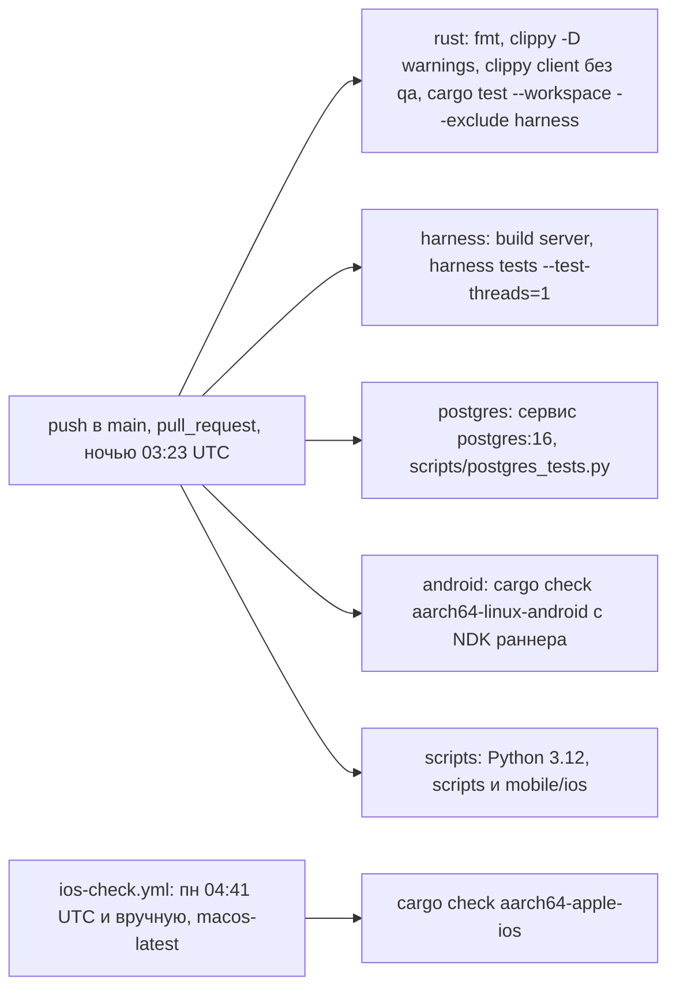

Toolchain закреплён: 1.94.1 (`rust-toolchain.toml` и workflow). Правило
процесса (REFACTORING.md, правило 2): PR сливается только после того, как
зелёные все обязательные проверки (`fmt, clippy, tests`,
`headless gameplay harness`, `postgres-backed tests`,
`python tooling tests`).

### 9.3 Локальный гейт

```sh
make check          # = fmt-check, lint, check-no-qa, test, test-scripts
#   cargo fmt --all -- --check
#   cargo clippy --workspace --all-targets --no-deps -- -D warnings
#   cargo clippy -p client --lib --no-deps --no-default-features -- -D warnings
#   cargo test --workspace --locked --exclude harness
#   python3 -m unittest discover -s scripts -p 'test_*.py'
#   python3 -m unittest discover -s mobile/ios -p 'test_*.py'
cargo build -p server && cargo test --locked -p harness -- --test-threads=1   # make verify-gameplay
OMOBA_TEST_DATABASE_URL=postgres://... make test-postgres                  # если трогали карьеру, account-api или миграции
```

---

## 10. Правила развития: короткие рецепты

### Добавить пакет или поле

1. **Поле.** Добавить поле в `shared/src/protocol/wire.rs` с
   `#[serde(default)]`. Если оно чаще всего пустое, добавить ещё
   `skip_serializing_if`. Golden-строки при этом не должны меняться. Добавить
   тест на аддитивность, как `wire::tests::snapshot_debug_access_is_additive`.
2. **Новый вариант `ClientPacket`.** `ClientPacket` строгий, старый сервер
   отбросит такой пакет. Нужно:
   - внести вариант в `wire_enums.rs`, и там же принять решение: bump
     `PROTOCOL_VERSION` плюс `POLICY_PROTOCOL_VERSION` либо терпимый
     декодер в более раннем релизе;
   - сделать обработчик `handle_<variant>` в
     `server/src/runtime/handlers/<тема>.rs` и arm в
     `runtime/dispatch.rs::handle_packet_authorized`;
   - на клиенте добавить вариант `NetworkCommand` в `client/src/net/commands.rs`;
   - повторить поведение в `client/src/net/offline.rs`;
   - при необходимости добавить golden-строку и сценарий в `harness/tests/`.
3. Прогнать `make check` и харнесс. Байты `PlayerState` закреплены в
   `server/src/tests/player_view.rs`.

### Добавить героя

1. Добавить вариант `HeroClass`, его место в `HeroClass::ALL` и `id` в
   `shared/src/lib.rs`. `HeroClass` терпимый, старый клиент покажет Warrior.
   Внести вариант в `wire_enums.rs`.
2. Добавить запись в `shared/assets/catalog/heroes.json` на той же позиции:
   четыре умения, `recommended_items` со всеми предметами ровно по разу.
3. На сервере: состав ботов и аватары ботов в `server/src/bots.rs`.
4. На клиенте:
   - атлас иконок и порядок в `client/src/skill_icons.rs`;
   - класс в `client/assets/config/combat_visuals.json`;
   - буква на миникарте в `client/src/minimap.rs`;
   - звуки;
   - если нужен новый вид снаряда: вариант `ProjectileStyle` и визуал.
5. `cargo test -p shared` проверит каталог. Чтобы только подкрутить баланс,
   достаточно править JSON.

Предмет добавляется так же: вариант `ItemId` и `ItemId::ALL`, запись в
`items.json`, место в `recommended_items` каждого класса и `item_code` в
`client/src/shop.rs`.

### Добавить UI-кнопку

1. Объявить enum действий экрана, например `enum MyAction { Open, Close }`, и
   зарегистрировать его: `app.add_ui_action::<MyAction>()`.
2. Создать кнопку через `ui::widgets::button(parent, "Label", ButtonKind::…,
   MyAction::Open, "MyOpenButton")`. Последний аргумент — `TestId`.
3. Обработчик читает `MessageReader<Activated<MyAction>>` и стоит
   `.after(UiSet::Dispatch)`.
4. Если это новая модалка: добавить `ModalId` с `layer()`, вызвать
   `register_modal::<State>(id, |s| s.open)` в
   `input_context::register_modals` и повесить `ModalRoot` на корень.
5. Размеры брать из `ui::theme::metric`. В тестах использовать
   `test_id::press` и `drain_actions`.

### Добавить debug-команду

1. Лучше всего сделать её новым `kind` в `PracticeCommand`
   (`shared/src/practice.rs`). Этот enum терпимый: старые хосты декодируют
   неизвестный kind как `Unsupported` и игнорируют. Внести вариант в
   `wire_enums.rs`.
2. Если нужен новый переключатель (новый пакет), это новый вариант
   `ClientPacket`, то есть решение по версии протокола. Затем вариант
   `DebugCommand` с `to_packet`/`from_packet` в `shared/src/debug.rs`.
3. Сервер: ветка в `server/src/debug/practice.rs` или `toggles.rs`, права
   через `debug_access()`. Offline: ветка в `Simulation::debug`
   (`client/src/net/offline.rs`).
4. Клиентский UI: `client/src/debug/tools_page.rs` (или `hud.rs`), показ по
   `ClientDebugAccess`.

---

## 11. Известные ограничения и что можно улучшить

Ниже честный список того, что осталось открытым по коду и по трекеру.

| Тема | Состояние |
| --- | --- |
| **13f** | Ростер аватаров — глобальный на процесс (`OnceLock` в `passport::avatars`), а не реестр, которым владеет `ServerRuntime`. Необязательно, но изолировало бы серверные тесты |
| **O5, половина arena-sync** | Проверка при загрузке ростера сделана. `arena-sync/src/main.rs` по-прежнему пишет файлы по slug из внешней цепочки без проверки до `fs::write` (риск path traversal в утилите разработчика) |
| **Asset-gate в CI** | Из 28 тестов asset-gate 27 работают. Тест с переименованным запрещённым бинарником пропускается в shallow checkout CI, потому что там нет самих запрещённых байтов (`scripts/test_candidate_assets.py`) |
| **Android и iOS** | Проверяется только компиляция: Android на каждый PR, iOS раз в неделю и не входит в гейт PR. Сборка, запуск и UI на устройствах проверяются только вручную ([manual-qa-matrix.md](manual-qa-matrix.md)) |
| **Опциональные срезы клиента** | 15f (камера через `SnapshotApplied`: пока у него нет читателя вне тестов, стоит `expect(dead_code)`), 15g (Career и Social из ingest как сообщения), 10h (сборки для магазинов без `qa`), 10i (уйти от реэкспорт-шимов старых путей), 12f (перекрёстная проверка `combat_visuals.json` против каталога) — см. [plans/client-10-15.md](plans/client-10-15.md), [plans/steps-11-13.md](plans/steps-11-13.md) |
| **Серверные тесты на реальном UDP** | Около 20 файлов фикстур ещё строят `ServerRuntime::new` на `127.0.0.1:0`. Новые тесты стоит писать на `for_test` (O19) |
| **Не фиксированный шаг** | `dt` — реальное время (≤ 100 мс), поэтому полная детерминированность тиков не гарантирована. Тай-брейк башен и детерминизм — в O19 |
| **Бот и sandbox внутри `ServerRuntime`** | `simulate_bots` (`bots.rs`) и Combat Test всё ещё методы runtime и проверяются через него целиком (O21). `AllocationRules` для решений о воркерах (около 20 мест `match_service.worker()`) отложен |
| **Снаряды в два прохода** | `simulate_projectiles_filtered` вызывается дважды (сначала по миньонам, потом по остальным), чтобы сохранить старый порядок кадра. Слить в один проход — следующий срез |
| **Утечки редакции** | `max_hp`, `max_mana` и кулдауны в `public_view` косвенно выдают предметы, earned gold виден через scoreboard. Решать при следующем bump протокола |
| **Конфигурация из env** | В `client/src` около 90 чтений `env::var`, большая часть в QA. Типизированного конфига нет (O27, ужатый вариант) |
| **Остальное из отчёта** | O8 (время CI), O12 (три hex-декодера), O14 (`SlotState` в shared), O15 (кэш видимости), O18 (схема account-api), O26 (`CareerClient`/`SocialClient` смешивают модель и UI) — низкая ценность, делать попутно |
| **Каталоги только во время сборки** | JSON встроен через `include_str!`: правка баланса требует пересборки обоих бинарников. Так задумано: клиент и сервер должны совпадать |

Если выбирать, что делать дальше: при подготовке к публичному PvP или
магазинам — половину O5 в arena-sync, редакцию при следующем bump протокола,
перевод фикстур на порты в памяти и тестовый запуск на устройствах. Всё
остальное — по мере того как соответствующий код будет меняться.
