# Архитектурный отчёт: итоги программы рефакторинга omoba

| Параметр | Значение |
|---|---|
| Базовая точка | **b6fad0e**, последний коммит до программы. В нём уже есть offline practice, исправление K/D/A и practice sandbox |
| Срез анализа | **4efbd8b**, #33, 2026-09-24 18:06 UTC. Все метрики «после» сняты здесь, если не сказано иное |
| «Текущий main» в отчёте | **5a1178d**, #38, 20:42 UTC. После среза влиты #34–#38, CI зелёный (run 44). Цифры по 5a1178d помечены отдельно |
| Что влито позже | **9889f07**, #39, 21:05 UTC: очередь `SessionEvent` и поэтапное применение снапшота (шаг 15, срезы 15a и 15b1); 12 файлов, +960 / −111; CI зелёный (run 46). Отчёт заканчивается на 5a1178d. #39 упомянут только там, где он меняет вывод: §3.2, §4.5, §7, §8.3, §8.4 |
| Как измерено | `git`, `grep`/`rg`, `wc`, скрипты на `python3`, GitHub Actions API и логи CI. **Ничего не собиралось и не запускалось.** «Не измерено» означает, что для цифры нужна сборка или запуск |

Все цифры получены командами. Методика и расхождения между парсерами описаны в [приложении](#приложение-как-получены-цифры).

**Содержание**

1. [Итог и вердикт](#1-итог-и-вердикт)
2. [Было → стало](#2-было--стало)
3. [Хронология](#3-хронология)
4. [Текущая архитектура](#4-текущая-архитектура)
5. [Качество и страховка](#5-качество-и-страховка)
6. [Изменения поведения и риски](#6-изменения-поведения-и-риски)
7. [Что осталось по дорожной карте](#7-что-осталось-по-дорожной-карте)
8. [Пространство для улучшений](#8-пространство-для-улучшений)
9. [Рекомендации](#9-рекомендации)

[Приложение: как получены цифры](#приложение-как-получены-цифры)

**Термины**

| Термин | Что значит в этом отчёте |
|---|---|
| срез | коммит 4efbd8b, на котором сняты метрики «после» |
| churn | объём изменённых строк: добавленные плюс удалённые |
| перенос, move-only | изменение, которое только перемещает код между файлами и не меняет логику |
| wire, провод | формат пакетов между клиентом и сервером (JSON по UDP) |
| view (`owner_view`, `public_view`) | функция, которая строит wire-структуру `PlayerState` из внутреннего состояния героя для конкретного получателя |
| golden-тест | тест, сравнивающий сериализованный пакет с точной строкой, записанной заранее |
| characterization-тест | тест, который фиксирует текущее поведение перед рефакторингом, чтобы любое его изменение уронило тест |
| bump протокола | повышение `PROTOCOL_VERSION`; после него клиенты со старой версией отклоняются |
| гейт (gate) | набор проверок перед слиянием: fmt, clippy, тесты, харнесс |
| харнесс | крейт `harness`: боты, которые по UDP играют против настоящего собранного сервера (black-box тесты) |
| флейк | тест, который иногда падает без изменения кода (гонки, тайминги) |
| SCC | сильно связная компонента графа: группа модулей, где каждый прямо или косвенно зависит от каждого, то есть цикл |
| soak | долгий прогон под нагрузкой для проверки стабильности |
| шим | тонкий модуль, который только реэкспортирует код из нового места, чтобы старые пути компилировались |
| S / M / L | оценка цены: до дня / несколько дней / больше |

---

## 1. Итог и вердикт

За один день (2026-09-24, 12:46–18:06 UTC) на `main` попали **17 изменений**: коммит с CI (1da8bed) и PR #18–#33. Они затронули **220 файлов (+23 506 / −19 958 строк)**, но продуктовый код почти не вырос: около +160 строк (+0,2 %, конвенция loc2, §2.2), тесты выросли примерно на +2 200 строк.

**Сервер.** Был 6 425-строчный `main.rs` с Bevy-ECS-зеркалом. Стал модульным runtime:
- один тик;
- `GameWorld` и `TickCtx`;
- авторитетное состояние героя (`Hero`), а для провода строятся view;
- таблица политик `MatchRules`;
- порты `Transport`, `Clock`, `CareerPort`;
- отдельный обработчик на каждый вариант пакета.

**Протокол** описан один раз, в `shared`, и закреплён golden-тестами. Появились CI и закреплённая версия toolchain.

**Клиент** на срезе переделан частично: разрезан `net/` и сделан пилот UI kit. После среза #35–#37 закрыли шаг 10, а #38 закрыл шаг 12. Уже после 5a1178d #39 начал шаг 15: события сессии и поэтапное применение снапшота.

**Поведение.** Одно намеренное изменение на проводе (#29, редакция чужой экономики). Остальные 16 записей реестра в §6 — мелкие правки или рефакторинги, заявленные как «без изменения поведения». Ручной игры, мобильных сборок и замеров производительности не было.

### Стало ли лучше?

**Да.** Сервер и протокол стали заметно лучше. Клиент стал лучше частично. Процесс улучшился, но с оговорками. Подробности в [§2.1](#21-сводная-таблица) и [§5.3](#53-инцидент-с-ci).

**Однозначно лучше** (подтверждено измерениями):
- протокол: 47 определений wire-типов в трёх разошедшихся рукописных копиях → одно определение с golden-тестами;
- серверный `main.rs`: 6 425 → 61 строка;
- удалены ECS-зеркало, второй путь снарядов и вторая регенерация маны;
- `PlayerState` больше не хранится и не мутируется напрямую (≈100 записей → 0);
- появились CI и toolchain 1.94.1 (раньше не было ничего);
- чужие золото и инвентарь больше не рассылаются всем;
- удалены крейт `skills` и 63 локальных `allow(clippy)`;
- `account-api` больше не тянет игровой сервер.

**Лучше структурно** (выигрыш проявится при следующих изменениях):
- `GameWorld`, `MatchRules`, порты, обработчики на вариант пакета и явные импорты сделали граф модулей видимым;
- но 29 из 35 модулей сервера по-прежнему образуют один цикл, а `ServerRuntime` остаётся хабом (93 метода в 19 файлах);
- клиентский `net/` разрезан по стадиям, но `apply_server_snapshot` на 5a1178d ещё одна система на 761 строку (#39 начал её делить);
- UI kit используют пока 2 экрана.

**Не проверено:**
- ручной игры в реальном клиенте не было (нет GPU);
- мобильные сборки не собирались;
- потоки с Postgres проверены только in-process, 35 тестов с БД в CI не запускаются;
- производительность тика, размер снапшотов, время сборки и размер бинарников не измерены;
- **11 слияний подряд (#18–#28) прошли без black-box харнесса в CI**.

**Цена:**
- большой churn: ветки, отрезанные до b6fad0e, будут конфликтовать;
- продуктовый код сервера вырос на ~3 % за счёт новых слоёв;
- `use`-инструкций в прод-коде сервера 81 → 439 (строк 136 → 540);
- CI не блокирует слияние: PR сливают через 3–14 с после старта проверки, `main` не защищён.

**Есть ли ещё пространство для улучшений?** Да. По дорожной карте открыты шаги **15** (начат в #39), **11, 13, 9b**. Вне карты подтверждено около 20 точечных задач. Самые выгодные:
- Postgres-тесты в CI;
- гигиенический PR (мёртвые зависимости, устаревшие команды в документации);
- CI как настоящий гейт и починка оставшегося флейка;
- бюджет движения против «скорости за счёт частоты пакетов»;
- три мелких бага, видимых игроку.

Подробности в разделах [8](#8-пространство-для-улучшений) и [9](#9-рекомендации).

---

## 2. Было → стало

### 2.1 Сводная таблица

| Область | Было (b6fad0e) | Стало (4efbd8b, для клиента также 5a1178d) | Почему это важно |
|---|---|---|---|
| Протокол | 3 рукописные копии (server `main.rs`, client `net.rs`, harness `protocol.rs`), разошедшиеся между собой. У харнесса было 11 из 18 `ClientPacket` и 24 из 36 полей `PlayerState` | Одно определение: `shared/src/protocol/wire.rs` (939 строк), 7 тестов, 6 golden-строк | Сервер, клиент и харнесс больше не могут тихо разойтись. Байты на проводе закреплены |
| Точка входа сервера | `main.rs` на 6 425 строк: wire-типы, `ServerRuntime` на 41 поле, диспатч, тик, 50 тестов | `main.rs` на 61 строку: список модулей и `runtime::run()` | Код можно читать и менять по частям |
| Тик сервера | Bevy App, 8 цепочечных систем, копирование `PlayerState` в ECS и обратно, два пути снарядов | Обычный цикл `prepare_tick` → `tick` → sleep до 10 мс, одна регенерация маны, одна функция снарядов | Одна реализация правил. Тесты гоняют продуктовый код, а не его тестовую копию |
| Состояние героя | `ConnectedPlayer.state: PlayerState` (36 wire-полей) мутировался напрямую ≈100 раз в 10 файлах | `Hero`, `HeroEconomy`, `HeroTimers`, `StatModifiers`. `PlayerState` строится только в `owner_view` и `public_view` | Провод стал проекцией состояния, а не самим состоянием. Приватность обеспечивается в одном месте |
| Политика режимов | `MatchMode::` в 46 местах в 7 файлах | Таблица `MatchRules::for_mode`: 11 полей — режим, размер команды и 9 флагов политики; вне `match_rules.rs` осталось 7 упоминаний `MatchMode::` | Новый режим матча описывается одной строкой таблицы |
| I/O сервера | `Instant::now()` в тике (15 раз в `main.rs`), `UdpSocket` в поле, `CareerBackend` вызывался напрямую | Порты `Transport`, `Clock`, `CareerPort`; в `sim/` и handlers 0 вызовов `Instant::now()` | Runtime можно целиком прогнать в памяти с ручными часами |
| Диспатч пакетов | Один `match` на 421 строку по 18 вариантам | Диспатчер на 149 строк и 16 обработчиков в 7 файлах, все возвращают `ControlFlow<()>` | Изменение одного пакета не задевает остальные |
| Импорты сервера | 36 glob-импортов, 21 из 25 модулей импортировал весь корень крейта | 4 glob-импорта (`use shared::…::*`), 0 `use crate::*` | Реальный граф зависимостей стал видим, и его можно резать |
| Крейты | `account-api` зависел от всего `server` (bevy, SDK, passport), чтобы получить `career_store`. Крейт `skills` был сиротой | `omoba-career-store` — отдельный крейт; `server` только бинарный; `skills` удалён | HTTP-сервис не собирает игровой сервер. Хранилище тестируется отдельно |
| Баланс и ориентация | 21 объявление констант в 8 файлах, дрейф (offline: мана 12/с вместо 8, снаряд 30 вместо 19). 14 ручных вызовов `atan2` | 10 констант в `shared::hero_balance`, хелперы ориентации в `shared::math` | Число задаётся в одном месте |
| Клиент: сеть | `net.rs` на 6 018 строк плюс своя копия протокола | Дерево `net/`: 12 файлов, 7 204 строки, по файлу на стадию конвейера, крупнейший файл 1 383 строки. Перенос был строго move-only | Видна структура конвейера, риск поведенческих изменений нулевой |
| Клиент: UI | Пауза: 26 маркер-компонентов, 10 `handle_*`-систем, 2 отдельных распознавателя тапов | UI kit `client/src/ui/` (1 378 строк). В паузе: `PauseAction` (11 вариантов), 4 `apply_*`-системы, один распознаватель | Кнопка добавляется вариантом enum, одним вызовом виджета и одной веткой `match` |
| Клиент: QA и плагины | 18 QA-файлов (11 070 строк) всегда в сборке. 60 плагинов в 29 вызовах `add_plugins`. `run_if` 14 | На 4efbd8b без изменений. **На 5a1178d:** feature `qa` (default on, 39 гейтов), 4 `PluginGroup` + `QaPlugins`, `run_if` 38 | Продуктовая сборка может исключить QA. Порядок плагинов стал явным |
| CI | Нет `.github`, нет `rust-toolchain.toml` | 3 job: fmt + clippy `-D warnings` + тесты; харнесс против собранного сервера; Python-тесты | Автоматический гейт, которого раньше не было |
| Документация | Не было ARCHITECTURE, REFACTORING, ui-kit | Добавлено 16 `.md` (1 356 строк): карта архитектуры, трекер, ui-kit и 13 progress-заметок | С работы можно продолжить по одному файлу |
| Приватность | Каждый клиент получал золото, инвентарь и чеки покупок всех игроков | Не-владелец получает `public_view`, в котором 7 полей экономики обнулены | Закрыта утечка экономики. Утечка частичная: см. §4.4 |

### 2.2 Метрики

Сюда попали только измеренные числа. «н/и» — не измерялось для этой точки. «—» — значение после среза не менялось (файл не трогали) или метрика к этой точке не применима.

| Метрика | b6fad0e | 4efbd8b | 5a1178d | Как измерено |
|---|---|---|---|---|
| Строк Rust в workspace (файлов `.rs`) | 135 446 (234) | 137 789 (286) | 138 756 (н/и) | `wc -l` по всем `*.rs`; для 5a1178d сумма прод и тестов по loc2 |
| Прод / тест строк (конвенция loc2) | 87 284 / 48 162 | 87 447 / 50 342 | 87 908 / 50 848 | `gap/loc2.py`, см. приложение. Другие парсеры дают прирост прода +137…+163 |
| Самый большой `.rs` | `server/src/main.rs`, 6 425 | `client/src/combat.rs`, 3 866 | `client/src/career.rs`, 3 306 | `wc -l \| sort -rn` |
| Файлов ≥5000 / ≥3000 / ≥2000 строк | 2 / 5 / 9 | 0 / 3 / 6 | 0 / 1 / 4 (все в client) | `wc -l`, пороги |
| Медиана размера файла | 386,5 | 329,5 | н/и | `statistics.median` |
| Определений 17 wire-типов | 47 | 18 (17 в shared плюс клиентский мост `StructureKind`) | — | regex по определениям |
| `server/src/main.rs` | 6 425 | 61 | 61 | `wc -l` |
| Прод-код сервера (loc2), без файлов, ушедших в career-store | 13 928 | 14 372 (+444, +3,2 %) | 14 383 (+455) | loc2; career_store.rs и matchmaking.rs перенесены побайтно |
| Поля / методы / файлы `ServerRuntime` | 41 / 75 / 9 | 28 (+15 в `GameWorld`) / 93 / 19 | н/и | `v_struct.py`, `v_scan.py` |
| Прод-функций сервера с ≥6 параметрами / с ≥3 HashMap-параметрами | 27 / 11 | 21 (из них старых 15) / 1 | н/и | `v_scan.py` |
| Длина `handle_packet_authorized` | 421 | 149 плюс 16 обработчиков (543 строки) | — | подсчёт скобок |
| `MatchMode::` в прод-коде | 46 в 7 файлах | 25 в 3 файлах (7 вне `match_rules.rs`) | н/и | `v_grep.py` |
| Glob-импорты в прод-коде сервера | 36 | 4 | н/и | `v_grep.py` |
| Ссылки на bevy в `server/src` | 3 | 0 (зависимость в `Cargo.toml` осталась) | 0 (зависимость осталась) | `grep -rnw bevy` |
| Локальные `#[allow(clippy::…)]` | 69 | 6 (плюс один новый workspace-allow `large_enum_variant`) | н/и | `git grep` |
| Атрибутов `#[test]` / `#[tokio::test]` | 1 006 | 1 024 | н/и (только client lib: 549, без `qa` 529, по трекеру) | `grep -rE '#\[(tokio::)?test'` |
| Golden- и characterization-тестов | 0 | 9 | н/и | чтение `wire.rs`, `player_view.rs`, `match_rules.rs` |
| CI | нет | 3 job | 3 job плюс `clippy -p client --no-default-features` | `.github/workflows/ci.yml` |
| `run_if` в клиенте | 14 | 14 | 38 | `grep -rn run_if` |
| Клиентских файлов >2000 строк | 8 | 6 | 4 | `wc -l` |
| Время сборки, размер бинарника, латентность тика, размер живого снапшота, реальный граф зависимостей по крейтам | **не измерено** | **не измерено** | **не измерено** | нужны `cargo build`, `cargo tree` или профилирование |

---

## 3. Хронология

### 3.1 PR программы (до среза)

Время — момент попадания в `main` (UTC). Размер: `git diff --shortstat <c>^1 <c>`. «Доля переноса» — доля добавленных строк, совпадающих с удалёнными (`moved.py`).

| # | Время | Что | Область | Файлов | + / − | Тип |
|---|---|---|---|---|---|---|
| 1da8bed | 12:46 | quality gate, закреплённый toolchain, фиксы clippy | infra | 16 | +193 / −75 | инфраструктура, прямой push |
| #18 | 13:20 | одно wire-определение в shared | shared, server, client, harness | 36 | +1 387 / −1 565 | дедупликация и исправление дрейфа (32 % перенос) |
| #19 | 13:20 | карта архитектуры и дорожная карта | docs | 2 | +122 / −0 | документация |
| #20 | 13:29 | константы баланса и конвенции ориентации | shared, server, client, harness | 21 | +215 / −120 | дедупликация и **поведенческие фиксы** (offline, facing) |
| #21 | 13:42 | крейт career-store, удалён `skills` | крейты | 68 | +87 / −725 | перенос и удаление (9 rename на 100 %), −64 allow |
| #22 | 14:15 | `GameWorld` и `TickCtx`, разрезан `main.rs` | server | 60 | +7 952 / −8 489 | перенос (53 %, 80 % после нормализации) |
| #23 | 14:37 | `net.rs` → `net/` | client | 17 | +5 863 / −5 604 | чистый перенос (92 %) |
| #24 | 15:13 | пилот UI kit | client | 25 | +2 321 / −1 690 | **переписывание** (26 %), семантика ввода |
| #25 | 15:26 | один тик, ECS-зеркало удалено | server | 23 | +330 / −724 | упрощение; порядок попаданий по миньонам |
| #26 | 15:43 | `PlayerState` как view, `HeroTimers` | server | 35 | +994 / −304 | новая структура и characterization-тест на 469 строк |
| #27 | 15:59 | `Hero` / `HeroEconomy` | server | 61 | +1 988 / −1 553 | переписывание модели (2 %) |
| #28 | 16:08 | трекер рефакторинга | docs | 2 | +107 / −0 | документация |
| #30 | 16:54 | детерминированные тесты для CI | тесты | 5 | +48 / −16 | только тесты; **с этого PR CI зелёный** |
| #29 | 17:00 | `StatModifiers`, редакция экономики | server | 34 | +814 / −326 | поведение и **wire-видимое изменение** |
| #31 | 17:14 | `MatchRules` | server | 21 | +492 / −205 | выделение политики |
| #32 | 17:37 | порты career, transport, clock | server | 23 | +925 / −277 | новые абстракции |
| #33 | 18:06 | per-variant handlers и явные импорты | server | 83 | +1 879 / −496 | перенос и импорты: 1 006 из 1 745 добавленных строк Rust — это `use` |

Сводка:
- **Чем были PR:** 8 только серверных, 2 клиентских, 3 сквозных, 2 инфраструктурных и тестовых, 2 документационных.
- **Как сливали:** 9 merge-коммитов и 7 squash. У squash-коммитов в сообщении только трейлеры (`Co-Authored-By`, `Claude-Session`), поэтому обоснование лежит в `docs/progress/` и на GitHub, но не в git.
- **Темп:** медианный интервал между слияниями 16,5 минуты.

### 3.2 После среза

| # | Время | Что | Область | Файлов | + / − | Тип |
|---|---|---|---|---|---|---|
| #34 | 18:35 | отказ debug-переключателей в раундах, выделенных воркеру; скрипты знают Warden | server, scripts | 7 | +103 / −21 | **исправление давней дыры целостности** |
| #35 | 18:40 | клиентский `domain/`, 2D/3D за `run_if` | client | 32 | +1 266 / −157 | структура (10a, 10d) |
| #36 | 19:18 | деревья `combat/` и `player/` | client | 28 | +7 321 / −6 979 | перенос (10b, 10c) |
| #37 | 20:33 | plugin groups, QA за feature `qa` | client, CI | 48 | +645 / −242 | структура (10e–10g) |
| #38 | 20:42 | data-driven каталоги героев и предметов | shared, scripts | 29 | +1 463 / −548 | данные (12a–12e) |
| #39 | 21:05 | очередь `SessionEvent` и поэтапное применение снапшота (уже после 5a1178d) | client, docs | 12 | +960 / −111 | структура (15a, 15b1) |

`git diff --shortstat 4efbd8b 5a1178d`: 117 файлов, +10 767 / −7 916. CI на `main` зелёный на всех этих коммитах, включая #39: push-прогоны `main` идут чётными номерами, #30 — run 26, #38 — run 44, #39 — run 46. Нечётные номера — прогоны PR.

### 3.3 Слияния по времени

Каждая полоса тянется от предыдущего слияния до текущего. Это показывает, когда шла работа, а не сколько усилий она заняла. #29 и #30 шли параллельно: основной коммит ветки #29 (8fbe6e0) сделан в 16:33, а влита она через 6 минут после #30. Поэтому полоса #29 показана как 16:54–17:00.

```mermaid
gantt
  title Программа рефакторинга 2026-09-24, UTC, попадание в main
  dateFormat HH:mm
  axisFormat %H:%M
  todayMarker off
  section Infra и тесты
  CI gate 1da8bed :milestone, ci, 12:46, 0m
  PR30 детерминированные тесты :t30, 16:08, 16:54
  section Shared и крейты
  PR18 wire в shared :p18, 12:46, 13:20
  PR20 баланс и facing :p20, 13:20, 13:29
  PR21 career-store, удалён skills :p21, 13:29, 13:42
  PR38 каталоги :p38, 20:33, 20:42
  section Сервер
  PR22 GameWorld и разрез main :p22, 13:42, 14:15
  PR25 один тик без ECS :p25, 15:13, 15:26
  PR26 PlayerState как view :p26, 15:26, 15:43
  PR27 Hero и HeroEconomy :p27, 15:43, 15:59
  PR29 StatModifiers и редакция :p29, 16:54, 17:00
  PR31 MatchRules :p31, 17:00, 17:14
  PR32 порты :p32, 17:14, 17:37
  PR33 handlers и импорты :p33, 17:37, 18:06
  PR34 фикс debug-тогглов :p34, 18:06, 18:35
  section Клиент
  PR23 net в net-модули :p23, 14:15, 14:37
  PR24 пилот UI kit :p24, 14:37, 15:13
  PR35 domain и run_if :p35, 18:35, 18:40
  PR36 combat и player :p36, 18:40, 19:18
  PR37 plugin groups и qa :p37, 19:18, 20:33
  PR39 SessionEvent и стадии apply :p39, 20:42, 21:05
  section Документация
  PR19 карта архитектуры :milestone, d19, 13:20, 0m
  PR28 трекер :milestone, d28, 16:08, 0m
```

### 3.4 Churn и лишняя работа

Если сложить диффы по шагам, получится **47 886** изменённых строк. Прямой дифф между концами даёт **43 464**. Разница в 4 422 строки — это работа, сделанная дважды, из них 4 040 строк на сервере. Пример: glob-импорты корня крейта сначала выросли с 10 до 25–26 (#22, #29), а потом #33 убрал их все. Счётчик `allow(clippy)` опустился до 2 и снова поднялся до 6.

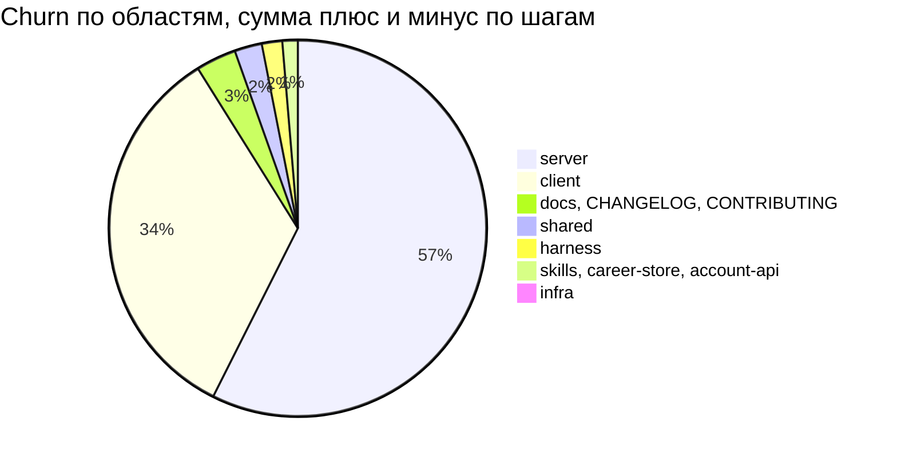

Строки `.rs` в сервере после каждого шага образуют V: сначала код удаляли, потом добавляли абстракции и импорты.

| Точка | Строк в `server/*.rs` |
|---|---|
| b6fad0e | 33 108 |
| #18 | 32 627 |
| #21 | 29 268 |
| #22 | 28 664 |
| #25 | **28 192** (минимум) |
| #26 | 28 777 |
| #27 | 29 120 |
| #29 | 29 458 |
| #31 | 29 670 |
| #32 | 30 209 |
| #33 | 31 473 |

Падение в #21 (−3 316 строк) — это в основном вынос кода в career-store: 3 298 строк перенесены побайтно (в career-store 3 306 вместе с новым `lib.rs` на 8 строк), 5 строк — удалённый `server/src/lib.rs`, ещё 13 — удалённые `allow(clippy)` в 7 файлах сервера.

---

## 4. Текущая архитектура

### 4.1 Карта крейтов

**Было (b6fad0e).** Обе диаграммы нарисованы по одному правилу: сплошные стрелки — используемые зависимости, пунктирные — объявленные, но не используемые, нужные только тестам или скрытые связи.

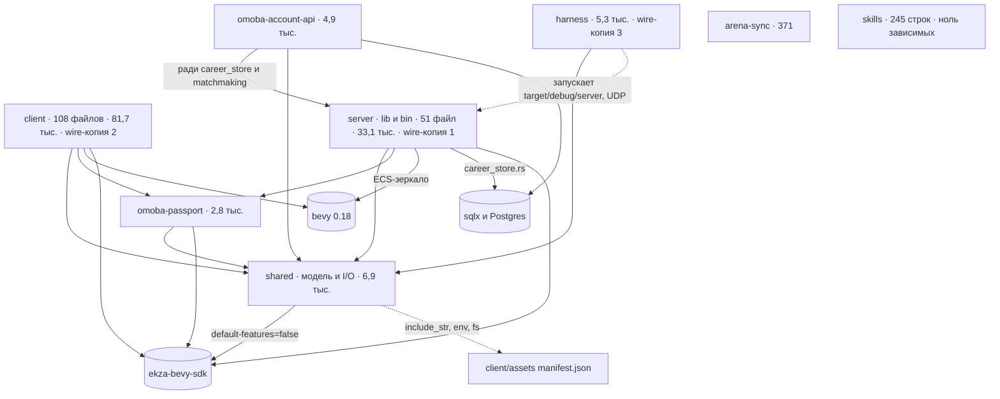

**Стало (4efbd8b).** Новое по сравнению с «было»: узел career-store и его рёбра, пропало ребро `account-api → server` и узел `skills`, рёбра `server → bevy` и `server → sqlx` стали пунктирными.

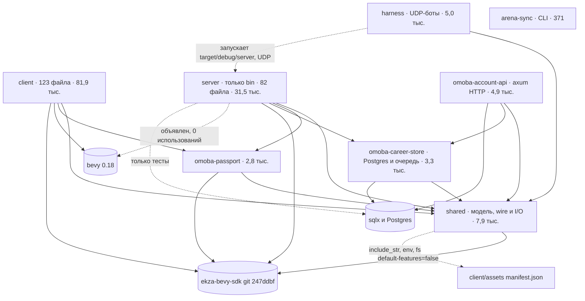

«`account-api` без Bevy» верно только для сборок с `-p`. В сборке `--workspace` (так собирает CI) унификация фич resolver-2 включает фичу `bevy` у SDK, потому что её запрашивает `client`. Это вывод из семантики Cargo, а не замер.

| Крейт | Роль | Файлов до → после | Строк до → после | Прод до → после (loc2) | Тест до → после (loc2) |
|---|---|---|---|---|---|
| `client` | Bevy-клиент, bin и lib | 108 → 123 | 81 729 → 81 902 | 59 231 → 58 925 | 22 498 → 22 977 |
| `server` | игровой UDP-сервер (standalone, lobby, match) | 51 → 82 | 33 108 → 31 473 | 15 585 → 14 372 | 17 523 → 17 101 |
| `omoba-career-store` | хранилище карьеры (Postgres), очередь матчмейкинга, миграции | — → 5 | — → 3 306 | — → 1 665 | — → 1 641 |
| `shared` | модель, wire, баланс, математика, ростеры аватаров (с I/O) | 26 → 28 | 6 922 → 7 941 | 4 971 → 5 523 | 1 951 → 2 418 |
| `harness` | black-box UDP-боты и сценарии | 18 → 18 | 5 324 → 5 049 | 2 271 → 1 921 | 3 053 → 3 128 |
| `omoba-account-api` | HTTP: портал, устройства, supporter | 13 → 13 | 4 947 → 4 947 | 2 986 → 2 986 | 1 961 → 1 961 |
| `omoba-passport` | паспорт Ekza, store аватаров | 16 → 16 | 2 800 → 2 800 (побайтно без изменений) | 1 684 | 1 116 |
| `arena-sync` | офлайн-утилита: карточки аватаров из Solana | 1 → 1 | 371 → 371 (побайтно без изменений) | 371 | 0 |
| `skills` | сирота | 1 → удалён | 245 → — | 185 → — | 60 → — |
| **Итого** | | **234 → 286** | **135 446 → 137 789** | **87 284 → 87 447** | **48 162 → 50 342** |

Прод и тест здесь посчитаны по конвенции loc2, как в §2.2 (`gap/loc2.py`, приложение C); `build.rs` клиента и пример в account-api (197 строк) считаются продом. Другие два парсера (приложение D) не считают эти 197 строк продом и по-другому режут `server`, поэтому дают итог прода примерно на 150 строк меньше: ~87 140 → ~87 279.

Прод сервера в таблице уменьшился только из-за выноса `career_store.rs` и `matchmaking.rs` в career-store (1 657 строк прода, перенесены побайтно). Без них серверный прод вырос: 13 928 → 14 372 (+444, +3,2 %, §2.2).

### 4.2 Процессы и развёртывание

На уровне процессов программа **ничего не изменила**:
- набор env-переменных сервера, career-store, account-api, passport и harness совпадает до и после (44 имени, пустой дифф);
- SQL-миграции перенесены из `server/` в `career-store/` без изменений;
- `mobile/`, `billing/`, `passport/` и `arena-sync/` не менялись.

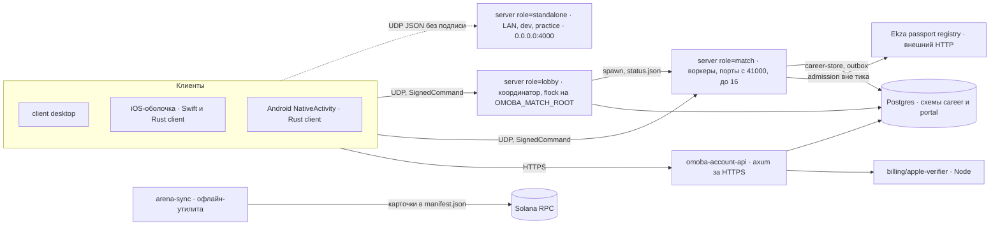

Стрелки клиентов идут от всей группы: iOS- и Android-оболочки обёртывают тот же Rust-клиент и ходят теми же путями, что desktop.

В одной базе живут **два независимо пронумерованных набора миграций**:
- `career_schema_version`: advisory lock 721946001, версии 1–3;
- `portal.schema_version`: advisory lock 721946101, версии 1–3.

Оба применяются командой `omoba-account-api migrate`. Так было и до программы.

### 4.3 Сервер

#### Карта модулей (4efbd8b)

| Слой | Файлы и размер | Что внутри |
|---|---|---|
| Точка входа | `main.rs` 61 | 45 объявлений `mod` (10 из них `#[cfg(test)]`) и `fn main() { runtime::run() }` |
| Runtime | `runtime/mod.rs` 265, `tick.rs` 169, `dispatch.rs` 348, `ports.rs` 136 | `ServerRuntime` (28 полей), конструктор `with_ports`, цикл `run`, приём пакетов, порты |
| Обработчики | `runtime/handlers/` 543: join 144, debug 103, session 89, combat 63, movement 45, utility 42, shop 41, mod 16 | 16 методов `handle_<variant>`, все возвращают `ControlFlow<()>` |
| Симуляция | `sim/`: minions 445, cast 266, towers 255, neutrals 237, projectiles 232, mod 101 | правила боя, реген маны, баз и командных баффов |
| Мир и сущности | `game_world.rs` 93, `entities.rs` 381, `hero.rs` 153, `hero_timers.rs` 170, `hero_stats.rs` 198 | `GameWorld` (15 полей), `ConnectedPlayer`, view для провода, формулы |
| Политика | `match_rules.rs` 312, `career_port.rs` 73 | таблица режимов; трейт хранилища (29 методов) |
| Вывод | `snapshot.rs` 314, `formation.rs` 145 | сборка снапшотов для каждого получателя, формирование матча |
| Фичи | `career_backend` 1 900, `career_runtime` 1 244, `bots` 1 198, `sandbox` 905, `session` 638, `match_service` 625, `shop` 595 и др. | карьера, боты, Combat Test, сессии, аллокация матчей |
| Тесты | `tests/`: 11 файлов, 2 933 строки, 53 теста | бывшие тесты из `main.rs` (все 50 имён сохранены) и новые |

**Граф модулей.** Импорты теперь явные: 157 рёбер между 35 прод-модулями. Это видимый результат, но разрезать граф ещё предстоит: **29 из 35 модулей входят в одну сильно связную компоненту** (цикл). Этот цикл существовал и раньше, но был скрыт glob-импортами корня крейта.

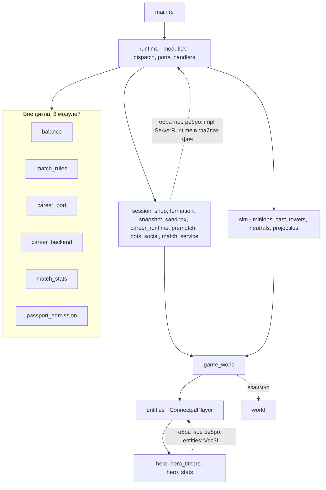

#### Тик: было и стало

**Было:**

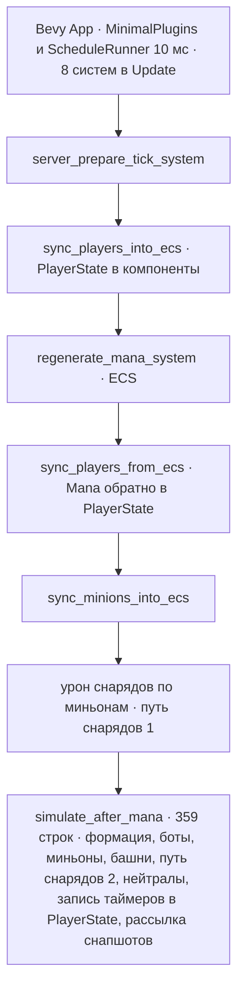

**Стало** (`server/src/runtime/tick.rs`):

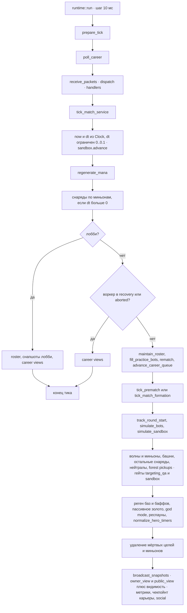

Функцию снарядов тик вызывает дважды: сначала по миньонам, потом по остальным целям. Так сохранён порядок бывших ECS-систем. Это осознанно закодированная совместимость.

`ARCHITECTURE.md:83-84` называет цикл «fixed-step», но `dt` — это разница реального времени, ограниченная 0,1 с. Фиксирован только шаг сна в 10 мс.

#### Модель состояния героя

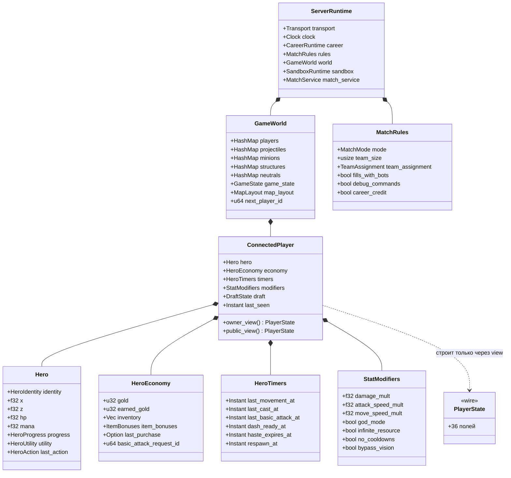

На диаграмме показаны не все поля. Полные размеры: `ServerRuntime` 28 полей, `GameWorld` 15, `ConnectedPlayer` 13, `Hero` 12, `HeroEconomy` 8, `HeroTimers` 7, `StatModifiers` 14, `MatchRules` 11 (режим, размер команды и 9 флагов политики, см. §2.1).

| `ConnectedPlayer` | Было | Стало |
|---|---|---|
| Полей | 23 | 13 |
| Wire-состояние | `state: PlayerState` (36 полей) хранилось и мутировалось | не хранится; ровно 2 литерала `PlayerState { … }`, оба в `entities.rs` |
| Часы | 8 полей типа `Instant` | `HeroTimers` (7 полей), чистые функции чтения и один `normalize_hero_timers` на тик |
| Debug и sandbox | 4 разрозненных поля, читаются в 52 местах | `StatModifiers` (14 полей), 44 обращения через `.modifiers.` |
| Формулы статов | разбросаны (три формулы max-pool) | `hero_stats.rs`, 12 функций. Но все берут `ConnectedPlayer`, а не `Hero` |

#### Порты и обработчики

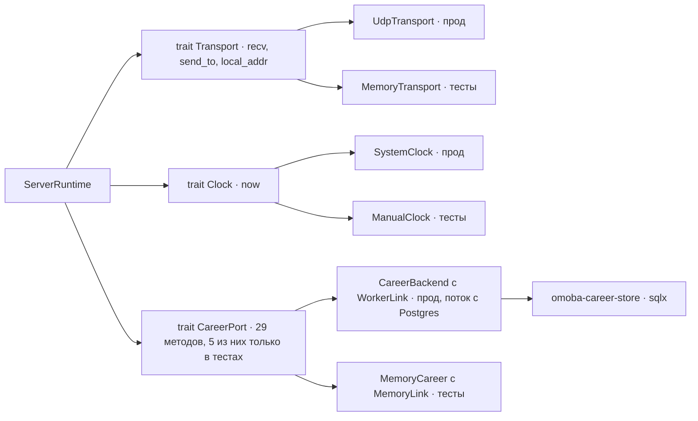

- `ServerRuntime::with_ports` — единственный конструктор. `new` и `new_with_map` оборачивают его процессными портами, `for_test` — портами в памяти.
- **Порты почти не используются в тестах:** 3 фикстуры на `for_test` против 22 вызовов `ServerRuntime::new` с реальным сокетом на `127.0.0.1:0` (в тестах 41 вызов `UdpSocket::bind`).
- Диспатчер выполняет упорядоченные проверки допуска, затем по одному обработчику на вариант пакета. `Continue` запускает общий хвост, `Break` повторяет старый ранний `return`. **Порядок веток значим**, это ловушка для будущих правок.
- Обработчики принимают распакованные поля варианта. Поэтому у `handle_join` 11 параметров, у `handle_transform` и `handle_utility` по 8. Workspace-allow `too_many_arguments` это скрывает.

#### Что на сервере осталось слабым

| Проблема | Факт |
|---|---|
| Один большой цикл модулей | 29 из 35 прод-модулей в одной SCC, 16 взаимных пар (`entities↔hero`, `entities↔prematch`, `runtime↔{session, sandbox, snapshot, …}`) |
| `ServerRuntime` — хаб | 93 прод-метода в 19 файлах; `career_runtime.rs` добавляет 25, `sandbox.rs` 13, `bots.rs` 10 |
| `GameWorld` — набор публичных полей без инвариантов | 149 прямых обращений к `world.players` в прод-коде; id-аллокаторы увеличиваются вручную в 6 местах; 22 функции всё ещё берут `HashMap<SocketAddr, ConnectedPlayer>` |
| Крупные функции | `simulate_minions` 345 строк, воркер `career_backend` 338, `simulate_bots` 282, `handle_cast_request` 208, `broadcast_snapshots` 193 |
| Политика воркер/standalone размазана | около 19–20 мест `match_service.worker()`, как и до программы. `REFACTORING.md` пишет «eleven», это устарело. `runtime::run` выбирает режим по `humans.len() == 10` |
| Мёртвые зависимости | `bevy` в `server/Cargo.toml` при 0 использований; `sqlx` нужен только тестам, но объявлен обычной зависимостью |
| Особые случаи sandbox и QA в общем тике | в `tick.rs` 3 проверки `self.sandbox`, 3 `targeting_qa` и 5 гейтов `sandbox_simulating` |

### 4.4 Протокол

#### Владение типами: было и стало

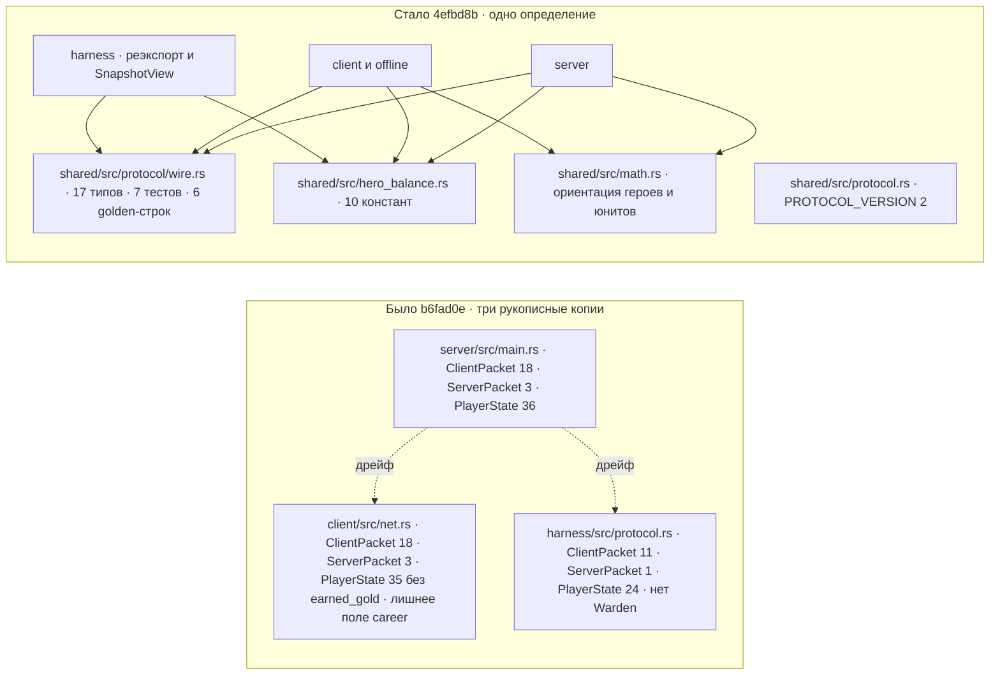

| Показатель | server (было) | client (было) | harness (было) | shared (стало) |
|---|---|---|---|---|
| Вариантов `ClientPacket` | 18 | 18 | 11 | 18 |
| Вариантов `ServerPacket` | 3 | 3 | 1 | 3 |
| Полей `PlayerState` | 36 | 35 | 24 | 36 |
| Полей `Snapshot` | 20 | 21 (лишнее `career`) | 15 | 20 |
| Атрибутов `serde(default)` | 54 | 73 | 66 | 73 |

Все 19 значений по умолчанию, которых не было в серверной копии, стоят на типах server→client. Поэтому то, как сервер декодирует `ClientPacket`, не изменилось.

#### Поток пакетов

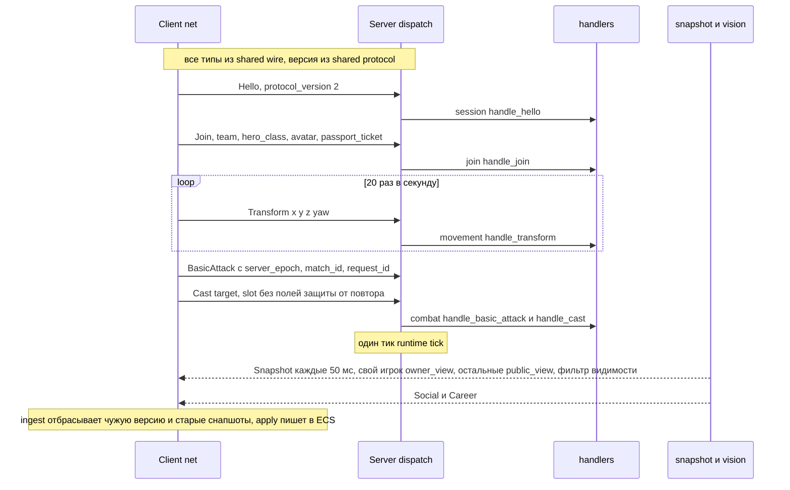

#### Правила протокола (сейчас)

1. **Единственный источник.** Wire-типы живут только в `shared/src/protocol/wire.rs` (CONTRIBUTING.md:34). Клиент держит только Bevy-мосты `Team` и `StructureKind` с 6 `From`/`PartialEq`.
2. **Golden-тесты.** 6 точных строк зафиксированы до переноса (Snapshot, Social, SetGodMode, Transform, BasicAttack, Join). Кроме них: все 18 вариантов `ClientPacket` как JSON-фикстуры, round-trip трёх `ServerPacket`, проверка декодирования legacy-снапшота и точные строки для `GameState` и `TargetId`.
   - Слабое место: `Career` проверяется только round-trip'ом от `Default`, так что переименование его поля тест пропустит.
3. **Аддитивные изменения.** Новое поле обязано иметь `serde(default)` и обновлённую golden-строку. `PROTOCOL_VERSION` поднимают только при несовместимом изменении (`ARCHITECTURE.md:200-215`).
   - Версия — одно `u16` со строгим сравнением в 5 местах. Согласования версий и минимальной совместимой версии нет.
   - Нет правила для **новых вариантов enum**: 44 из 51 enum в `shared` строгие. Клиент выбрасывает весь датаграм при ошибке декодирования.
4. **Редакция.** Владелец получает `owner_view`. Все остальные, включая союзников, получают `public_view`, где обнулены 7 полей: `gold`, `earned_gold`, `inventory`, `item_bonuses`, `last_purchase`, `basic_attack_request_id` и `utility.last_request_id`.
   - Ключи JSON сохранены, версия не менялась.
   - На golden-фикстуре запись чужого игрока уменьшилась с 1 019 до 938 байт (−8 %, оценка на python).

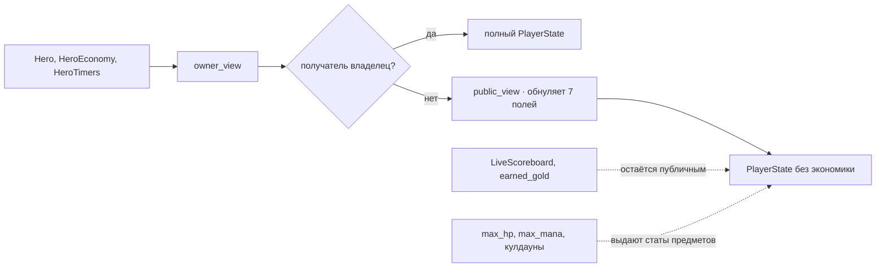

**Где протокол ещё слаб:**
- Редакция частичная: `earned_gold` уходит всем через скорборд (`shared/src/live_score.rs:21`).
- Разделение на публичное и приватное держится на соглашении: новое приватное поле по умолчанию разошлётся всем.
- Тип SDK (`ekza_bevy_sdk::EkzaCharacter as CharacterChoice`) входит в контракт провода, поэтому смена ревизии SDK может изменить формат.
- `Cast` и `UpgradeSkill` не содержат полей защиты от повтора. В публичных ролях это закрыто подписанным `SignedCommand` с монотонным `sequence`.
- 4 debug-варианта живут в продуктовом `ClientPacket`, но закрыты гейтами.
- `client/src/net/offline.rs` (1 195 строк) — вторая реализация правил поверх того же провода.

### 4.5 Клиент

#### Конвейер кадра (на 5a1178d)

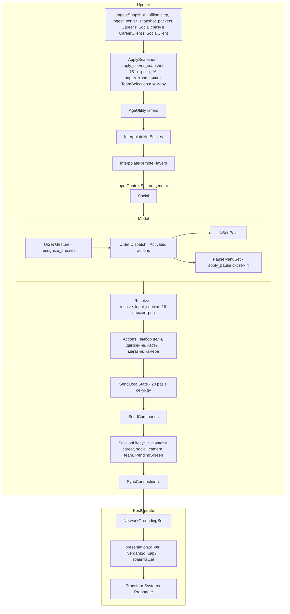

Стадии существуют как наборы систем (`ClientNetPipeline`, 10 стадий; блок побайтно тот же, что до программы). На 5a1178d `ApplySnapshot` — одна система, это и показано на диаграмме.

**#39 (9889f07), влит после 5a1178d**, разбил её на цепочку `SnapshotApply::{Begin, Session, Resources, Entities, Finish}` внутри `ApplySnapshot`. Длина функций с сигнатурой (подсчёт скобок по `git show 9889f07:client/src/net/apply.rs`):
- `apply_snapshot_session` — 17 строк;
- `apply_snapshot_resources` — 71 строка;
- `apply_snapshot_entities` — 702 строки, это прежнее тело начиная с гейта Draft.

Там же появилась очередь `SessionEvent` (9 вариантов) в `ClientSession.outbox` и пустой пока набор `SessionReactions`. Следующий срез 15b2 делит `Entities` и убирает `SnapshotUiState`.

#### Модули `net/` (4efbd8b)

| Файл | Строк | Отвечает за |
|---|---|---|
| `session.rs` | 1 383 | жизненный цикл сессии, `ClientSession` (8 публичных полей) |
| `apply.rs` | 1 341 | `apply_server_snapshot` |
| `offline.rs` | 1 195 | офлайн-«сервер» practice (вторая реализация правил) |
| `transport.rs` | 666 | UDP, фрейминг, декодирование |
| `commands.rs` | 589 | `send_network_commands` (13 параметров, 315 строк) |
| `ingest.rs` | 390 | приём и выбор свежего снапшота, маршрутизация Career и Social |
| `components.rs` | 331 | сетевые компоненты, мост `StructureKind` |
| `test_fixtures.rs` | 316 | фикстуры |
| `interpolate.rs` | 313 | интерполяция |
| `public_transport.rs` | 257 | подписанный публичный транспорт |
| `status_ui.rs` | 250 | UI состояния соединения |
| `mod.rs` | 173 | `NetworkingPlugin`, порядок конвейера |

Разрез был строго move-only: 164 функции до и после, тела отличаются только видимостью (111 `pub(in crate::net)`), переносами строк от rustfmt и путями. Связность не изменилась: `net` ссылается на те же 23 модуля клиента, а на `ClientSession` вне `net` ссылаются 40 файлов (25 прод, 13 QA, 2 тестовых).

#### UI kit (`client/src/ui/`, 6 файлов, 1 378 строк, 10 тестов)

| Модуль | Что даёт |
|---|---|
| `theme` | палитра и стили кнопок (`ui_theme.rs` стал 4-строчным шимом) |
| `gesture` | `Pressable`, `TapTracker`, `recognize_presses`, `GestureEpoch`, `SyntheticPress`; побеждает самая верхняя кнопка |
| `action` | `UiAction<T>`, `Activated<T>`, `add_ui_action`; срабатывает по фронту, без повтора при удержании |
| `widgets` | конструкторы кнопок и строк |
| `test_id` | `TestId`, `harness::press` для тестов и QA |
| `mod` | `UiKitPlugin`, `UiPlatform` (платформа определяется один раз), `UiSet::{Gesture, Dispatch, Paint}` |

Пока кит полностью используют 2 экрана: пауза и practice. Карьера использует только `Pressable` и `GestureEpoch`. Старые пути живут параллельно: 29 вхождений `MenuButton`, 56 сырых запросов `Interaction`, 9 отдельных систем прокрутки.

#### Что изменилось после среза (5a1178d)

- `client/src/domain/`: `RoundId`, `Team`, `CombatStats`, маркеры акторов (#35).
- 2D- и 3D-бэкенды закрыты 37 гейтами `in_models3d()`/`in_sprite2d()`; всего `run_if` 14 → 38 (#35).
- `combat.rs` → `combat/` (13 файлов, `targeting.rs` переехал внутрь); `player.rs` → `player/` (7 файлов), перенос без правок (#36).
- `client/src/plugins.rs`: `NetPlugins`, `UiPlugins`, `GameplayPlugins`, `PresentationPlugins`; затем `#[cfg(feature = "qa")] QaPlugins` (#37).
- `client/Cargo.toml`: `[features] default = ["qa"]`, 39 гейтов `feature = "qa"`, QA-харнессы в `client/src/qa/`. CI гоняет `clippy -p client --lib --no-default-features` (#37).
- Порядок `UiKitPlugin` → `MobileControlsPlugin` → `MobileUiPlugin` сохранён; это единственные чтения ресурсов на этапе build.
- Уже после 5a1178d: `SessionEvent` и стадии `SnapshotApply` (#39, срезы 15a и 15b1, см. выше).

#### Что в клиенте всё ещё монолитно (на 5a1178d)

| Что | Факт | Шаг |
|---|---|---|
| `apply_server_snapshot` (на 5a1178d; частично закрыто в #39) | 761 строка, 16 параметров (предел Bevy, обходится через `SnapshotUiState`), 3 точки возврата, 3 почти одинаковых бандла спауна локального героя. После #39 это 5 стадий, но `apply_snapshot_entities` — 702 строки, и `SnapshotUiState` остаётся | 15b1 (#39), 15b2 |
| `net` пишет чужое состояние (на 5a1178d; частично закрыто в #39) | `update_session_lifecycle` чистит career и social, двигает камеру, ставит `PendingScreen`; ingest пишет в `CareerClient` и `SocialClient`; нет `SessionEvent`. #39 добавил `SessionEvent`, но потребителей у событий пока нет, прямые записи остались | 15a (#39), 15c, 15d |
| `ClientSession` | 8 публичных изменяемых полей, 25 прод-файлов вне `net` | 15e |
| Двойной гейт режима | 37 гейтов `run_if`, при этом 93 проверки `PlayerVisualMode` внутри систем остались | 10, уборка |
| Большие файлы | `career.rs` 3 306, `presentation2d.rs` 2 428, `mobile_controls.rs` 2 260, `social.rs` 2 236 | 9b |
| Системы на пределе в 16 параметров | 9, из них 6 не QA (`apply_server_snapshot`, `career::render`, `select_target_system`, `resolve_input_context`, `handle_player_input`, `wallet_connect_ui_system`) | 9b, 15 |
| Ключ раунда | 9 модулей сами строят ключ `(server_epoch, match_id)` | 15c |
| Offline practice | отдельная симуляция, разошедшаяся с сервером (герой «Level 6» с пулами 1-го уровня) | 11 и O16 |

---

## 5. Качество и страховка

### 5.1 Тесты по крейтам

| Крейт | `#[test]` b6fad0e | `#[test]` 4efbd8b | Прогон на 4efbd8b | Примечание |
|---|---|---|---|---|
| shared | 69 | 78 | 78 passed | +7 в `wire.rs`, +1 `math`, +1 `hero_balance` |
| server | 306 | 285 | 282 passed, 3 ignored | 28 тестов ушли в career-store; без них 278 → 285 |
| career-store | — | 28 | 13 passed, 15 ignored (нужен Postgres) | перенесены из server |
| client | 536 | 543 | 543 | на 5a1178d 549 (529 без `qa`) |
| harness | 46 | 46 | 22 unit и 24 black-box | 13 тестовых таргетов cargo («13 suites» в сводке гейта): lib, bin `bots` и 11 файлов в `harness/tests` |
| account-api | 23 | 23 | 17 ignored (Postgres) | |
| passport | 21 | 21 | 3 ignored (внешний реестр) | |
| skills | 5 | — | — | крейт удалён |
| **Итого Rust** | **1 006** | **1 024** | | считались атрибуты, а не выполненные тесты |
| Python `scripts/` | 112 методов | 112 | 84 OK, 1 skipped | пропуск — это весь класс asset-gate (28 методов) |
| Python `mobile/ios` | 42 | 42 | **не запускается в CI** | на Linux проходят: 42 OK |

**Новая страховка:**
- **9 golden- и characterization-тестов:** 5 в `wire.rs`, 2 в `tests/player_view.rs` (сериализованные `owner_view` и `public_view` через всю жизнь героя и для sandbox-акторов), 2 в `match_rules.rs`.
- Тесты из `main.rs` переехали в `server/src/tests/` (11 файлов, все 50 имён сохранены, добавлено 3).
- Появились `MemoryTransport` и `ManualClock`, но используют их пока 4 теста.

**Чего CI не видит:**
- 35 тестов с Postgres (career-store 15, account-api 17, server 3). В CI нет сервиса БД, флаг `--ignored` не передаётся.
- `postgres_live_udp` при отсутствии URL выходит досрочно и засчитывается как passed.
- Документированная команда `cargo test -p server career_store -- --ignored` с #21 выбирает 0 тестов. Она записана в 3 местах.
- Класс asset-gate (28 тестов лицензий и запрещённых ассетов) пропускается целиком.
- `mobile/ios` (42 теста) и `billing/apple-verifier` (5 JS-тестов) не запускаются.
- Нет ни одной сборки или проверки под Android и iOS.

### 5.2 CI

| Job | Что делает | Длительность (зелёный прогон, 4efbd8b) |
|---|---|---|
| rust | `fmt --check`, `clippy --workspace --all-targets -D warnings`, `test --workspace --locked --exclude harness` | 8 мин 27 с, из них компиляция тестов около 7 мин и прогон 6,6 с |
| harness | `build -p server`, затем `test -p harness --test-threads=1` | 5 мин 51 с, из них тесты 4 мин 44 с. 3 теста занимают 60 % времени (ждут реальные игровые таймеры) |
| scripts | `python3 -m unittest discover -s scripts` | 23 с |

Первый холодный прогон длился около 27 мин 50 с. Toolchain 1.94.1 закреплён в `rust-toolchain.toml` и продублирован в двух местах `ci.yml`.

### 5.3 Инцидент с CI

1. **CI добавлен в 1da8bed и на первом прогоне был полностью зелёным**, включая харнесс (278 с). В описании PR #30 и в итоговой сводке по рефакторингу сказано, что CI был красным на каждом прогоне с момента добавления workflow. По GitHub Actions API это неверно.
2. **#18 сломал lib-тест харнесса.** Харнесс начал строго декодировать общими типами, и fixture с `null`-списками перестал разбираться (`bot_ai::tests::midgame_rally_uses_an_open_lane_then_the_weakest_tower`). В описании PR #30 причиной назван #20, это ошибка.
3. **Cargo останавливается на первом упавшем тестовом таргете.** Поэтому **24 black-box теста в CI не выполнялись ни для одного из 11 слияний #18–#28**, включая самые рискованные серверные: #22 (разрез мира), #25 (удаление ECS) и #26/#27 (модель героя). Шаг харнесса падал за 14–23 с; зелёный прогон длится около 4 мин 40 с.
4. **Юнит-job падал ещё дважды:**
   - #23: флейк `match_pool::tests::only_one_coordinator_can_own_a_root_and_drop_releases_it` (`server/src/match_pool.rs:386`). **Он не исправлен и остаётся в наборе.**
   - #27: гонка в тесте passport admission (исправлено в #30).
5. **Никто не ждал результата.** Каждый PR сливался через 3–14 с после старта его CI-прогона. `main` не защищён (`protected=false`). Правило 2 в `REFACTORING.md` прямо предписывает «открыть PR и сразу слить». Проверка на PR #18 падение поймала, но на неё не посмотрели. Сам #18 локально только компилировал харнесс (`cargo test -p harness --no-run`).
6. **#30 починил 4 тестовые проблемы**, и с него все push-прогоны `main` зелёные: от #30 (run 26) до #38 (run 44) и #39 (run 46). Push-прогоны `main` идут чётными номерами, нечётные — прогоны PR. При этом две проверки #30 ослабил, а не только починил:
   - XP за лесные лагеря теперь принимает `expected + k·90`;
   - повторный `begin()` admission принимает Pending или Free.
7. **Вывод «бисект показал, что регрессий геймплея нет»** (итоговая сводка по рефакторингу; единственная запись о проверке — описание PR #30) опирается на три вещи: зелёный локальный gate, зелёный CI начиная с #30 и одну проверку `jungle_camps` (3 из 3 без нагрузки на двух точках: текущий сервер и сервер до #25). **Это не бисект по #18–#28.** Тесты `jungle_camps` и `legacy_snapshots` в CI вообще не падали, потому что CI до них не доходил.

### 5.4 Документация

Добавлено 16 `.md` (1 356 строк): `ARCHITECTURE.md` 278, `REFACTORING.md` 114, `ui-kit.md` 139 и 13 progress-заметок. В `CONTRIBUTING.md` появились правила `make check` и «wire-типы только в shared».

Документы уже начали расходиться с кодом:

| Где | Расхождение |
|---|---|
| `CHANGELOG.md` | два заголовка `## [Unreleased]` (на 5a1178d строки 7 и 138, на 9889f07 — 7 и 144) |
| `REFACTORING.md` | «eleven» мест `worker()` (фактически около 19–20); «this PR» вместо номеров #37 и #38 (6 строк на 5a1178d; #39 добавил ещё 4) |
| `career-store/src/career_store_tests.rs:2`, `career-store/migrations/postgres/README.md:130`, `docs/public-mvp.md:169` | команда `-p server career_store` выбирает 0 тестов |
| `CHANGELOG.md:24` и progress-заметка про hero-stats | утверждают, что `PlayerEquipment` навешивается только на локального игрока; на самом деле и на удалённых (`net/apply.rs:556`, `:599`) |
| `ARCHITECTURE.md` | у `shared` указана зависимость только от `serde` и «нет I/O», у server не указаны `bevy`, `sqlx` и SDK; тик назван «fixed-step» |
| `mobile/ios/TESTFLIGHT.md:166` | ссылается на `client/src/net.rs`, которого больше нет |

---

## 6. Изменения поведения и риски

В диапазоне b6fad0e..4efbd8b одно wire-видимое изменение (BC1) и ещё 16 записей реестра: мелкие правки поведения и рефакторинги, заявленные как «без изменений». Версия осталась `0.23.0-rc.6`, протокол — 2.
- **Видимы игроку при нормальной работе семь:** BC1, BC4, BC6, BC8, BC9, BC10, BC11. Отдельный тест есть у трёх (BC1, BC9, BC11), частичное покрытие у одного (BC8), у трёх теста нет (BC4, BC6, BC10).
- **Заметны игроку только при регрессии ещё два:** BC12 (кнопки паузы и practice переведены на UI kit) и BC16 (видимость touch-контролов на телефоне). Их тоже нужно проверить руками (§9).

| # | Изменение | PR | Где | Чем проверено | Проверить руками | Риск |
|---|---|---|---|---|---|---|
| BC1 | Не-владельцы получают `public_view` без 7 полей экономики (wire) | #29 | `server/src/entities.rs:255-275`, `snapshot.rs:238` | `vision/tests.rs:655`, `:711`; `tests/player_view.rs` | **Да:** матч на 2 клиентах (панели союзников и врагов, скорборд, Combat Test UI) | низкий–средний; версия не поднята; утечка через скорборд осталась |
| BC2 | Попадания снарядов по миньонам в порядке id, а не хеша | #25 | `sim/projectiles.rs` | косвенно: `combat_feedback/tests.rs:408`, `terminal_result_tests.rs:329` | нет | низкий |
| BC3 | Тик без Bevy App, один реген, один путь снарядов | #25 | `runtime/mod.rs:258-262`, `tick.rs` | юнит-тесты; харнесс начиная с #30 | тайм-матч или soak | низкий–средний: тик и CPU не измерены; при слиянии харнесс в CI не работал |
| BC4 | Покупка в песочнице больше не сбрасывает неизрасходованные очки навыков | #29 | `sandbox.rs` | **нет теста** | **Да:** Combat Test — поднять уровень, купить предмет, очки остаются | низкий |
| BC5 | God mode вне Combat Sandbox пропускает стоимость маны у каста | #29 | `sim/cast.rs:68,91,209` | только флаг (`practice_tests.rs:1427`) | нет: на проводе не видно, пул восполняется до снапшота | пренебрежимо |
| BC6 | Offline practice: реген маны 12 → 8/с, скорость снаряда 30 → 19 | #20 | `client/src/net/offline.rs` | **нет теста** | **Да:** ощущения в offline practice | намеренное изменение |
| BC7 | Значение по умолчанию `next_level_xp` в legacy 120 → 90 | #18, #20 | `shared/src/protocol/wire.rs:32` | `wire.rs:833` | нет | пренебрежимо: сервер всегда шлёт это поле |
| BC8 | Актёр Combat Test смотрит по ходу движения (раньше бежал спиной) | #20 | `server/src/sandbox.rs:862` | конвенция в `shared/src/math.rs:41` | **Да** | низкий |
| BC9 | Тапы в карьере через общий гейт: landscape и фокус; в preview эмуляция мышью | #24 | `client/src/ui/gesture.rs:210-216` | `career.rs:2457`, 3 теста gesture | **Да:** iOS/Android; в portrait тапы игнорируются | низкий–средний |
| BC10 | «×» в шапке паузы не зеленеет при наведении | #24 | `ui/theme.rs` | **нет теста** | **Да:** визуально | косметика |
| BC11 | Перекрывающиеся кнопки: побеждает самая верхняя (`stack_index`) | #24 | `ui/gesture.rs:248` | `gesture.rs:399` | **Да:** на touch-устройстве | низкий |
| BC12 | Пауза и страница practice на UI kit, QA нажимает через `SyntheticPress` | #24 | `pause_menu.rs`, `practice_sandbox.rs` | 12 и 2 теста, число не изменилось | **Да:** прокликать паузу, настройки, practice, звук | низкий |
| BC13 | Харнесс декодирует строго общими типами | #18 | `harness/src/protocol.rs`, `bot.rs:85-96` | фикстуры починены в #30 | нет | только тестовый инструмент |
| BC14 | У клиента убрано мёртвое поле `career` в `Snapshot`; изменён порядок ключей в `buy_item` | #18 | `wire.rs` | 7 тестов `wire.rs` | нет | низкий |
| BC15 | Часы, транспорт и карьера за портами; Postgres через `WorkerLink` | #32 | `runtime/ports.rs`, `career_backend.rs` | `tests/sessions.rs:201`, `career_runtime_tests.rs:188`; реальная БД только в 3 ignored-тестах | **Да:** вход и сохранение результата матча на реальном Postgres | средний |
| BC16 | `MobileControls.enabled` по умолчанию `false` и копируется из `UiPlatform` в `build()` | #24 | `mobile_controls.rs:579-582` | порядок плагинов сохранён; на Linux компилируется | **Да:** на телефоне видны ли touch-контролы | средний (только на устройстве) |
| BC17 | Рефакторинги, объявленные «без изменений» (#26, #27, #29, #33) | — | порядок веток диспатчера значим | `player_view.rs:201`, `:394`, golden-тесты | нет | низкий, но ловушка для будущих правок |
| После среза | Debug-переключатели отклоняются в раундах, выделенных воркеру | #34 | `runtime/handlers/debug.rs` (`debug_toggles_allowed`) | `match_allocation.rs:395` | нет | закрыта давняя дыра: god mode мог попасть в сохраняемый результат |

Не проверено вообще:
- игра в реальном клиенте;
- мобильные сборки: изменений строк внутри `#[cfg(target_os = "android" | "ios")]` нет, но на устройстве ничего не запускалось;
- потоки с Postgres вне in-process тестов;
- производительность.

Сборка снапшота была O(N²) и осталась O(N²), но теперь для каждого получателя строится N view вместо клонирования общего списка. Константа не измерена.

---

## 7. Что осталось по дорожной карте

| Шаг | Содержание | На 4efbd8b | На 5a1178d | PR | Следующее |
|---|---|---|---|---|---|
| 1 | CI, toolchain, `make check` | готово | готово | 1da8bed | обязательные проверки (O2), Postgres-job (O1), проверка компиляции под mobile (O24) |
| 2 | Один wire в shared, golden-тесты | готово | готово | #18 | политика новых вариантов enum (O10) |
| 3 | Баланс и ориентация | готово | готово | #20 (трекер ошибочно указывает также #19) | харнесс всё ещё считает yaw сам; `max_hp_for_level` не используется; формулы offline (O16) |
| 4 | Гигиена крейтов | готово частично | готово частично | #21 | I/O в shared — это шаг 13; мёртвые `bevy` и `sqlx` в server |
| 5 | `GameWorld`, разрез `main.rs` | готово | готово | #22 | — |
| 6a/6b/6c | Один тик; `PlayerState` как view; `StatModifiers` и редакция | готово | готово | #25, #26, #27, #29 | формулы от `Hero`, а не от `ConnectedPlayer` |
| 7 | `MatchRules` и порты | готово | готово | #31, #32 | перевести фикстуры на порты в памяти (обещано «вместе с шагом 14», не сделано); `AllocationRules` отложен |
| 8 | Разрез `net/` на клиенте | готово | готово | #23 | события сессии — это шаг 15 |
| 9 | Пилот UI kit | пилот готов | пилот готов | #24 | 9b |
| 10 | Клиентский domain, разрез combat и player, `run_if`, plugin groups, feature `qa` | **в работе** | **готово** | #35, #36, #37 | по желанию: 10h (сборки в магазины без `qa`), 10i (уход от реэкспорт-шимов), удалить 93 внутренние проверки режима |
| 11 | Одно семейство debug-команд (Combat Test, practice, offline) | не начат | не начат | — | серверная часть: O21 (sandbox и practice-места с `ServerRuntime`) |
| 12 | Data-driven каталоги | не начат | **готово** (12a–12e) | #38 | 12f по желанию (перекрёстные проверки на клиенте) |
| 13 | Ростеры и ассеты, типы SDK вне shared | не начат | не начат | — | ужатый срез из O30 и валидация из O5 можно сделать раньше |
| 14 | Обработчик на вариант пакета, явные импорты | готово | готово | #33 | — |
| 15 | События сессии клиента, поэтапное применение снапшота | не начат | не начат; **после 5a1178d в #39 влиты 15a и 15b1** (`REFACTORING.md` на 9889f07: «in progress: 15a+15b1») | #39 | 15b2 (разделить `apply_snapshot_entities`, убрать `SnapshotUiState`), 15c, 15d, 15e; 15f и 15g по желанию (`docs/plans/client-10-15.md`) |
| 9b | Продолжение UI kit: прокрутка, реестр модалок, экраны | не начат | не начат | — | расширить объём (O23, ужатый) |

Рекомендуемый порядок из трекера — **15 → 11 → 13 → 9b**.

---

## 8. Пространство для улучшений

Пункты O1–O30 проверены по коду среза 4efbd8b: у каждого есть доказательство со ссылками на строки этого коммита. После среза клиентские файлы переезжали (#35–#37, #39), а `shared/src/lib.rs` сократился с 1 325 до 994 строк (#38), поэтому на текущем `main` номера строк могут отличаться. Пункты Q1–Q9 (§8.1) проверены на 5a1178d. Нумерация O1–O30 взята из внутреннего списка проверки; каждый номер встречается в §8.2–§8.5. Для каждого пункта прошла отдельная оценка «ценность и цена для небольшой команды, которая выпускает MOBA». Где оценка понизила ценность или ужала объём, в таблице стоит уже скорректированный вариант. Цена: S — до дня, M — несколько дней, L — больше.

### 8.1 Быстрые победы: один гигиенический PR

Все пункты проверены на 5a1178d. Каждому нужен `cargo check` или тест, которые здесь не запускались.

| # | Что | Доказательство | Откуда взялось |
|---|---|---|---|
| Q1 | Удалить `bevy` из `server/Cargo.toml` | 0 обращений `bevy::` в `server/src` начиная с #25. Выигрыш небольшой: SDK сам зависит от bevy, унификацию фич надо проверить `cargo tree -p server -i bevy` | внесено в #25 |
| Q2 | Перенести `sqlx` у server в `[dev-dependencies]` | 0 использований в прод-коде; осталось 8, все в тестах | внесено в #21 |
| Q3 | Удалить `serde` у career-store | 0 обращений; `tokio` и `serde_json` используются, их оставить | внесено в #21 |
| Q4 | Слить два `## [Unreleased]` в `CHANGELOG.md` | строки 7 и 138 | внесено в #18 |
| Q5 | Исправить команду `-p server career_store` в 3 местах, добавить `make test-postgres` | выбирает 0 тестов | внесено в #21 |
| Q6 | Харнесс: использовать `shared::math::hero_yaw_towards` | `harness/src/bot_ai.rs:622`, `harness/src/bin/bots.rs:388` | было до программы |
| Q7 | `shared::hero_balance::max_hp_for_level` вызывают только собственные тесты | `hero_balance.rs:41` | внесено в #20 |
| Q8 | Мелочи из O9: 3 устаревших `allow(dead_code)`, 5 локальных clippy-allow, дублирующих workspace-allow, `skills/` в `LICENSING.md:10`, ревизию SDK вынести в `[workspace.dependencies]` | проверено grep | разное |
| Q9 | Документация: «eleven», «this PR», «fixed-step», карта крейтов в `ARCHITECTURE.md`, `PlayerEquipment` в `CHANGELOG`, `TESTFLIGHT.md` | §5.4 | разное |

Отдельно, но так же дёшево: **починить флейк** `match_pool::tests::only_one_coordinator_can_own_a_root_and_drop_releases_it`. Он был до программы, #30 его не трогал, а в run 13 он уронил CI.

### 8.2 Вне дорожной карты

**Безопасность и целостность**

| ID | Что | Доказательство | Ценность | Цена | Вердикт |
|---|---|---|---|---|---|
| O3 | Бюджет движения по времени вместо допуска на каждый пакет | `hero_stats.rs:149-158` прибавляет `+0.10` к каждому `Transform`. При лимите 120 пакетов/с потолок скорости 5 + 12 = 17 ед/с (**×3,4**). Обычный клиент на 20 Гц уже получает +40 % (7 ед/с). На standalone лимита на endpoint нет | средняя сейчас (публичного сервера нет, anti-cheat — non-goal MVP); **высокая** с открытием рейтингового PvP | S | делать. Бюджет начислять при приходе пакета, стартовать с допуска, тогда одиночные тесты не меняются. Нужен тест на пачку пакетов с `ManualClock`. Вместо новых полей в `Cast` поправить формулировку `ARCHITECTURE.md:206` |
| O4 | Лимит на endpoint'ы до join и никаких полных снапшотов непроверенным адресам в standalone | `ensure_connected` без лимита; каждый датаграм даёт около 100 снапшотов (по одному в 50 мс в течение 5 с `PLAYER_TIMEOUT`); по умолчанию слушает `0.0.0.0:4000` | средняя (LAN и хост беты; публичные роли уже защищены) | M | делать перед расширением беты: маленький статусный снапшот в ответ на каждый Hello/Ping плюс тест с `MemoryTransport` |
| O5 | Валидировать записи ростера аватаров при загрузке; arena-sync проверяет slug до `fs::write` | `arena-sync/src/main.rs:240,318` пишет файл по slug из цепочки (path traversal); `avatar_roster()` не проверяет правило `ekza-`, а `register_store_avatar` проверяет; admission отдаёт `Free` | средняя | S | делать ужатый вариант: около 10 строк в `avatar_roster()` и проверку slug в arena-sync. Типизацию arena-sync не делать (утилитой никто не пользуется) |
| O10 | Политика для новых вариантов enum, привязанная к `PROTOCOL_VERSION` | 44 из 51 enum строгие; клиент выбрасывает весь датаграм при ошибке | низкая сейчас, средняя с появлением сборок в магазинах | S | до первого публичного мобильного релиза: исчерпывающий `match` без `_` в тесте рядом с версией |
| — | Утечки редакции | `earned_gold` через `LiveScoreboard`; `max_hp`, `max_mana` и кулдауны выдают предметы | низкая | M, нужен bump протокола | решить вместе со следующим поднятием версии |

**Тесты, CI, процесс**

| ID | Что | Доказательство | Ценность | Цена | Вердикт |
|---|---|---|---|---|---|
| O1 | Postgres-тесты в CI и исправление документированной команды | 35 тестов не запускаются никогда; `postgres_live_udp` тихо засчитывается как passed; #21 и #32 перестроили путь хранения | **высокая**: результаты матчей, рейтинг, ключи устройств, supporter-леджеры | S | **делать первым.** Job с `services: postgres:16`, на push в main, ночью и на PR с путями `career*`/`account-api`/миграции. Упавшие при первом запуске тесты считать находками |
| O2 | CI как настоящий гейт | PR сливают через 3–14 с; `main` не защищён; 12 красных PR-прогонов слиты | средняя | S | делать: обязательные проверки, `gh pr merge --auto`, поправить правила 2 и 6 в `REFACTORING.md`, `--locked` в `verify-gameplay`. Сначала починить флейк и O20 |
| O20 | Сделать падения харнесса диагностируемыми | `harness/src/server.rs:81` отправляет stderr сервера в `null`, stdout выбрасывается; бинарник `target/debug/server` берётся без проверки свежести | средняя | S | делать: кольцевой буфер последних 200 строк, печать при панике, предупреждение о старом бинарнике. Ускорение таймеров отложить |
| O6 | Запускать 70 пропущенных Python-тестов | `mobile/ios` (42) не в CI; asset-gate (28) пропускается целиком, хотя байты запрещённых файлов нужны одному тесту; git-fallback недостижим в shallow clone | средняя | S | делать |
| O24 | Проверка компиляции под Android и iOS | 38 строк `target_os` в 9 файлах, FFI StoreKit; ни одна сборка после 1da8bed не компилировалась под mobile | средняя | M | сначала один раз вручную на Mac собрать `cargo check` под оба target. Затем Android-job в CI, iOS — вручную или раз в неделю |
| O8 | Время CI | около 7 из 8,5 мин уходит на сборку тестов; харнесс-job (около 5 мин 50 с) идёт параллельно и задаёт пол | низкая | S | коротко: один прогон с `--timings`, `line-tables-only` в тестовом шаге, закрепить action по SHA. Ключ кэша не трогать |
| O19 | Детерминизм серверных тестов | 22 фикстуры на реальном UDP против 3 на портах в памяти; тай-брейк башен по хешу | низкая | S (ужатый) | поправить формулировку `ARCHITECTURE.md` про fixed-step; тай-брейк по id в `sim/towers.rs`; новые тесты писать на `for_test`. Массовый перенос и fixed dt не делать |

**Баги и корректность, видимые игроку**

| ID | Что | Доказательство | Ценность | Цена | Вердикт |
|---|---|---|---|---|---|
| O11 | Портрет в карьере не видит аватары из store | `career.rs:1155-1160` грузит `avatars/{file}` в обход `ekza://` (`passport.rs:247-253`); платные аватары в 3D будут пустыми (визуально не проверено) | средняя | S | делать: одна строка через `thumbnail_asset_path` и тест. По желанию `AvatarThumbnails::get_or_load` вместо 4 копий цикла |
| O7 | Файл настроек перезаписывается на каждом prematch-снапшоте | `apply.rs:228-240` присваивает без сравнения → `persistence.rs:399-424` синхронно и неатомарно пишет до 20 раз в секунду в драфте; обрыв в момент записи теряет `client_session_id` | средняя | S | делать: сравнивать перед присваиванием, писать атомарно (temp и rename), тест |
| O16 | Offline practice разошлась с формулами сервера | «Level 6» с пулами 1-го уровня (`offline.rs:150-154`), лечение без масштабирования (20 против 23,9), реген мёртвым, Q записывается как Cast, а не Attack | средняя | S (ужатый) | делать офлайн-часть. Ботов харнесса не трогать: это рискует таймингом black-box тестов |
| O13 | Один резолвер цели вместо трёх копий | `basic_attack.rs:25-79` повторён в `sim/cast.rs:110-181` и частично в `sim/projectiles.rs:59-120` | средняя | S | делать: `cast.rs` вызывает существующий `resolve_hostile_target` (минус около 70 строк), тест «каст по защищённой башне отклоняется». Проверку `joined` для снарядов не менять |
| O17 | Жизненный цикл раунда спрятан в `record_match_metrics` | `session.rs:627-630`: функция «логирования» завершает карьерный раунд как Completed и ставит таймер реванша | средняя (ужатый) | S | ужатый вариант: `settle_finished_round` отдельно; `restart_round` выбирает Completed или Abandoned по состоянию; тест. Типизированные `MatchMetric` не делать |
| O29 | Восстановление outbox не покрыто тестами без БД | пролог воркера `career_backend.rs:1171-1213` проверяется только ignored-тестом | средняя (срез) | S | вынести чистую `recover_outbox(&Path)` и тесты на временной директории. Воркер и `AllocationRules` пока не трогать |
| O25 | Решение lock-in в выборе героя | `team.rs:1587-1655` — ветка «отправить игрока в матч» без тестов, 3 правки за короткое время; `Join` собирается вручную в 3 местах | средняя | S | делать чистую функцию `lock_in(...)` и тесты. Перенос файла сделать в 9b-3 |

**Структура (вне карты), низкая ценность, только ужатые варианты**

| ID | Что | Вердикт |
|---|---|---|
| O14 | Состояние слота умения считается в 3 местах (HUD desktop, мобильное кольцо, гейт каста) | этап 1 (S): `SlotState` в `shared`, чтобы и сервер использовал то же правило. Этап 2 (слой intent'ов) не делать |
| O15 | Видимость команды пересчитывается на каждый вызов | сначала измерить (лог переполнения шага на матче ботов 16v16); затем при желании считать видимость один раз на рассылку (S) |
| O12 | Три hex-декодера с разными правилами регистра | делать мимоходом, когда трогаются эти файлы. Это не дыра: байты те же |
| O18 | account-api пишет в таблицы career напрямую (3 записи) | после O1: одна константа версий схемы и сохранение причины ошибки `sqlx` (S) |
| O26 | `CareerClient` и `SocialClient` смешивают модель и UI | S: `render_view()` с исчерпывающей деструктуризацией и тест стабильности ключа. Полное разделение — внутри 9b-4 |
| O27 | Конфигурация читается из env в 161 месте | S: один разбор role, allocation и recovery в `runtime::run` (есть реальное расхождение семантики epoch) плюс 3 недостающих имени в `RUNBOOK.md` |

**Прочие пункты списка: вошли в дорожную карту, в быстрые победы или отклонены**

| ID | Что | Где в отчёте |
|---|---|---|
| O9 | Гигиена зависимостей: неиспользуемый `bevy` у server, ревизия SDK повторена в 5 объявлениях в 4 манифестах, `allow(dead_code)` не сообщает, когда перестаёт быть нужен | ужатый вариант — в Q1 и Q8 (§8.1) |
| O21 | Вынести practice-места, обработчики sandbox и «мозг» бота из `ServerRuntime`: `simulate_bots` на 282 строки проверяется только через весь runtime | серверная часть шага 11 (§7, §8.3) |
| O22 | Data-driven каталоги героев и предметов; начать с отвязки числа предметов от размера инвентаря | шаг 12, сделан в #38 (§7) |
| O23 | Расширить 9b: все системы прокрутки, реестр модалок, ресурс `ScreenMetrics` | ужатый вариант — в шаге 9b (§8.3), `ScreenMetrics` отклонён (§8.5) |
| O28 | Headless-крейт `sim`, чтобы offline practice и харнесс гоняли настоящие правила сервера | отклонён (§8.5) |
| O30 | Явный источник ростера аватаров без поиска относительно рабочей директории; свой реестр store-аватаров у каждого процесса | дешёвый срез — в шаге 13 (§8.3) |

### 8.3 На дорожной карте

| Шаг | Что добавить или уточнить |
|---|---|
| 15 | 15a и 15b1 влиты в #39: очередь `SessionEvent`, `SnapshotApplied`, стадии `SnapshotApply`. Дальше по плану: 15b2 (разделить `apply_snapshot_entities` на 702 строки, убрать `SnapshotUiState`), 15c, 15d, 15e (аксессоры `ClientSession`). Guard для O7 положить в `apply_snapshot_resources`: на 9889f07 присваивание `team_selection` стоит там (`apply.rs:289-290`) |
| 11 | Серверная часть (O21): вынести practice-места и чистый `decide()` бота из `ServerRuntime`, но сначала зафиксировать несколько детерминированных practice-раундов. Sandbox переделывать уже внутри шага 11 |
| 13 | Сначала дешёвый срез из O30 (S): убрать 3 кандидата манифеста относительно рабочей директории (`shared/src/lib.rs:336-342` на 5a1178d и 9889f07; на срезе 4efbd8b это `:667-673`) и печатать источник ростера при старте. Полный 13f делать только при реальной нужде |
| 9b | Расширить объём (O23, ужато): `ScrollArea` из уже отлаженного кода `mobile_ui`/`career` для всех 9 систем прокрутки, минимальный `is_open()` для модалок. `ScreenMetrics` не делать |
| 12 | Сделано в #38. Проверка оценивала JSON-каталоги как малоценные для небольшой команды: правка контента всё равно требует пересборки, `include_str!` без runtime override. Расширять эту механику стоит только при конкретной потребности |

### 8.4 Приоритетный список

1. **O1**: Postgres-тесты в CI и исправление команды. Высокая ценность, S.
2. **Гигиенический PR**: Q1–Q9. Низкий риск, S.
3. **Стабилизировать гейт**: флейк `match_pool`, затем **O20** (логи сервера в харнессе), затем **O2** (обязательные проверки, слияние после зелёного).
4. **O3**: бюджет движения. До открытия рейтингового PvP.
5. **Баги, видимые игроку**: **O11** (портреты store-аватаров), **O7** (файл настроек), **O16** (offline practice).
6. **Мелкие серверные срезы**: **O13**, **O17**, **O29** (после O1), **O25**.
7. **Перед расширением беты или публичным мобильным релизом**: **O4**, **O5**, **O6**, **O24**, **O10**.
8. **Дорожная карта**: 15 (продолжить с 15b2 после #39) → 11 (вместе с O21) → 13 (вместе со срезом O30) → 9b (вместе с O23).

Порядок зависит от одного решения владельца. Сделать CI обязательным (O2 в пункте 3) значит отменить правило «открыть PR и сразу слить» (правило 2 в `REFACTORING.md`). Если владелец решит это сразу, пункт 3 можно выполнить первым; остальной порядок не меняется. Раздел 9 повторяет эту же нумерацию.

### 8.5 Рассмотрено и отклонено или ужато

| Идея | Почему не в полном объёме |
|---|---|
| Выделить headless-крейт `sim` из сервера (O28) | Цена L и выше. Кроме 21 файла ядра придётся тянуть порядок тика, ботов и sandbox (около 3 тыс. строк). Бот харнесса — это мозг, а не копия правил. Ту же пользу дешевле дают шаг 11 и in-process тесты на `for_test` |
| Полная декомпозиция карьеры (O29 целиком, `AllocationRules`) | Повод для `AllocationRules` ещё не наступил: число мест `worker()` не растёт. Переделка воркера без Postgres в CI рискует результатами игроков |
| Кэш видимости на тик (O15 целиком) | Небольшие входы, выигрыш не измерен, риск устаревшего состояния внутри тика |
| career-store — единственный владелец схемы (O18 целиком) | Движение транзакционного SQL между крейтами при нуле работающих тестов с БД в CI |
| Детерминизм тиков (O19 целиком: fixed dt, массовый перенос тестов) | Меняет геймплей (тайминги). Флейки, починенные в #30, это бы не предотвратило |
| Типизированная конфигурация везде (O27 целиком) | Большая часть чтений в клиенте — QA: из 92 вызовов `env::var`/`env::var_os` в `client/src` на 4efbd8b 69 стоят в файлах с `qa` в пути (`grep`, python). Из 83 имён переменных 47 не упомянуты в `docs/`, `README.md`, `RUNBOOK.md` и `CONTRIBUTING.md`. Если учесть README крейтов, остаётся 41: переключатели безопасности `OMOBA_ALLOW_INSECURE_LOCAL`, `OMOBA_TRUST_LOOPBACK_PROXY` и `OMOBA_PORTAL_SECRET` описаны в `account-api/README.md:40-61`. Из этих 41 имени 33 — QA- и тестовые хуки, 3 — переменные Cargo и ОС (`OUT_DIR`, `CARGO_CFG_TARGET_OS`, `APPDATA`), 2 внутренние (`OMOBA_MATCH_ALLOCATION` и `OMOBA_MATCH_RECOVERY` выставляет сам lobby). Для оператора не описаны 3: `OMOBA_ACCOUNT_API_URL`, `OMOBA_OFFLINE_PRACTICE`, `OMOBA_BALANCE_OPENINGS` |
| Разделение `CareerClient`/`SocialClient` сейчас (O26) | Всё равно будет переделано в 15d/15g и 9b-4. Риск по IME и фокусу проверить без устройства нельзя |
| Слой intent'ов ввода (этап 2 O14), `ScreenMetrics` (O23), ускорение таймеров харнесса (O20) | L или высокий риск на чувствительном к таймингу вводе; устарело после 10e; добавляет рычаг в прод-код ради двух минут CI |
| Общий хелпер hex и Ed25519 (O12 целиком) | Эксплуатируемой разницы нет. Хелпер добавил бы крипто-зависимость в `shared` ради около 30 строк |

---

## 9. Рекомендации

### Следующие шаги по порядку

Нумерация та же, что в §8.4. Если владелец сразу откажется от правила «слить сразу», шаг 3 можно сделать первым.

1. **O1:** добавить Postgres-job в CI и исправить документированную команду. Сделать до любых перемещений SQL (O18, O29, шаг 13).
2. **Гигиенический PR** Q1–Q9.
3. **Стабилизировать гейт:** починить флейк `match_pool`, сделать O20 (логи сервера в харнессе), затем O2: защитить `main` и сделать 3 CI-job обязательными. Это решение владельца, оно меняет правило 2 в `REFACTORING.md`. Флейк и O20 идут раньше, чтобы обязательный харнесс не блокировал слияния случайными падениями.
4. **O3:** бюджет движения, до открытия рейтингового PvP.
5. **Баги, видимые игроку:** O11, O7, O16.
6. **Мелкие серверные срезы:** O13, O17, O29 (после O1), O25.
7. **Перед расширением беты или публичным мобильным релизом:** O4, O5, O6, O24, O10.
8. **Дорожная карта:** 15 (с 15b2, после #39) → 11 → 13 → 9b.

Два правила на всё время работы:
- держать перенос отдельно от поведения, а в PR с массовыми переносами (как #33) отделять импорты от логики;
- новые серверные тесты писать на `ServerRuntime::for_test`, старые переводить, только когда файл и так трогается.

### Что проверить руками (сборка с GPU и устройство)

| Проверка | Что должно быть |
|---|---|
| Матч на 2 клиентах | Панели союзников и врагов, скорборд и Combat Test UI выглядят нормально при редактированной экономике (BC1) |
| Offline practice | Скорость снарядов и реген маны ощущаются правильно (BC6). Заодно видно «Level 6» с пулами 1-го уровня (O16) |
| Combat Test | Актёр смотрит по ходу движения (BC8). После покупки предмета неизрасходованные очки навыков остаются (BC4) |
| Меню паузы | «×» не меняет цвет при наведении (BC10). Работают все кнопки настроек, practice и звука (BC12) |
| Телефон (iOS и Android) | Touch-контролы видны (BC16). Тапы карьеры работают в landscape (BC9). Из перекрывающихся кнопок срабатывает видимая (BC11) |
| Сборки под mobile | `cargo check -p client --target aarch64-apple-ios` и `--target aarch64-linux-android` на текущем `main`. Под mobile ничего не компилировалось с начала программы |
| Postgres | Вход, сохранение результата матча и восстановление после падения воркера на реальной БД (BC15) |
| Сервер | Тайм-матч или soak после удаления Bevy ScheduleRunner (BC3): стабилен ли шаг 10 мс |
| Карьера в 3D | Портреты купленных store-аватаров не пустые (O11) |
| Драфт | Нет подвисаний на экране выбора героя (O7) |

---

## Приложение: как получены цифры

### A. Точки и срезы

| Метка | Коммит | Где лежит |
|---|---|---|
| До | b6fad0e | временный worktree `scratchpad/wt-before` на этом коммите |
| После (срез) | 4efbd8b (#33) | временный worktree `scratchpad/wt-after` на этом коммите; отчёт писался в нём |
| «Текущий main» | 5a1178d (#38) | `origin/main` рабочей копии, измерялся через `git show` и `git grep` по объектам |
| Позже | 9889f07 (#39) | `origin/main` рабочей копии; проверен точечно (`git show --stat`, `apply.rs`, `REFACTORING.md`, run 46 в API) |

Worktree были временными копиями репозитория на указанных коммитах и в репозиторий не входят. Чтобы повторить замеры, достаточно `git worktree add <каталог> <коммит>`.

Диапазон `b6fad0e..4efbd8b`: 28 коммитов, из них 18 без merge и 17 first-parent. Первым идёт прямой push 1da8bed, затем PR #18–#33 (#29 влит после #30).

### B. Команды

- Размеры: `find . -name '*.rs' -print0 | xargs -0 wc -l | sort -rn`; `git grep -c '' <commit> -- '*.rs'`.
- Диффы: `git diff --shortstat b6fad0e HEAD [-- '*.rs']`; `git diff --shortstat <c>^1 <c>` для каждого first-parent коммита; `git diff -M --numstat` для churn по областям.
- Время слияний: `TZ=UTC git log --first-parent --format='%h %cd %s' --date=format-local:'%H:%M'`.
- Wire-типы: `rg -n '^\s*(pub(\(crate\))? )?(enum|struct) (ClientPacket|ServerPacket|PlayerState)\b'`.
- Тесты: `grep -rE '^\s*#\[(tokio::)?test' <crate> --include=*.rs | wc -l`; `grep -rn '#\[ignore'`.
- Импорты и allow: `grep -rnE '^use (super|crate)::\*;'`; `git grep -E 'allow\(clippy::'`.
- CI: GitHub Actions API (`list_workflow_runs`, `list_workflow_jobs`, `get_job_logs`) для `ci.yml` в `o-moba/omoba-bevy`; `list_branches` (`protected=false`).
- Процессы и env: `git grep` имён переменных по крейтам на b6fad0e и 5a1178d (44 имени, пустой дифф).

### C. Скрипты

Скрипты лежали во временном рабочем каталоге (`scratchpad/`) и в репозиторий не закоммичены. Ниже описана их логика, её достаточно, чтобы написать их заново.

| Скрипт | Назначение |
|---|---|
| `gap/loc2.py` | **основная конвенция прод/тест**. Тест — это `tests/`, `benches/`, `*_tests.rs`, `tests.rs`, `test_fixtures.rs`, файлы, подключённые через `#[cfg(test)] mod x;` (включая `#[path]`), и каждый элемент с `#[cfg(test)]`. Всё остальное, включая пустые строки и комментарии, — прод |
| `crates-audit/loc.py`, `crates-verify/vloc.py` | построчный и посимвольный разделители. Совпадают везде, кроме server (расхождение 7–9 строк) |
| `v_scan.py`, `v_loc.py`, `v_grep.py`, `v_struct.py`, `v_graph.py` | проверка сервера. `v_scan.py` заменяет комментарии и строки пробелами, находит блоки `#[cfg(test)]` по парным скобкам и для каждой функции считает параметры на нулевой глубине скобок, параметры с `HashMap`/`HashSet` и длину тела. `v_graph.py` собирает `use crate::{…}`, пути `crate::x` и `super::x` в прод-коде, сворачивает их до модулей верхнего уровня и ищет сильно связные компоненты алгоритмом Тарьяна |
| `vproto/defs.py`, `vproto/drift.py` | определения wire-типов и дрейф копий |
| `vclient/*.py` | клиент: разделение прод/тест, проверка move-only (`cmpfn*.py`), параметры систем, связность |
| `vq/tc.py`, `vq/tloc.py` | подсчёт тестов и доли тестовых строк |
| `gap/moved.py`, `gap/mobilecfg.py`, `gap/prodgrep.py`, `gap/ci/*.json` | доля перенесённых строк, изменения внутри mobile-cfg, прод-использования, данные CI |

### D. Расхождения и неопределённость

- **Прод-строки сервера** зависят от парсера:
  - loc2: 15 585 → 14 372, без перенесённых файлов 13 928 → 14 372 (+444);
  - построчный и посимвольный парсеры (`loc.py`, `vloc.py`): ~15 638 → ~14 401; они же дают итог прода по workspace ~87 140 → ~87 279, потому что не считают продом `build.rs` и пример в account-api (197 строк);
  - верификатор сервера, где `#[cfg(test)]`-хелперы считаются продом, без перенесённых файлов: 14 321 → 14 982 (+661);
  - эвристика «от первого `#[cfg(test)] mod` до конца файла» ошибочна (теряет около 1 100 строк `bots.rs`) и отброшена.
  
  В отчёте основная конвенция — loc2: по ней посчитаны §2.2 и таблица крейтов в §4.1. Прод-код всего workspace вырос на +137…+163 строк в зависимости от парсера.
- **Места `match_service.worker()`:** 19 по верификатору сервера, 20 по другому подсчёту, 26 строк у простого `grep` (с doc-комментариями). В `REFACTORING.md` написано «eleven».
- **Крупнейший прод-файл сервера** `career_backend.rs`: 1 302 (loc2) или около 1 505 (маска строк верификатора); всего в файле 1 900 строк.
- **Что оказалось неточным в итоговой сводке по рефакторингу и в описании PR #30** (проверено по GitHub Actions API, логам CI и `git log`):
  - сводка и PR #30: «CI красный с первого прогона» — на самом деле первый прогон (1da8bed) полностью зелёный;
  - PR #30: lib-тест харнесса сломал #20 — на самом деле #18;
  - сводка: четыре тестовые проблемы — был и пятый источник красного, флейк `match_pool`, он не исправлен;
  - сводка: шаг 10 на неслитой ветке — шаги 10 и 12 уже влиты (#35–#38), а шаг 15 начат в #39;
  - сводка: «бисект показал, что регрессий нет» — это одна проверка `jungle_camps`, 3 из 3 на двух точках.
- **Не измерено (нужна сборка или запуск):** время компиляции, размеры бинарников, реальный граф зависимостей по крейтам, латентность и CPU тика, размер живых снапшотов, накладные расходы на `dyn`-порты, поведение на устройствах.
