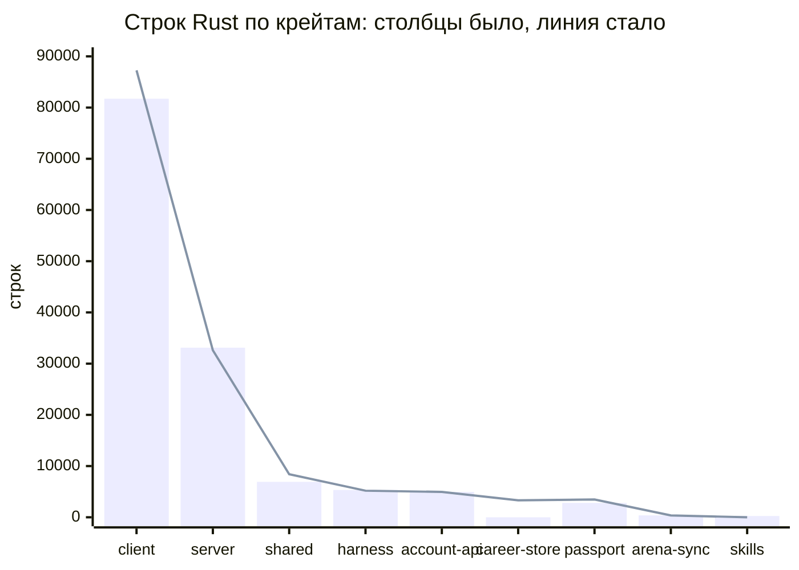
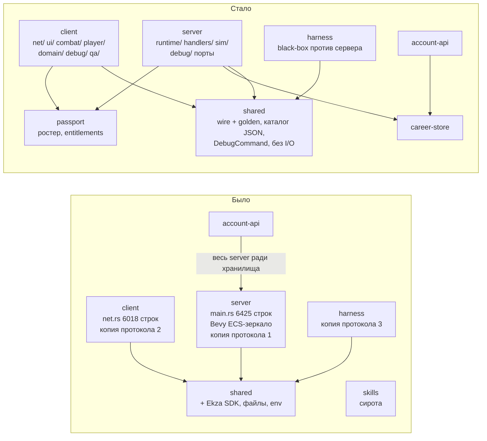
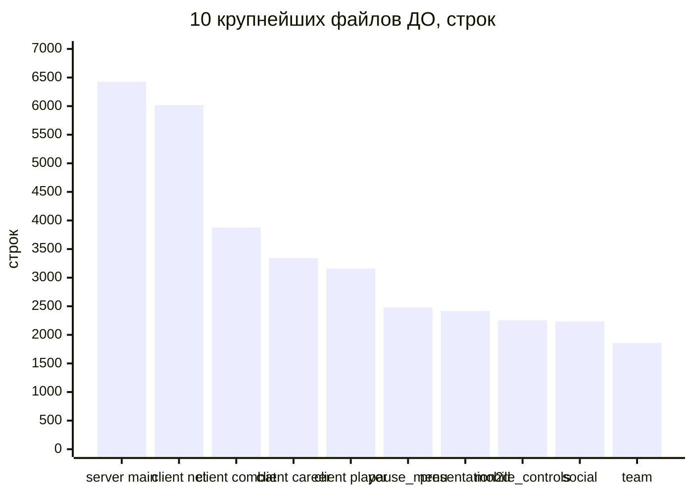
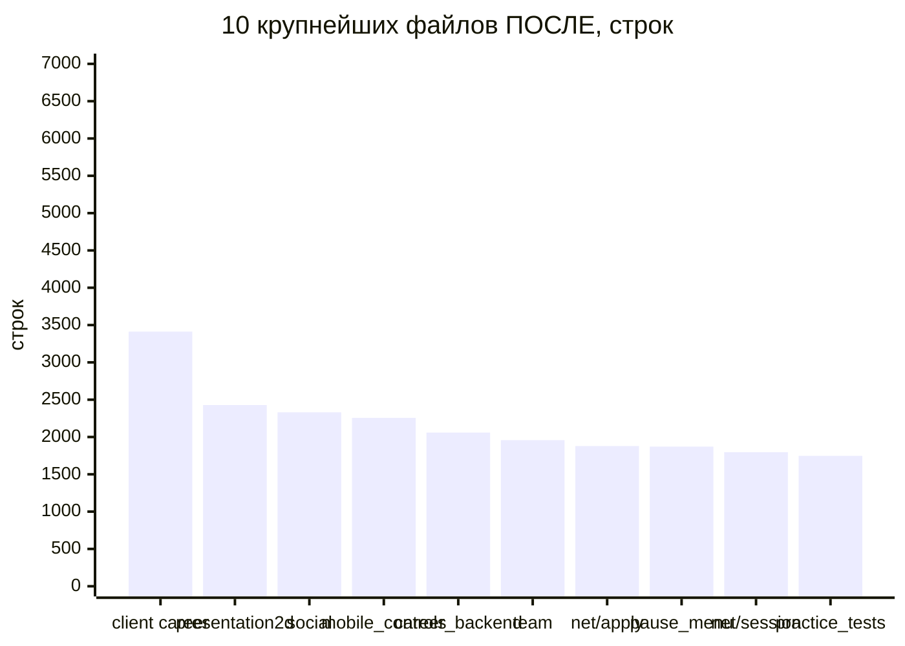
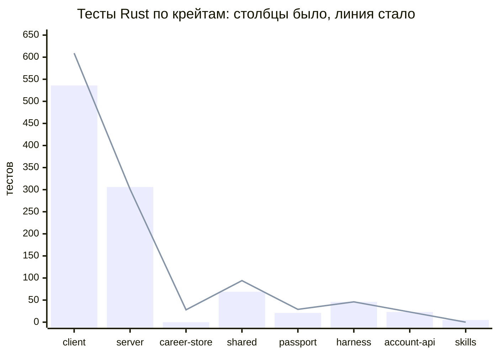
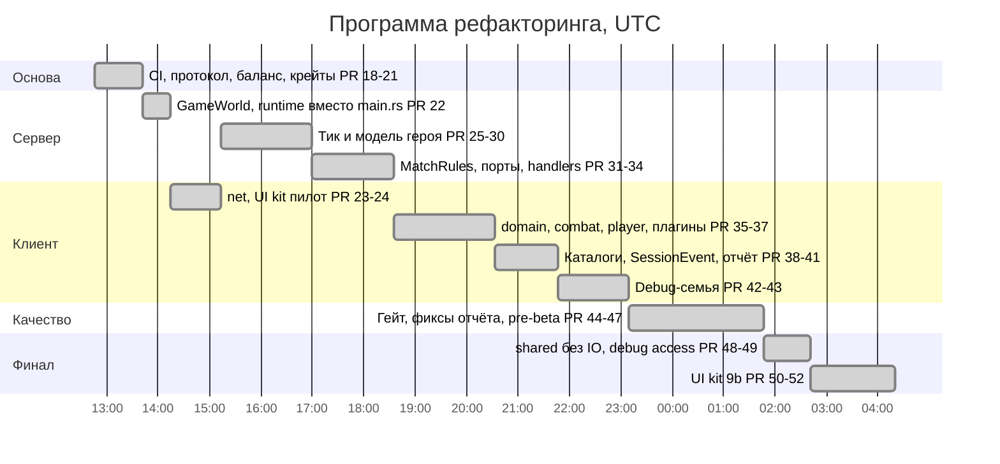
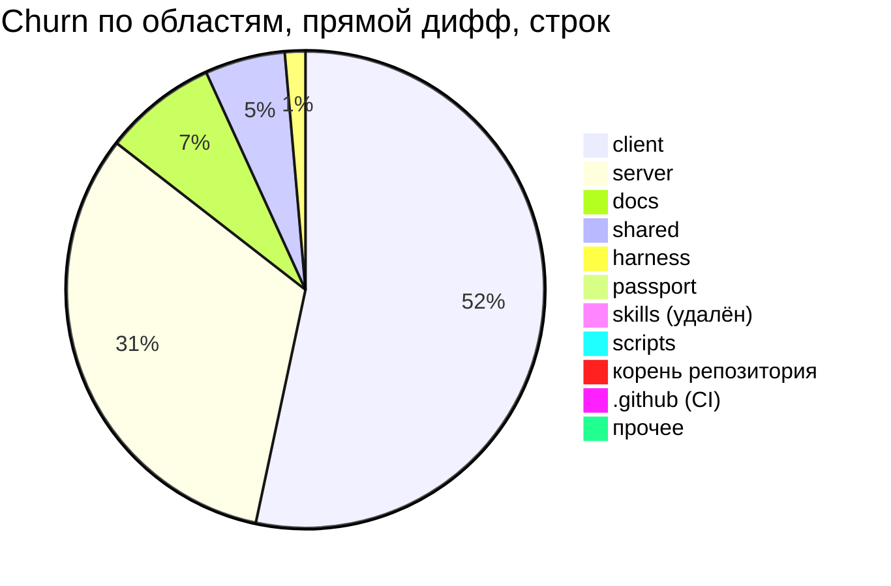

# Масштаб программы рефакторинга: было → стало

Этот документ даёт общую картину: сколько работы проделано, что было до
программы, что стало после, сколько строк и модулей, какие тесты и проверки
появились. Подробный технический разбор есть в
[ARCHITECTURE_REPORT.md](ARCHITECTURE_REPORT.md), пошаговый трекер — в
[REFACTORING.md](REFACTORING.md), заметки по каждому шагу — в
[progress/](progress/).

| Точка | Коммит | Что это |
|---|---|---|
| **Было** | `b6fad0e` (2026-09-24 10:32 UTC) | последний коммит `main` до программы |
| **Стало** | `1f5fff9` (2026-09-25 04:20 UTC) | `main` после последнего PR программы (#52) |

Все цифры ниже сняты командами (`git`, `wc -l`, `git grep`, небольшой скрипт
на Python) на этих двух коммитах. Методика описана в
[конце документа](#как-считались-цифры). Время везде в UTC.

---

## 1. Итог в цифрах

| Показатель | Было | Стало | Разница |
|---|---:|---:|---|
| Строк Rust (все `*.rs`) | 135 446 | 145 566 | +10 120 (+7,5 %) |
| — из них продуктовый код* | 88 633 | 91 849 | +3 216 (+3,6 %) |
| — из них тесты* | 46 813 | 53 717 | +6 904 (+14,7 %) |
| Файлов `.rs` (модулей) | 234 | 325 | +91: 101 новый, 10 удалено, 24 перенесено |
| Каталогов с кодом Rust | 39 | 51 | +15 новых, 3 исчезли |
| Крейтов в workspace | 8 | 8 | удалён `skills`, добавлен `career-store` |
| Самый большой файл | 6 425 (`server/src/main.rs`) | 3 412 (`client/src/career.rs`) | −47 % |
| `server/src/main.rs` | 6 425 | 62 | −99 % |
| Файлов > 3 000 строк | 5 | 1 | −4 |
| Файлов > 2 000 строк | 9 | 5 | −4 |
| Сумма строк в 15 крупнейших файлах | 42 316 | 29 634 | −30 % |
| Медиана размера файла | 386 | 313 | −19 % |
| Тестов Rust (`#[test]` и `#[tokio::test]`) | 1 006 | 1 130 | +124 |
| Тестов Python (`scripts/`) | 112 | 124 | +12 |
| Тестов Python (`mobile/ios`), запускаемых в CI | 0 из 42 | 42 из 42 | +42 |
| Golden- и characterization-тестов протокола и поведения | 0 | 18 | +18 |
| CI: workflow / job | 0 / 0 | 2 / 6 | с нуля |
| Закреплённая версия Rust | нет | 1.94.1 (`rust-toolchain.toml`) | с нуля |
| Локальных `#[allow(clippy::…)]` | 69 | 1 | −68 |
| Markdown-документов (строк) | 162 (12 430) | 197 (18 550) | +35 (+6 120) |
| PR в `main` | — | 35 (#18–#52) + 1 прямой коммит с CI | 36 изменений |
| Коммитов в `main` | — | 36 по первому родителю, 47 всего | |
| Изменено файлов (прямой дифф) | — | 351 | +48 265 / −31 468 строк |
| Сумма churn по шагам | — | 86 457 строк | добавлено плюс удалено |
| Длительность | — | 15 ч 34 мин | 24.09 12:46 → 25.09 04:20 |

\* Продуктовый код и тесты разделены эвристикой: тестом считается файл
`tests.rs`, `*_tests.rs`, `tests/…` и блок `#[cfg(test)] mod … { }` внутри
обычного файла. В отчёте ([§2.2](ARCHITECTURE_REPORT.md#22-метрики))
использовался другой парсер, поэтому абсолютные числа там немного другие,
а вывод тот же: почти весь прирост — это тесты.

Коротко:

- **35 PR за 15,5 часов**, в среднем одно слияние каждые 26 минут;
- **15 шагов дорожной карты + шаг 9b** закрыты полностью;
- **16 пунктов O\*, 9 пунктов Q\* и флейк** из отчёта исправлены отдельными PR;
- **было 0 CI, стало 6 job**: fmt, clippy, тесты, black-box харнесс,
  PostgreSQL, Android, Python и iOS.

---

## 2. Почему строк стало больше, а файлы стали меньше

Общий объём Rust вырос на 10 120 строк (+7,5 %). Это не раздувание:

| Куда ушли +10 120 строк | Строк | Доля |
|---|---:|---:|
| Новые тесты (golden, characterization, тесты портов, UI kit, prejoin, каталога и др.) | +6 904 | 68 % |
| Продуктовый код клиента (`SessionEvent`, стадии применения снапшота, UI kit, `debug/`, `plugins.rs`) | +1 498 | 15 % |
| Продуктовый код сервера и `career-store` (порты, `MatchRules`, `debug/`, `prejoin`, явные импорты) | +991 | 10 % |
| `shared` (каталог, `DebugCommand`, `wire_enums.rs`, планировщики) | +774 | 8 % |
| `passport` (ростер аватаров и entitlements переехали из `shared`) | +342 | 3 % |
| Удалён продуктовый код: крейт `skills` и третья копия протокола в `harness` | −389 | −4 % |

Продуктовый код вырос всего на 3,6 %, а тесты — на 14,7 %.

Большие файлы при этом исчезли. Код не стал короче, но разложен по файлам,
у каждого из которых одна задача:

- **39 → 51** каталог с кодом;
- **62 → 110** маленьких файлов (≤ 200 строк);
- **67 318 → 53 035** строк живут в файлах длиннее 1 000 строк: это 36 %
  кода вместо прежних 50 %.

Явные модули, границы видимости и импорты стоят строк: одних `use`-строк в
продуктовом коде сервера стало заметно больше (отчёт, §1: 136 → 540 строк
на срезе #33). Это осознанная цена: граф зависимостей стал видимым.

| Крейт | Файлов было → стало | Строк было | Строк стало | Разница |
|---|---|---:|---:|---:|
| client | 108 → 150 | 81 729 | 87 271 | +5 542 |
| server | 51 → 87 | 33 108 | 32 603 | −505 |
| career-store (новый) | 0 → 5 | — | 3 307 | +3 307, перенос из server |
| shared | 26 → 32 | 6 922 | 8 410 | +1 488 |
| harness | 18 → 18 | 5 324 | 5 189 | −135 |
| account-api | 13 → 13 | 4 947 | 4 947 | 0 |
| passport | 16 → 19 | 2 800 | 3 468 | +668 |
| arena-sync | 1 → 1 | 371 | 371 | 0 |
| skills (удалён) | 1 → 0 | 245 | — | −245 |
| **Итого** | **234 → 325** | **135 446** | **145 566** | **+10 120** |

Сервер вместе с вынесенным `career-store` вырос с 33 108 до 35 910 строк.
Весь прирост — тесты и явные слои: тестов в серверном коде стало больше, а
6 425-строчный `main.rs` исчез.

---

## 3. Как было → как стало

| Область | Было (`b6fad0e`) | Стало (`1f5fff9`) |
|---|---|---|
| **Протокол** | Три рукописные копии wire-типов: в `server/src/main.rs`, в `client/src/net.rs` и в `harness/src/protocol.rs` (522 строки). Всего 47 определений, копии разошлись: у харнесса было 11 из 18 `ClientPacket`, не было `warden` и `passport_ticket` | Одно определение: `shared/src/protocol/wire.rs` (1 046 строк, 9 тестов, 6 golden-строк) и `wire_enums.rs` (277 строк: 43 wire-enum закреплены за `PROTOCOL_VERSION`). В `harness/src/protocol.rs` осталось 157 строк: только транспорт |
| **Сервер: точка входа** | `main.rs` на 6 425 строк: wire-типы, `ServerRuntime` на 41 поле, диспатч, тик, 50 тестов | `main.rs` на 62 строки: список модулей и `fn main`. Остальное разложено по `runtime/`, `sim/`, `debug/`, `tests/` и 9 новым модулям верхнего уровня |
| **Сервер: тик** | Bevy `App`, 8 систем, копирование `PlayerState` в ECS-зеркало и обратно, два пути снарядов, две регенерации маны | Обычный цикл `prepare_tick` → `tick`. Одна регенерация, один путь снарядов, ECS-зеркало удалено, Bevy больше не зависимость сервера |
| **Сервер: состояние героя** | `PlayerState` (36 wire-полей) мутировался напрямую примерно в 100 местах в 10 файлах | `Hero`, `HeroEconomy`, `HeroTimers`, `StatModifiers`. `PlayerState` строится только в `owner_view` и `public_view`. Чужие золото и инвентарь больше не рассылаются |
| **Сервер: режимы матча** | `MatchMode::` в 46 местах в 7 файлах | Таблица `MatchRules::for_mode`, закреплена тестом `rules_table_per_mode` |
| **Сервер: I/O** | `UdpSocket` в поле, `Instant::now()` в тике, прямые вызовы `CareerBackend` | Порты `Transport`, `Clock`, `CareerPort`. Runtime целиком прогоняется в памяти (`MemoryTransport`, `ManualClock`, `MemoryCareer`) |
| **Сервер: диспатч** | Один `match` на 421 строку по 18 вариантам | `runtime/dispatch.rs` и 8 файлов в `runtime/handlers/`: один обработчик на вариант, `ControlFlow<()>` |
| **Сервер: импорты** | 36 glob-импортов, `use crate::*` в 10 модулях | 0 `use crate::*`, у каждого модуля явные импорты |
| **Клиент: сеть** | `net.rs` на 6 018 строк со своей копией протокола | `client/src/net/`: 12 файлов, по одному на стадию конвейера (`transport`, `ingest`, `apply`, `interpolate`, `session`, `commands`…). Очередь `SessionEvent`, поэтапное применение снапшота по видам сущностей |
| **Клиент: бой и игрок** | `combat.rs` 3 876, `targeting.rs` 1 743, `player.rs` 3 159 | `combat/` из 13 файлов (крупнейший 1 739), `player/` из 7 файлов (крупнейший 951), `domain/` с общими типами (`RoundId`, `Team`, `CombatStats`) |
| **Клиент: UI** | У каждого экрана свои маркер-компоненты, `handle_*`-системы, свой скролл и распознаватель тапов. Модалки проверялись вручную | UI kit `client/src/ui/` (8 файлов, 2 931 строка): `theme` с единой политикой `metric`, `gesture`, `UiAction<T>`/`Activated<T>`, `widgets`, `ScrollArea`, `ModalStack`, `TestId`. На кит переведены все экраны и HUD-кнопки: 129 упоминаний `UiAction`, 115 — `TestId` |
| **Клиент: плагины и QA** | 60 плагинов в 29 вызовах `add_plugins`; 18 QA-файлов (11 070 строк) всегда в сборке; `run_if` 14 раз | 6 `PluginGroup` (`NetPlugins`, `UiPlugins`, `GameplayPlugins`, `PresentationPlugins`, `DebugPlugins`, `QaPlugins`). QA в `client/src/qa/` за cargo-feature `qa` (39 `cfg`-гейтов), 2D/3D-бэкенды за `run_if` (48 раз) |
| **Debug-инструменты** | Три копии состояния god mode и speed boost на клиенте. Отдельные пакеты и пути для Combat Test, practice и offline. Сервер принимал god mode даже в раундах, выделенных воркеру | Одна семья `shared::debug::DebugCommand`. На сервере `server/src/debug/`, на клиенте `client/src/debug/` с `DebugToggles`. Доступ задаёт сервер: `Snapshot.debug_access`. Одна страница «Debug tools» |
| **Данные и каталоги** | Способности, предметы и базовые атаки — Rust-константы. Числа баланса объявлены в 21 месте в 8 файлах, offline practice разошёлся с сервером | `shared/assets/catalog/heroes.json` и `items.json` с валидацией при загрузке (`shared/src/catalog.rs`, 8 тестов). Баланс в одном месте, `shared::hero_balance`, ориентация в `shared::math`. Python-скрипты читают тот же каталог (`scripts/catalog.py`) |
| **`shared` без I/O** | `shared` зависел от Ekza SDK, читал файлы ростера и переменные окружения, искал файлы относительно рабочего каталога | `shared` зависит только от `serde` и `serde_json`. Ростер спрайтов в `client/src/sprite_roster.rs`, аватары и entitlements в `passport` (`assets.rs`, `avatars.rs`, `entitlements.rs`). `CharacterChoice` вместо типа SDK на проводе |
| **Крейты** | `account-api` зависел от всего `server` (Bevy, SDK), чтобы получить хранилище. Крейт `skills` — сирота | `omoba-career-store` — отдельный крейт, от него зависят и `server`, и `account-api`. `skills` удалён |
| **CI и гейт** | Нет `.github`, нет закреплённой версии toolchain | `ci.yml` (5 job: `rust`, `harness`, `postgres`, `android`, `scripts`; push, PR, ночной прогон) и `ios-check.yml` (раз в неделю и вручную). `make check`, `make test-postgres`. Правило: сливать только после зелёного CI |
| **Документация** | Не было карты архитектуры, трекера и описания UI kit | `ARCHITECTURE.md` (622 строки), `REFACTORING.md` (226), `ARCHITECTURE_REPORT.md` (1 182), `ui-kit.md` (340), 2 плана и 29 progress-заметок |

### Архитектура крупно

---

## 4. Крупнейшие файлы

| # | Было: файл | Строк | Стало: файл | Строк |
|---:|---|---:|---|---:|
| 1 | `server/src/main.rs` | 6 425 | `client/src/career.rs` | 3 412 |
| 2 | `client/src/net.rs` | 6 018 | `client/src/presentation2d.rs` | 2 428 |
| 3 | `client/src/combat.rs` | 3 876 | `client/src/social.rs` | 2 331 |
| 4 | `client/src/career.rs` | 3 341 | `client/src/mobile_controls.rs` | 2 256 |
| 5 | `client/src/player.rs` | 3 159 | `server/src/career_backend.rs` | 2 059 |
| 6 | `client/src/pause_menu.rs` | 2 479 | `client/src/team.rs` | 1 958 |
| 7 | `client/src/presentation2d.rs` | 2 418 | `client/src/net/apply.rs` | 1 879 |
| 8 | `client/src/mobile_controls.rs` | 2 253 | `client/src/pause_menu.rs` | 1 871 |
| 9 | `client/src/social.rs` | 2 234 | `client/src/net/session.rs` | 1 797 |
| 10 | `client/src/team.rs` | 1 860 | `server/src/practice_tests.rs` | 1 747 |
| 11 | `server/src/career_backend.rs` | 1 757 | `client/src/combat/targeting.rs` | 1 739 |
| 12 | `client/src/targeting.rs` | 1 743 | `client/src/minimap.rs` | 1 636 |
| 13 | `client/src/minimap.rs` | 1 627 | `client/src/game_vfx.rs` | 1 586 |
| 14 | `client/src/game_vfx.rs` | 1 581 | `client/src/shop.rs` | 1 526 |
| 15 | `server/src/practice_tests.rs` | 1 545 | `client/src/combat/tests.rs` | 1 409 |
| | **Сумма топ-15** | **42 316** | | **29 634** |

Судьба пяти самых больших файлов:

| Файл до | Строк | Что с ним стало |
|---|---:|---|
| `server/src/main.rs` | 6 425 | 62 строки. Содержимое разошлось по `runtime/` (14 файлов, 1 789 строк, из них `handlers/` 8 файлов), `sim/` (6 файлов, 1 467), `debug/` (3 файла), `tests/` (11 файлов, 3 102 строки; все 50 старых тестов сохранены по именам), `game_world.rs`, `entities.rs`, `snapshot.rs`, `hero*.rs`, `match_rules.rs`, `formation.rs`, `career_port.rs`. Wire-типы ушли в `shared` |
| `client/src/net.rs` (+ старые `net/offline.rs`, `net/public_transport.rs`) | 6 018 (+1 445) | `client/src/net/` из 12 файлов, 8 326 строк, крупнейший — `apply.rs` на 1 879. Прирост дали очередь `SessionEvent`, поэтапное применение снапшота и тесты |
| `client/src/combat.rs` (+ `targeting.rs`, `target_presentation_tests.rs`) | 3 876 (+1 974) | `client/src/combat/` из 13 файлов, 5 944 строки: `cast`, `cooldown`, `feedback`, `hotbar`, `bars`, `marker`, `mobile`, `selection`, `round_reset`, `targeting`, тесты |
| `client/src/career.rs` | 3 341 | 3 412: не разрезан. Теперь это крупнейший файл, кандидат на следующий шаг |
| `client/src/player.rs` | 3 159 | `client/src/player/` из 7 файлов, 3 213 строк: `input`, `motion`, `animation`, `respawn_ui`, тесты. Крупнейший файл 951 строка |

Файлы по размеру:

| Порог | Было | Стало |
|---|---:|---:|
| > 5 000 строк | 2 | 0 |
| > 3 000 строк | 5 | 1 |
| > 2 000 строк | 9 | 5 |
| > 1 000 строк | 36 | 35 |
| > 500 строк | 85 | 99 |
| ≤ 200 строк | 62 | 110 |

Файлов длиннее 1 000 строк почти столько же (36 → 35). Гиганты на 3–6
тысяч строк распались, но часть их кусков осталась в диапазоне 1 000–2 000
(`net/apply.rs`, `net/session.rs`, `combat/targeting.rs`). Нетронутые
клиентские модули (`career.rs`, `social.rs`, `team.rs`, `presentation2d.rs`,
`mobile_controls.rs`) остались крупными: их программа не резала.

---

## 5. Новые модули

**101 новый `.rs`-файл, 24 перенесены без изменений, 10 удалены. Появилось 15 новых каталогов**, исчезли 3 (`server/src/gameplay`,
`client/src/frontend_qa` — переехал в `qa/`, `skills/src`).

| Каталог или модуль | Файлов | Строк | Что внутри |
|---|---:|---:|---|
| **Сервер** | | | |
| `server/src/runtime/` | 6 | 1 323 | `mod` (цикл), `dispatch`, `tick`, `ports` (`Transport`, `Clock`), `prejoin` с тестами |
| `server/src/runtime/handlers/` | 8 | 466 | по обработчику на вариант пакета: `join`, `movement`, `combat`, `utility`, `shop`, `session`, `tools` |
| `server/src/sim/` | 6 | 1 467 | `cast`, `minions`, `neutrals`, `projectiles`, `towers` |
| `server/src/debug/` | 3 | 461 | `mod` (`debug_access`, `handle_debug`), `toggles`, `practice` |
| `server/src/tests/` | 11 | 3 102 | `bosses`, `cast`, `formation`, `minions`, `movement`, `neutrals`, `player_view`, `progression`, `sessions`, `snapshot` |
| модули верхнего уровня | 9 | 1 911 | `game_world`, `entities`, `snapshot`, `hero`, `hero_stats`, `hero_timers`, `match_rules`, `formation`, `career_port` |
| **Крейт `career-store`** | 5 | 3 307 | хранилище карьеры и matchmaking, перенесено из `server` побайтно, плюс `lib.rs` |
| **Клиент** | | | |
| `client/src/net/` | 10 новых (12 всего) | 8 326 | `apply`, `commands`, `components`, `ingest`, `interpolate`, `session`, `status_ui`, `transport`, `test_fixtures`, `mod` |
| `client/src/combat/` | 13 | 5 944 | см. §4 |
| `client/src/player/` | 7 | 3 213 | см. §4 |
| `client/src/ui/` | 8 | 2 931 | UI kit: `theme`, `gesture`, `action`, `widgets`, `scroll`, `modal`, `test_id` |
| `client/src/domain/` | 5 | 178 | `round`, `team`, `stats`, `actors` |
| `client/src/debug/` | 4 | 1 738 | `hud`, `console`, `tools_page`, `DebugToggles` |
| `client/src/qa/` | 19 | 10 782 | все QA-харнессы за feature `qa` (перенесены) и `supporter` |
| `client/src/plugins.rs`, `sprite_roster.rs` | 2 | 470 | группы плагинов, ростер спрайтов (из `shared`) |
| **Shared и passport** | | | |
| `shared/src/protocol/` | 2 | 1 323 | `wire.rs` (единственное определение протокола), `wire_enums.rs` |
| `shared/src/catalog.rs` + `assets/catalog/*.json` | 1 + 2 JSON | 675 + 317 | каталог героев и предметов с валидацией |
| `shared/src/debug.rs`, `math.rs`, `progression.rs` | 3 | 369 | `DebugCommand`, `DebugAccess`, ориентация, план прокачки |
| `passport/src/assets.rs`, `avatars.rs`, `entitlements.rs` | 3 | 664 | ростер аватаров и выдача entitlements (из `shared`) |

Удалены: `server/src/lib.rs`, `server/src/gameplay/` (ECS-зеркало),
`skills/src/lib.rs`, монолиты `client/src/{net,combat,player}.rs`,
`client/src/god_mode.rs`, `practice_sandbox.rs` и `ui_theme.rs`. Их
содержимое переехало в новые модули.

---

## 6. Тесты и гарантии

### Тесты по крейтам

Считаются атрибуты `#[test]` и `#[tokio::test]` в исходниках.

| Крейт | Было | Стало | Примечание |
|---|---:|---:|---|
| client | 536 | 609 | UI kit, стадии снапшота, `SessionEvent`, debug access, lock-in |
| server | 306 | 301 | 28 тестов ушли в `career-store`; без них 278 → 301 |
| career-store | — | 28 | перенесены из `server`, в CI идут против настоящего PostgreSQL |
| shared | 69 | 94 | golden-тесты протокола, `wire_enums`, каталог, `debug`, планировщики |
| passport | 21 | 29 | ростер и entitlements |
| harness | 46 | 46 | 22 unit и 24 black-box |
| account-api | 23 | 23 | |
| skills | 5 | — | крейт удалён |
| **Итого Rust** | **1 006** | **1 130** | **+124** |
| Python `scripts/` | 112 | 124 | `catalog.py`, `postgres_tests.py`, `check_combat_balance` |
| Python `mobile/ios` | 42, не в CI | 42, в CI | |

### Новые виды страховки

| Вид | Было | Стало |
|---|---|---|
| **Golden wire-тесты** | не было | `shared/src/protocol/wire.rs`: 9 тестов, 6 golden-строк. Байты `Snapshot`, `Join` и других пакетов закреплены. Аддитивное поле `debug_access` проверено отдельным тестом |
| **Политика wire-enum** | не было | `wire_enums.rs`: 43 enum, исчерпывающие `match` без `_`, скан требует классифицировать каждый новый serde-enum в `shared` (5 тестов) |
| **Characterization** | не было | `server/src/tests/player_view.rs`: сериализованные `owner_view` и `public_view` на протяжении жизни героя. `match_rules`: таблица политик по режимам. Временные тесты эквивалентности «старый код = новый» при переносе каталога (побитово, `f32::to_bits`) и планировщиков (все классы × уровни 1–10 × бюджет 0–1000), удалены вместе со старым кодом |
| **Runtime в памяти** | не было | `MemoryTransport`, `ManualClock`, `MemoryCareer`: полный серверный runtime без сокета и реального времени (тесты движения, prejoin, сессий) |
| **Black-box харнесс в CI** | не было CI | Отдельный job: собирается сервер, 24 теста ботов играют против него по UDP. После #44 харнесс при падении печатает последние 200 строк вывода сервера |
| **PostgreSQL в CI** | 35 тестов с БД не запускались нигде | Job `postgres` с сервисом `postgres:16`: миграции, роли, `--include-ignored`. `postgres_live_udp` падает, а не молча проходит, без БД |
| **Python** | не было CI | Job `scripts`: `scripts/` и `mobile/ios`. Класс asset-gate выполняет 27 тестов из 28 |
| **Android / iOS** | ни одной проверки | `cargo check -p client --target aarch64-linux-android` в каждом прогоне. `aarch64-apple-ios` в `ios-check.yml` раз в неделю и вручную |
| **Сборка без QA** | не было | `clippy -p client --no-default-features`: продуктовая сборка без feature `qa` проверяется отдельно |
| **Строгий clippy** | не было | `-D warnings` на закреплённом toolchain 1.94.1 |

---

## 7. Хронология PR

Все изменения в `main` после `b6fad0e`. Время — слияние в `main`. Колонка
«Файлов, +/−» — дифф этого коммита относительно предыдущего `main`. #25,
#27 и #29 влиты merge-коммитом, остальные — squash.

| PR | Слито | Файлов, +/− | Что сделано |
|---|---|---|---|
| — (1da8bed) | 24.09 12:46 | 16, +193/−75 | Шаг 1: CI-гейт, закреплённый toolchain 1.94.1, `make check`, исправлены замечания clippy |
| #18 | 24.09 13:20 | 36, +1 387/−1 565 | Шаг 2: одно определение протокола в `shared` для сервера, клиента и харнесса; golden-тесты |
| #19 | 24.09 13:20 | 2, +122 | Карта архитектуры и дорожная карта (`ARCHITECTURE.md`) |
| #20 | 24.09 13:29 | 21, +215/−120 | Шаг 3: константы баланса в `shared::hero_balance`, ориентация в `shared::math` |
| #21 | 24.09 13:42 | 68, +87/−725 | Шаг 4: крейт `career-store`, удалён сирота `skills`, убраны лишние `allow` |
| #22 | 24.09 14:15 | 60, +7 952/−8 489 | Шаг 5: `GameWorld` + `TickCtx`, модульный runtime вместо `main.rs` на 6 000 строк |
| #23 | 24.09 14:37 | 17, +5 863/−5 604 | Шаг 8: `net.rs` разрезан на дерево `net/` (только перенос) |
| #24 | 24.09 15:13 | 25, +2 321/−1 690 | Шаг 9: пилот UI kit — тема, жесты, типизированные действия, виджеты |
| #25 | 24.09 15:26 | 23, +330/−724 | Шаг 6a: один тик, одна регенерация маны, один путь снарядов, ECS-зеркало удалено |
| #26 | 24.09 15:43 | 35, +994/−304 | Шаг 6b: `PlayerState` как view поверх состояния героя, `HeroTimers` |
| #27 | 24.09 15:59 | 61, +1 988/−1 553 | Шаг 6b: авторитетные `Hero` и `HeroEconomy` |
| #28 | 24.09 16:08 | 2, +107 | Трекер рефакторинга и страница передачи работы (`REFACTORING.md`) |
| #30 | 24.09 16:54 | 5, +48/−16 | Детерминированные тесты харнесса и admission, падавшие в CI |
| #29 | 24.09 17:00 | 34, +814/−326 | Шаг 6c: `StatModifiers` и формулы `hero_stats`; чужая экономика скрыта от не-владельцев |
| #31 | 24.09 17:14 | 21, +492/−205 | Шаг 7: `MatchRules` — режим матча превращается в решения один раз |
| #32 | 24.09 17:37 | 23, +925/−277 | Шаг 7: карьера, транспорт и часы за портами |
| #33 | 24.09 18:06 | 83, +1 879/−496 | Шаг 14: обработчик на каждый вариант пакета, явные импорты вместо glob |
| #34 | 24.09 18:35 | 7, +103/−21 | Шаг 11-0: debug-переключатели запрещены в раундах воркера; скрипты знают Warden |
| #35 | 24.09 18:40 | 32, +1 266/−157 | Шаг 10: модуль `domain`, 2D/3D-бэкенды за `run_if`, планы клиента |
| #36 | 24.09 19:18 | 28, +7 321/−6 979 | Шаг 10: деревья `combat/` и `player/` (перенос без изменений) |
| #37 | 24.09 20:33 | 48, +645/−242 | Шаг 10: группы плагинов, QA за feature `qa` |
| #38 | 24.09 20:42 | 29, +1 463/−548 | Шаг 12: каталоги героев и предметов в JSON с валидацией |
| #39 | 24.09 21:05 | 12, +960/−111 | Шаг 15: очередь `SessionEvent` и поэтапное применение снапшота |
| #40 | 24.09 21:24 | 3, +1 184 | Архитектурный отчёт по итогам программы (`ARCHITECTURE_REPORT.md`) |
| #41 | 24.09 21:47 | 15, +891/−277 | Шаг 15: стадии снапшота по видам сущностей, сбросы раунда читают `SessionEvent` |
| #42 | 24.09 22:12 | 22, +1 027/−341 | Шаг 11: одна семья debug-команд (`DebugCommand`, `server/debug/`, общие планировщики) |
| #43 | 24.09 23:09 | 43, +664/−319 | Шаги 11d и 15e: клиентский `debug/` с `DebugToggles`, `ClientSession` за аксессорами |
| #44 | 24.09 23:46 | 38, +605/−113 | Гейт: PostgreSQL в CI, флейк `match_pool`, логи харнесса, гигиена Q1–Q9 |
| #45 | 25.09 00:34 | 2, +15/−5 | Правило: сливать PR только после зелёного CI |
| #46 | 25.09 01:08 | 23, +1 033/−178 | Фиксы отчёта: бюджет движения, портреты, запись настроек, offline-формулы и др. |
| #47 | 25.09 01:47 | 15, +1 022/−63 | Pre-beta: лимит prejoin-эндпоинтов, мобильные тесты в CI, Android/iOS, политика enum |
| #48 | 25.09 02:22 | 63, +1 531/−813 | Шаг 13: `shared` без I/O — ростеры в `passport`/`client`, `CharacterChoice`, без SDK |
| #49 | 25.09 02:41 | 25, +1 172/−242 | Шаги 11e и 11f: debug-доступ задаёт сервер, одна страница debug-инструментов |
| #50 | 25.09 03:20 | 22, +1 939/−657 | Шаг 9b-1 и 9b-2: `ScrollArea` и реестр модалок |
| #51 | 25.09 03:31 | 49, +2 014/−1 063 | Шаг 9b-3 и 9b-4: экраны на типизированных действиях UI kit |
| #52 | 25.09 04:20 | 38, +1 055/−532 | Шаг 9b-5…7: единая политика `metric`, `TestId` в QA, последние HUD-кнопки |

Самые объёмные по churn: #22 (разрез сервера, 16 441 строка), #36 (разрез
`combat`/`player`, 14 300) и #23 (разрез `net`, 11 467). Все три — почти
чистые переносы кода. Сумма churn по шагам (86 457) больше прямого диффа
(79 733): часть работы делалась дважды. Например, glob-импорты сначала
размножились (#22, #29), а потом #33 убрал их все.

Churn `career-store` почти нулевой (27 строк): его файлы перенесены из
`server` как есть и засчитаны git как переименования.

---

## 8. Найденные и исправленные баги

Рефакторинг — это не только перекладка кода. Сведение копий в одну и новые
тесты вскрыли реальные ошибки. Каждое исправление закреплено тестом.

| # | Что было не так | Где исправлено | Как закреплено |
|---|---|---|---|
| 1 | **Протокол харнесса разошёлся с сервером**: не было `warden`, `passport_ticket`, social/career-конвертов. Боты молча выбрасывали пакеты, которые не смогли разобрать | #18 | общий протокол; боты логируют первый неразобранный пакет |
| 2 | **Offline practice разошёлся с сервером**: мана регенерировала 12/с вместо 8, снаряд летел со скоростью 30 вместо 19 | #20 | одна константа в `shared::hero_balance` |
| 3 | **Утечка экономики**: каждый клиент получал золото, инвентарь и чеки покупок всех игроков | #29 | `public_view`, тесты видимости и `player_view` |
| 4 | **Харнесс в CI не работал с #18**: lib-тест упал на `null`-списках, cargo остановился, и 24 black-box теста не выполнялись 11 слияний подряд. Плюс гонка в тесте passport admission | #30 | 4 тестовые проблемы исправлены; с #30 все push-прогоны `main` зелёные |
| 5 | **God mode и speed boost принимались в раундах, выделенных воркеру**: debug-режим мог попасть в сохраняемый результат матча | #34 | `allocated_practice_refuses_debug_toggles_after_the_durable_start` |
| 6 | **HUD god mode «протекал» в следующий матч**: после выхода из practice HUD продолжал показывать и пересылать god mode | #43 | один `DebugToggles` со сбросом на выходе |
| 7 | **Флейк `match_pool`**: `flock` координатора переживал drop пула, если параллельный тест в этот момент форкал процесс. Воспроизведено: 2 падения на 2 000 прогонов | #44 | `impl Drop for Pool` с явным unlock; тест держит дубликат дескриптора |
| 8 | **35 тестов с PostgreSQL не запускались нигде**, `postgres_live_udp` без БД засчитывался как пройденный, документированная команда выбирала 0 тестов | #44 | job `postgres` в CI, `scripts/postgres_tests.py`, `make test-postgres` |
| 9 | **Скорость за счёт частоты пакетов (O3)**: допуск движения добавлялся к каждому `Transform`. 120 пакетов в секунду сдвигали героя на 17 единиц при потолке 5,1 | #46 | `movement_budget_caps_a_packet_flood_at_normal_speed` |
| 10 | **Пустые портреты в карьере (O11)** для аватаров из магазина | #46 | `career_portrait_loads_store_avatars_from_the_ekza_source` |
| 11 | **Файл настроек перезаписывался на каждом prematch-снапшоте (O7)**, и запись не была атомарной | #46 | сравнение перед записью, `write_atomically`, 2 теста |
| 12 | **Offline-формулы (O16)**: у героев 6-го уровня базовые HP и 100 маны, реген у мёртвых, мёртвый герой мог кастовать, Q записывался как `Cast` | #46 | `offline_formulas_match_the_server` |
| 13 | **Рестарт после победы записывался как Abandoned (O17)** | #46 | `restart_round_settles_a_won_round_as_completed_…` |
| 14 | **Усиление трафика на standalone-сервере (O4)**: любой адрес без лимита получал полный снапшот мира каждые 50 мс — около 100 снапшотов на один датаграм | #47 | `runtime/prejoin.rs`: не больше 64 непроверенных эндпоинтов, один маленький статус-ответ; 5 тестов |
| 15 | **42 iOS-теста и asset-gate не запускались в CI (O6)**, не было ни одной проверки сборки под Android и iOS (O24) | #47 | job `scripts`, `android`, `ios-check.yml` |
| 16 | **Ростер пускал `ekza-` аватар без boundary как бесплатную косметику (O5)**, ростер искался относительно рабочего каталога (O30) | #48 | `roster_entries_must_follow_the_store_avatar_rule`, строка источника при старте |
| 17 | **Debug-страница в раундах воркера**: клиент показывал practice-страницу (режим читается как `"practice"`), а сервер отклонял команды | #49 | доступ задаёт сервер в `Snapshot.debug_access` |

Кроме того, #44 убрал зависимость сервера от Bevy, сделал `sqlx`
dev-зависимостью, удалил неиспользуемый `serde` из `career-store`, 5
устаревших `allow(dead_code)` и расхождения в документации (Q1–Q9).

---

## 9. Что это даёт

По фактам, без преувеличений:

- **Протокол больше не может тихо разойтись.** Одно определение, байты
  закреплены golden-тестами, новый enum нельзя добавить, не классифицировав
  его. До программы три копии уже разошлись (баг 1).
- **Сервер можно читать и менять по частям.** Вместо файла на 6 425 строк —
  модули с одной задачей, обработчик на пакет, правила режима в одной
  таблице. Runtime целиком тестируется в памяти с ручными часами, поэтому
  стали возможны тесты, как для багов 9 и 14 из §8.
- **Безопасность и приватность.** Закрыты утечка чужой экономики, «speedhack»
  частотой пакетов, усиление трафика на standalone-сервере и debug-режим в
  сохраняемых матчах.
- **Клиент получил структуру.** Сетевой конвейер разложен по стадиям, у
  UI единый кит: новая кнопка — это вариант enum и одна ветка `match`. QA
  отделён от продуктовой сборки feature-флагом.
- **Есть автоматический гейт, которого не было вообще.** 6 job CI, в том
  числе харнесс против настоящего сервера, PostgreSQL, Android и iOS.
  Правило «сливать только на зелёном» появилось после того, как отчёт
  показал: красный харнесс не замечали 11 слияний.
- **С работы можно продолжить по документам.** Карта архитектуры, трекер,
  отчёт, план по каждому шагу и 29 progress-заметок.

Честные оговорки:

- Кода стало больше на 7,5 %. В основном это тесты (+6 904 строки), но и
  продуктовый код вырос на 3,6 % за счёт явных слоёв и импортов.
- Файлов длиннее 1 000 строк почти столько же (35 против 36). Не тронуты
  `career.rs` (3 412), `social.rs`, `team.rs`, `presentation2d.rs`,
  `mobile_controls.rs`.
- Ручной игры в собранном клиенте с GPU и на телефонах в рамках программы не
  было. Мобильные таргеты проверяются через `cargo check`, а не на устройстве.
  Производительность тика и размер снапшотов не замерялись.
- Открыты необязательные хвосты: 10h/10i, 12f, 13f, 15f/15g и пункты §8.2
  отчёта, не вошедшие в таблицу follow-ups
  ([REFACTORING.md](REFACTORING.md)).

---

## Как считались цифры

- Строки: `git ls-files '*.rs' | xargs wc -l` на `b6fad0e` и `1f5fff9`.
  Разбиение по крейтам — по первому компоненту пути.
- Продуктовый код и тесты: скрипт на Python. Тестовыми считаются файлы
  `tests.rs`, `*_tests.rs`, `*/tests/*`, `harness/tests/*` и блоки
  `#[cfg(test)] mod … { … }` (подсчёт фигурных скобок).
- Тесты: `grep -E '^\s*#\[(tokio::)?test'` по `.rs`, `grep 'def test_'` по
  `test_*.py`.
- Churn: `git diff --numstat b6fad0e 1f5fff9` (прямой дифф, с учётом
  переименований) и сумма `git diff --numstat <c>^1 <c>` по коммитам
  `git log --first-parent b6fad0e..1f5fff9`.
- Новые, удалённые и перенесённые файлы: `git diff --name-status -M`.
- CI: `.github/workflows/ci.yml` и `ios-check.yml`; в `b6fad0e` каталога
  `.github` нет.
- Числа «было» для протокола, тика, `MatchMode::`, диспатча и glob-импортов
  взяты из [ARCHITECTURE_REPORT.md](ARCHITECTURE_REPORT.md) §2, где они
  измерены на `b6fad0e`.
- Время — время коммита в `main`, в UTC. Этот документ входит в финальный
  PR с документацией после #52 и в таблицы не включён.
