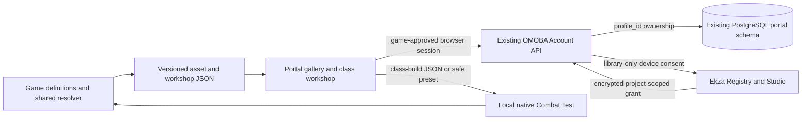

# Community workshop prototype

The community entry point is the existing `omoba-web` portal. `/creators` shows
what the engine ships and which visual roles need artwork; `/workshop` composes
an executable local class recipe. The marketing repository `landing-v2`, app
`apps/omoba`, links to both pages when its actual portal destination is configured.
This prototype is available in source and the local demo; no public deployment is
implied by those routes.

## What people can do

1. Browse 17 classes and 68 skills, their original icons, default handheld model
   previews/downloads, credits and authored visual requirements. Missing model
   roles remain visible as requirements, not invented downloadable models.
2. Choose one of 12 modular cores and four of 48 reusable skills. Read their
   canonical costs, cooldowns, ranges, unlock levels and dependencies. The core
   controls baseline stats, attack profile, resource policy and default equipment.
3. Name a build, keep a browser draft, import/export its portable document, and
   optionally save private named builds under their existing OMOBA account.
4. Export a complete safe Combat Test preset or load the document with
   `scripts/combat_test.py --class-build FILE`. The native host resolves it using
   the same shared Rust rules as the Account API. A saved draft is not a new
   ranked class or an executable mod.
5. Connect an Ekza library through explicit Studio consent. Use the catalogue's
   contribution brief and existing Studio upload/review flow for a visual variant.

The first iteration uses baseline stills and downloads. Interactive model and
animation comparison, requirement-targeted submissions, public build publishing,
moderation and automatic installation of approved cosmetic sets are follow-up
work. Uploading a design to Studio does not automatically attach it to a skill.
The current browser composition preview never borrows another core's weapon
because one of its skills was selected.

## Protocol and ownership



`omoba.asset-catalog.v1` describes visual requirements and content-addressed
references; `omoba.workshop.v1` exports compiled gameplay choices and sandbox
defaults; `omoba.class-build.v1` is the small portable named recipe. This is the
first SDK boundary: versioned JSON, a dependency-free browser validator, shared
Rust validation and a native launcher adapter. There is no second balance table
or newly introduced production package.

OMOBA's stable identity is `career_profiles.profile_id`, already shared by native
game keys and game-approved browser sessions. Private build rows belong to that
ID, never a username, device key supplied in a request, or browser-selected owner.
The existing `settings:write` consent covers private preferences. Saving does not
grant publication, asset approval, match admission or new account scopes.

The API enforces 50 builds per profile, strict bounded recipes, optimistic versions
and idempotent changes. Existing HttpOnly cookies, same-origin/CSRF checks and the
BFF route allowlist remain the browser boundary. PostgreSQL migrations 004/005
add private builds and encrypted library grants; separate runtime grants are in
`account-api/ops/grants.sql`. Existing schema 1–3/1–4 remains bootable with the
unavailable feature reported explicitly, allowing an operator-controlled rollout.
Apply migrations and grants together before enabling those features in a hosted
environment; this task does not apply them to a hosted database.

## What linking Ekza means

An authenticated OMOBA profile requests Registry's existing device flow with
`projectId=omoba` and `scope=library`. Studio displays the consent code. Only after
approval does Registry return a grant. The Account API stores it encrypted using
the existing portal key and associated data containing the owner, Registry origin
and credential phase. The browser receives a verified display name and connection
state, never a device secret or bearer token.

The library is checked when connection status is refreshed. A service outage
preserves the saved grant and reports unavailable; explicit expired/invalid
credentials clear it. Disconnect forgets OMOBA's local copy. Registry currently
has no grant-revocation endpoint for this protocol, so forgetting the copy does
not claim to revoke every previously issued Ekza grant.

This is a library connection, not unified SSO or account merging. Registry's
current library response exposes `username` without an immutable subject ID.
That value may change and must never become an OMOBA identity key. A future SSO
bridge needs an explicit immutable-subject proof/consent contract before accounts
can be safely associated for login or recovery. Connecting a library also does
not bypass technical publication or OMOBA's separate asset approval.

## Repeatable local demo

Use the existing shared Cargo cache and the portal's installed dependencies.
See [game import commands](class-workshop-game.md) and the portal's
`docs/class-workshop.md` for UI verification and build/export details.

```sh
# From omoba-bevy. The fixture helper refuses remote databases/addresses.
export CARGO_TARGET_DIR=/Users/wotori/git/ekza/omoba-bevy/target
cargo build --locked -p omoba-account-api --bin omoba-account-api --example seed-local-portal
python3 account-api/ops/workshop_fixture.py --target-dir "$CARGO_TARGET_DIR" init
python3 scripts/ekza_library_fixture.py
```

In another terminal, start the existing Account API against the disposable local
database with `python3 account-api/ops/workshop_fixture.py --target-dir "$CARGO_TARGET_DIR" serve`. Start the
`omoba-web` build on port 3010 with its Account API origin pointing to
`http://127.0.0.1:40560`; its workshop browser proof uses the public synthetic
seed-7 fixture through the real signed pairing API. No real player's key is read.
The local database at 55581 is separate from all hosted databases.

The synthetic Registry listens on 40561 and requires clicking “Approve synthetic
library connection.” The API fixture explicitly sets
`OMOBA_EKZA_LOCAL_FIXTURE_ORIGIN=http://127.0.0.1:40561`, which is accepted only with
a loopback portal origin. The UI labels this mode; it is evidence of protocol
integration, not evidence of a hosted account connection. Without that fixture
setting the integration uses the existing HTTPS Registry/Studio origins, with
redirects disabled. Test setup does not request hosted consent.

Open `/creators`, then `/workshop`. Build “Light and rockets” with Dawnweaver's
first three skills and `wild_rocket`, save it, reload, and download its class JSON.
Load that exact browser download in the native launcher and cast the borrowed
ultimate at the training target. Keep browser and native evidence associated with
the exported revision. Other devices/languages and hosted infrastructure require
separate verification before community deployment.
