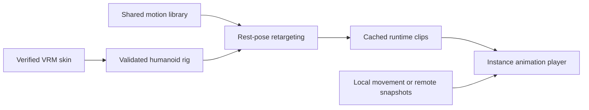

# Shared humanoid motion and VRM compatibility

Status: implemented engine-side skeletal capability in 0.21.0-rc.5. External Studio profile migration is a separate rollout.

## Decision

A skin supplies geometry, skinning, humanoid bone indices and a rest pose. The engine supplies movement and action motions. One shared CC0 library contains Idle, Walk, Run, Attack, Cast and Death. Normal hero movement selects Run, sourced from Quaternius `Sprint_Loop`; Walk is retained for a future explicit debuff policy. Movement speed, navigation and server combat rules are unchanged.



`passport::humanoid` parses VRM0/VRM1 metadata into one typed rig. The client retains source metadata during normal glTF loading. `HumanoidRuntimeLibrary` generates clips in memory and caches them by actual model asset identity. Original model files, approved hashes and download bytes are not rewritten. Target bone entities are resolved using skin node indices and inverse-bind asset identity, not names. An instance-specific `AnimatedBy` link prevents another hero from receiving its animation.

Motion consists of semantic bone world-rotation deltas relative to the source T-pose, plus hips displacement. The engine converts those deltas through each target's rest hierarchy, accounting for facing, proportions, rotated intermediary nodes and uniform ancestor scale. Limb translations are preserved. Locomotion remains in place: animation never drives the authoritative player root. Missing optional bones are handled through world-pose recovery.

VRM models with no embedded animation receive a runtime animation player and bone targets. Existing embedded GLB models without supported VRM metadata retain their legacy path. Such uninstalled legacy models cannot be certified as running until inspected; the procedural Cube remains an explicit non-humanoid debug fallback. The 2D roster already selects its separate Run sprite sequences.

## Supported skeletal input

- Self-contained glTF 2 binary container, staged as `.glb`; VRM0 `VRM` or VRM1 `VRMC_vrm` humanoid metadata.
- At most 50 MiB, 4 MiB JSON and 4096 nodes; valid acyclic single-parent hierarchy and unique humanoid assignments.
- Required anatomical bones present with valid references and supported parent relations. VRM1 optional chest/neck and versioned thumb naming are normalized by the adapter.
- Required extensions are limited to the verified `KHR_materials_unlit` and `KHR_texture_transform` subset. Required VRM/MToon/spring/constraint/compression extensions are rejected explicitly; optional VRM metadata is supported. The engine never strips a required-extension declaration.
- TRS transforms, finite normalized rotations and positive uniform scales. Matrix nodes and non-uniform/negative scales are rejected with an explicit compatibility error.
- The renderer uses Scene0. Every mapped humanoid bone must occur in skins instantiated by that scene. Unweighted humanoid-only nodes, separate rigid attachments and ambiguous repeated skin instances require a future node-index loader adapter.

This is a defined skinned-humanoid subset, not a promise that every file with a `.vrm` suffix works. Full MToon rendering, facial expressions, spring bones, look-at and VRM constraints are separate capabilities. Hair, tails and wings outside the humanoid map keep their existing pose. Same-handle editor hot reload is not an asset revision mechanism: replace immutable model handles for new revisions.

## Local model validation and import

Validate the unchanged input before staging:

```sh
cargo run --offline -p omoba-passport --bin validate-runtime-vrm -- /path/to/skin.vrm
python3 scripts/convert_vrm_to_glb.py /path/to/skin.vrm /path/to/local/assets/avatars/my-skin.glb
```

The validator reports version and rig size or a concrete compatibility error. The existing conversion tool copies a valid GLB container to a `.glb` path without baking animation. Add that local model to an operator-controlled avatar manifest using the existing `OMOBA_AVATAR_MANIFEST` flow for both client and server. Runtime compatibility alone never grants project approval, ownership or a paid-avatar ticket. A file-picker or arbitrary untrusted URL import is not part of this change.

The opt-in native audit accepts a separate asset directory containing `clipless-vrm0.glb` and `clipless-vrm1.glb`. It loads actual meshes through Bevy and the same player animation systems; these fixtures are not Studio ownership evidence.

## Studio/SDK contract

The published `humanoid-glb-v1` contract still requires its existing five embedded clips. `validate_humanoid_profile`, checksum validation, immutable rendition identity and server admission remain intact. Approved SDK avatars with VRM metadata gain runtime Run after their normal verified load.

To deliver clipless VRM directly through Studio, publish a versioned runtime-humanoid profile, align registry validation/rendition output, opt the SDK selector and server approval checks into that profile, and run a real cross-application rehearsal. Do not silently broaden an existing approval or rename a raw skin into a supposedly approved rendition. No registry, SDK dependency, deployment or external catalogue was changed here.

## Reproducible motion data and evidence

`python3 scripts/export_humanoid_motion.py --check` verifies the committed shared asset against existing CC0 inputs. The source and buffer hashes, attribution and clip mapping are recorded in the JSON and animation README. `Sprint_Loop` has a 0.667-second cycle; Walk is a different 1.333-second motion. Loop endpoints are closed and net locomotion root drift removed.

The task evidence includes deterministic conversion tests, numeric audits of all 15 shipped rigs, real ECS instance isolation and replacement tests, parser rejection cases, and a native audit that records changing leg rotations/hips translations alongside screenshots. Native scripted scenes are labeled fixtures, not a multiplayer or physical-device playtest.

## Specification references

- [VRM1 humanoid bone requirements](https://github.com/vrm-c/vrm-specification/blob/master/specification/VRMC_vrm-1.0/humanoid.md)
- [VRM rest-pose conversion guidance](https://github.com/vrm-c/vrm-specification/blob/master/specification/VRMC_vrm_animation-1.0/how_to_transform_human_pose.md)
- [VRM Animation specification](https://github.com/vrm-c/vrm-specification/tree/master/specification/VRMC_vrm_animation-1.0)

The engine's versioned shared JSON is an internal motion asset; it does not claim `.vrma` import support. A future VRMA adapter can feed the same normalized rig and motion layers.
