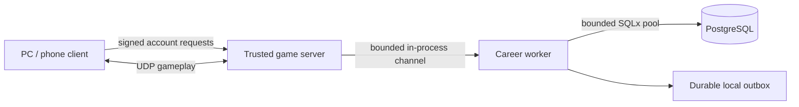

# Match results, profiles and friends

Implemented in `0.19.0-rc.6`. PostgreSQL is the shared career database. Replays
are explicitly deferred. This document describes the implemented beta boundary
and identifies the remaining work before a larger global service.

## What players get

The post-game dashboard shows the winner, every match-time nickname, class and
avatar/skin, kills/deaths/assists, actual damage to heroes/structures/creeps,
damage received, last hits, final level, progression and rating changes. A
receipt remains accessible after scene teardown; play-again is an explicit action.
The profile shows permanent progression, rating, wins/losses and paginated history.
PC and phone use different dashboard layouts and input handling.

Friends have incoming/outgoing requests, accept/reject/cancel/remove actions,
friend profile inspection and online/in-game status. Share the full account ID
from the Friends panel; nicknames are Unicode and need not be unique. Lists are
bounded to 64 relationships per account. Presence expires after 30 seconds when
refreshes stop. Lists refresh on opening or Refresh; no push chat is implied.

Friendship and presence are the social scope of this release. Party invitations,
coordinated group matchmaking, chat and voice are future work. Friends do not
bypass roster capacity, account reservations or matchmaking rules.

## Running a career-enabled beta

Use PostgreSQL 18 as the tested reference engine. Create a dedicated database and
supply `OMOBA_DATABASE_URL` to the trusted game server process. Do not put the
connection string in Git, client builds, screenshots or public distribution.
The adapter applies its versioned PostgreSQL migration transactionally and rejects
unexpected schema versions. See [migration and transaction details](../server/migrations/postgres/README.md).

```sh
# Set OMOBA_DATABASE_URL using the local/server secret mechanism.
# Give each arena a persistent, separate outbox directory.
export OMOBA_CAREER_OUTBOX=/var/lib/omoba/arena-1/career-outbox
export OMOBA_MATCH_MODE=release
cargo run -p server --locked
```

`OMOBA_CAREER_OUTBOX` defaults to `.omoba/career-outbox` in the working directory.
Mount it on persistent storage. Finished receipts are written and synced here
before settlement and retried after a process restart. Do not clear it to resolve
a database error: pending match results may still need it.

Without `OMOBA_DATABASE_URL`, the old guest/development path is explicitly
unranked and does not claim database persistence. If a configured PostgreSQL is
unavailable, career authentication/start waits or reports an error; it does not
silently turn a rated roster into a guest game. The service does not provision a
production database, configure backups or deploy infrastructure itself.

## Actual runtime boundary



The beta uses a modular worker inside each trusted game server, not a public
website account API. Signature validation and simulation run at the game boundary;
all SQL and filesystem receipt writes run outside the simulation tick. The worker
uses a bounded pool and queue; lease renewal runs independently of long database
batches. Share the PostgreSQL database across trusted servers to share profiles,
history and friendships. Never grant arbitrary community servers access to the
official career database.

This separation is suitable for later extraction into an authenticated backend
service. A website/launcher would use an HTTPS account API, and regional game
servers would submit authenticated allocations/results there. That HTTP service,
regional routing and website profile integration are not implemented by this change.

## Identity and account authorization

The client creates a random Ed25519 device key once and saves it privately in the
platform application preferences directory. `OMOBA_CLIENT_CONFIG_DIR` overrides
that directory for isolated QA. The public key maps to a separate random account
ID in PostgreSQL; nickname, entity ID, reconnect token and UDP port are not the
account identity. Existing-key login preserves the saved nickname.

The server issues a short-lived challenge bound to its epoch, public key,
nickname and session. The client verifies that it requested this exact challenge.
Subsequent account operations sign the action, epoch, nonce and monotonic sequence.
Replayed or altered account requests cannot change a friendship or profile.
Historical names and loadouts are frozen in the match receipt. Private keys are
never included in packets, logs or the public friend code.

Device-key storage currently identifies an installation. Key export/import,
email/password recovery, multiple linked devices and linking the optional avatar
passport are not implemented. Losing the key loses access to that profile;
corrupt keys are preserved and reported rather than silently replacing an account.
Account signatures provide authenticity; the existing UDP transport is not an
encrypted account API. TLS configuration for remote PostgreSQL remains an operator
responsibility.

## Match authority and durability

Accepted server damage receipts feed lifetime round totals, independently of
short-lived visual events. Typed actor identities prevent NPC IDs from being
credited as player kills. Disconnect retains the participant and its accumulated
totals; reconnect is bound to the authenticated profile and session.

A globally random result ID identifies the allocation. PostgreSQL enforces one
active allocation per account across processes. Release starts only after its
frozen allocation is durable. The first terminal winner freezes the result, and
later same-tick impacts cannot change it. Finalization stages immutable intent,
locks profiles in deterministic order, updates progress and ratings atomically,
then marks the receipt saved. Retries cannot double-credit; a conflicting receipt
is rejected. Saved acknowledgement includes refreshed profiles before requeue.

A 90-second owner lease and 10-second renewal distinguish a live match from a lost
server. Recovery only acts on expired owners. It finishes staged terminal intent,
or records an interrupted checkpoint with no ranked reward. Local terminal outbox
replay precedes the expired-allocation sweep. An outage before a terminal receipt
reaches durable storage can still leave an interrupted match rather than a win;
a periodic checkpoint is not a replay or a zero-loss record of every simulation tick.

## Rating and matchmaking

The implemented authenticated queue holds at most 128 waiting/reserved players per
arena. The first 20 rated matches form a separate newcomer cohort; compatible
rosters have at most 300 MMR spread. Equal teams are selected with balanced rating,
and the default full release roster is 5v5. An empty/insufficient population waits
honestly; it is not filled with mismatched veterans.

Rating starts at 1000, uses outcome-based team Elo with K = 32, and stays within 0–5000.
An eligible rated completion gives 150 permanent XP for a win and 100 for a loss;
profile level is 1 + XP / 1000. These are initial beta values, not a calibrated
competitive ranking model. Damage farming never directly increases MMR.

Only authenticated full release rosters on the approved actual default map/ruleset
are eligible. Development, QA, custom tuning, guests, abandoned and interrupted
rounds are explicitly unranked. Completed unrated rounds may appear in history
without ranked XP/MMR. The system does not claim bot detection or smurf prevention.

## Verification and scale limits

Real PostgreSQL tests cover concurrent registration/settlement, immutable receipts,
rollback, reopen, ownership fencing, interrupted recovery, active-account uniqueness,
history privacy and friendship direction/idempotence. Signed UDP integration drives
actual queue admission, allocation acknowledgement, combat victory and saved history.
Native renderer QA captures desktop and phone layouts with an explicitly labeled
synthetic fixture; it does not substitute for physical iOS/Android testing.

There is one arena/queue per game process and a bounded modular account worker.
Thousands of concurrent players, global queue ownership, regional latency routing,
production failover/restore, rate calibration and physical-device acceptance need
separate load and release validation. PostgreSQL provides the transaction foundation;
its presence alone is not evidence of that operational capacity.

Useful primary references: [SQLx pools](https://docs.rs/sqlx/0.8.6/sqlx/struct.Pool.html),
[PostgreSQL locking](https://www.postgresql.org/docs/current/explicit-locking.html),
[backup/PITR](https://www.postgresql.org/docs/current/continuous-archiving.html),
[Ed25519 verification](https://docs.rs/ed25519-dalek/2.2.0/ed25519_dalek/struct.VerifyingKey.html).
