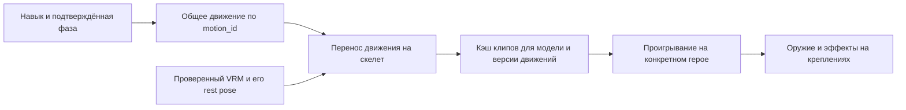

# План обновления визуала боёвки

Рабочий TODO для OMOBA: сделать навыки различимыми по движению, форме эффекта и реакции цели, включая будущие гибридные пользовательские классы. Нынешние 16 классов служат готовыми наборами для инвентаризации и проверки. Основа — проверка кода на 30 сентября 2026, commit `c36dd0f`, каталог `standard-kits-2`. Ниже разделены существующая механика и **предлагаемые** анимации, модели и VFX. Пункты остаются открытыми до реализации и проверки в игре.

После исходного аудита старт уточнён: первым реализован пилот **Dawnweaver + Wildspark**. Он проверяет настройку движения по SkillId, общую VRM-библиотеку, фазу луча, объёмные эффекты и модели ракеты/ловушки. [Описание пилота и ограничения](../combat-cosmetics.md#skill-presentation-pilot). Ниже исходная карта потребностей; полные пункты CV остаются открыты, пока не выполнены все их критерии.

Дальнейший порядок: закончить контракт смешанных наборов и сокеты/хват → полностью оформить Dawnweaver/Wildspark → интерактивные объекты Chainkeeper и Frostguard → остальные семейства. Это даст видимую разницу в бою раньше, чем одновременное производство новых моделей всех персонажей.

## Обязательный контракт для гибридных классов

Требование владельца проекта: будущий класс может состоять из любых четырёх выбранных умений, в том числе четырёх разных ультимейтов или атак разным оружием. Класс — сохранённый рецепт, а Q/W/E/R — назначения управления. Визуальный слой должен поддерживать такой набор с первого этапа. Числа, стоимость и допуск рецепта в конкретный режим задаются отдельно; в архитектуру не закладывается правило «не больше одной ульты».

| Понятие | Целевой контракт |
| --- | --- |
| Определение навыка | Собственный стабильный ID, механика, targeting, стадии, требования, animation family, реквизит, VFX и sound cues. Навык сохраняет свою идентичность при переносе между классами и кнопками |
| Слот управления | Один из четырёх адресов в принятом рецепте. Сам слот не означает выстрел, каст, обычное умение или ульту |
| Категория ultimate | Метаданные силы/роли навыка и правил прогрессии; не синоним кнопки R. Перенос на Q не превращает ульту в базовую атаку и не должен автоматически открывать её на первом уровне |
| Экземпляр умения | Состояния cooldown, charges, recast и активных объектов принадлежат экземпляру в рецепте. Определение, слот, экземпляр и отдельный cast/event — разные идентичности; состояние не хранится лишь по имени класса или SkillId |
| Класс | Готовый или пользовательский рецепт: выбранные умения, пассивка, параметры основы/ресурса и профиль AA. Нынешние классы — пресеты; новая комбинация не требует нового renderer или нового набора моделей тела |
| Визуал | SkillId + стадия + подтверждённый контекст выбирают нужную анимацию и эффект; instance/cast/effect ID управляют сроком жизни. Внешность аватара может менять оформление внутри совместимого профиля, сохраняя смысл и геометрию навыка |
| Оружие | Конкретное действие запрашивает свой реквизит и хват: пушка → топор → лук → магический выпуск. Профиль автоатаки независим. Несколько пушечных навыков могут использовать одну модель с разными выпусками |
| Требования | Явные зависимости: контроллер сферы, источник боеприпаса, поддерживаемый ресурс/режим оружия. Композиция подключает нужную возможность или явно отклоняется как неполная; имя исходного класса не является зависимостью |

Повтор одного и того же навыка в нескольких слотах пока не является отдельным продуктовым требованием. Тем не менее, общий контракт не должен случайно объединять такие экземпляры по SkillId: правила допустимости повторов и общего/независимого cooldown должны быть явными, если повторы появятся.

**Что пока мешает этому в коде.** `BuildRecipe` уже хранит четыре SkillId отдельно от внешности, но [resolve](../../shared/src/loadout.rs) требует `SkillDefinition.slot == equipped_slot` и возвращает `WrongSlot`. Поэтому четыре нынешних R-навыка сегодня не пройдут проверку. AA-профиль выбирается из core, переключение оружия требует Repeater, а поле/стяжка требуют контроллер сферы. [PlayerActionKind::for_cast](../../shared/src/lib.rs) пока выводит Attack/Cast из кнопки. Существующая поддержка совместимых смешанных рецептов не равна полной свободе компоновки.

Разблокировка слотов сейчас задана уровнями 1/2/4/6, а [прогрессия ботов](../../shared/src/progression.rs) приоритизирует R как ульту. Общий [HeroState расширенных техник](../../common/src/skills/advanced.rs) имеет одиночные поля orb/challenge/parry/defense: для будущих пересекающихся способностей нужно явно определить совместное владение или независимые экземпляры. Это ограничение расширения, не утверждение о неисправности текущих пресетов. При этом recast и возврат зарядов SpiritDash уже преимущественно используют фактический слот/технику — это свойство сохранить и покрыть перестановками слотов.

Первый пользовательский конструктор собирает классы из существующих навыков. Добавление совершенно новых определений — следующий уровень: текущий каталог содержит закрытый enum из 44 стандартных SkillId, а 20 базовых навыков живут в старом пути. Общая визуальная идентичность должна охватить оба пути; генерация новых боевых механик или загрузка пользовательского исполняемого кода этим планом не предполагается.

В CV-01 требуется спроектировать и постепенно снять ограничения назначения слота, проверить прогрессию/ранги, ресурсные зависимости и хранение состояний. Нельзя просто удалить проверку WrongSlot и объявить конструктор готовым. Нужны версия каталога/рецепта и сохранение поведения действующих пресетов. Публичный редактор классов, сохранение на аккаунте и подбор баланса остаются отдельными будущими задачами; визуальная основа не должна ждать их появления.

**Реквизит и параллельные эффекты.** У тела один актуальный жест и согласованный набор предметов в руках. Начало следующего навыка освобождает временный реквизит прошлого действия согласно его фазе; постоянный щит или оружейный режим имеют отдельный срок жизни. Уже летящая ракета, поставленная ловушка, фонарь или сфера продолжают существовать независимо от того, какое оружие сейчас держит герой. Прерывание каста, смерть и возврат к AA проверяются отдельно. Для аватара без нужного крепления остаётся общий жест и совместимый процедурный выпуск.

**Обязательные сценарии до массовой полировки классов:**

- Четыре разных ульты: Horizon Ray, Last Spark, Horizon Wave, Winter Divide — каждое сохраняет свою подготовку, траекторию и силуэт независимо от Q/W/E/R. Четыре ultimate допустимы в тестовом рецепте; правила конкретного режима не маскируются ограничением renderer.
- Четыре разных оружейных действия: пушка, топор, лук, магический выпуск. Топор — новый пример для будущего каталога, а не уже существующий навык. Проверить смену реквизита/хвата без создания четырёх моделей героя.
- Один существующий навык последовательно назначается на каждый из четырёх слотов: совпадают motion family, warning, геометрия, hit/status/expiry; меняется назначение кнопки.
- Смешанный набор с длительным объектом: сфера/ловушка/фонарь остаётся корректным при касте навыка из другой семьи и смене предмета в руках; новый cast не забирает старый emitter.
- Неполная зависимость, например поле без контроллера сферы, даёт объяснимый отказ при сборке; полноценный гибрид работает на локальном и удалённом персонаже. UI показывает имена, иконки, targeting и cooldown из принятого рецепта.

## Что уже есть и где основной разрыв

| Область | Подтверждено в текущем коде | Что требуется |
| --- | --- | --- |
| Классы | 5 базовых + 11 расширенных; 64 активных навыка: 20 встроенных + 44 каталожных | Карта ниже покрывает каждый Q/W/E/R, автоатаку и имеющуюся пассивку |
| Выбор внешности | Класс и аватар независимы; 15 поставляемых 3D-аватаров | Сохранять класс читаемым на разных телах; начинать с предметов, жестов и эффектов |
| Анимации | Общие состояния Idle, Walk, Run, Attack, Cast, Death; набор конкретного аватара может быть неполным. Runtime retargeting для поддерживаемых humanoid/VRM; Q выбирает Attack, W/E/R — Cast | Выбирать действие по навыку и стадии; сейчас слот не выбирает отдельный клип для лука, удара ногой, парирования или рывка |
| Снаряды | Процедурные формы, следы, подтверждённые вспышки попаданий; GLB/atlas fallback. В поставляемом manifest восемь профилей, defaults пяти базовых классов; action/avatar/sprite overrides и animation aliases не заполнены | Различить слоты базовых классов; подключить расширенные навыки к полноценному представлению |
| Расширенные навыки | Передаются SkillId, геометрия, остаток времени, armed и потраченные стороны клетки. Большинство объектов — Gizmos: фонарь/сфера/душа/якорь/лечение похожи на двойные кольца; снаряд/ракета — на кольцо со штрихом | Узнаваемые объекты и стадии с точной геометрией; текущая отрисовка объектов не использует остаток времени для показа стадии |
| Обратная связь | Подтверждённые damage receipts, до 48 чисел урона, общие cast-вспышки, dash/haste VFX. Звуки попадания выбираются по projectile style | Различать cast/warning, heal, shield apply/break, parry и passive proc; отдельного потока этих подтверждений сейчас нет |
| Ограничения | 256 частиц в пуле; максимум 128 частиц полёта; 384 корня обычных снарядов; 128 активных skill effects и 16 на владельца | Сначала приоритеты и повторное использование ресурсов; увеличение лимитов только после измерений |
| Практика | В 0.31 общий боевой движок поддерживает все 16 классов онлайн и офлайн | Использовать офлайн-дуэль для быстрых сцен и онлайн для подтверждений/репликации |

Числа выше — текущие ограничения разных подсистем, их нельзя складывать в «общий бюджет частиц». Ранние progress-документы с пятью/семью классами описывают прежние версии.

### Недостающие данные для честного визуала

- **Навык и причина отклика.** [Resolved hit source](../../common/src/skills/mod.rs) выдаёт расширенным навыкам общий `ProjectileStyle::Arcane`; [CombatEvent](../../shared/src/combat.rs) не содержит `SkillId`. Поэтому их подтверждённые попадания сейчас получают общий magic burst/arcane sound. Для выбора по навыку использовать принятый recipe там, где он известен, и определить минимальные данные для скрытого источника, recast и пассивного срабатывания. Исчезновение объекта само по себе не подтверждает попадание, сбор, блок или лечение.
- **Тип и владелец статуса.** В [LoadoutState](../../shared/src/loadout.rs) `root_remaining_secs` объединяет root и stun через максимум, `shield_hp` — сумма активных щитов без их владельцев, общая метка не передаёт весь смысл конкретного proc. Отдельные stun/root, щит нужного источника и успешное parry требуют достаточного авторитетного признака; их нельзя угадывать по цвету, HP delta или названию класса.
- **Стабильность объектов.** У обычных runtime effects есть ID, но [advanced::visuals](../../common/src/skills/advanced.rs) назначает orb/healing/anchor/soul ID как `u64::MAX − индекс в текущем списке`. При исчезновении прежнего объекта ID может перейти к другому. До привязки длительных эмиттеров и моделей нужен стабильный ключ; начало, обновление, истечение и подтверждённое потребление не должны повторяться из-за перестановки snapshot.
- **Видимость — уже часть контракта.** [Vision filtering](../../common/src/vision.rs) обнуляет скрытого владельца (`owner_id = 0`) и обрезает вражеский луч до видимого сегмента. Эффект должен работать без owner entity и пользоваться полученными endpoints; нельзя восстанавливать полную длину из каталога или тянуть цепь к ранее известной скрытой позиции. Для метки/щита сохранять только разрешённые источники и связи.
- **Форма не определяется одним EffectVisualKind.** Сейчас ConeBrittle и BallPull передаются как `BeamWarning`, хотя [серверная механика](../../common/src/skills/advanced.rs) — соответственно конус (`dot > 0.6`) и круг вокруг сферы. Выбор контура должен учитывать `SkillId` и фактический центр. У Beam поле `width` используется как полуширина: полный контур — `2 × width`; у кругов `radius` не является диаметром. Проверка попадания дополнительно учитывает радиус цели. Прицеливание, художественный эффект и коллизия должны описывать одну механику.

## Визуальный язык и честность механики

Предлагаемая стилистика: читаемые скульптурные формы, короткие рисованные вспышки, ограниченные шлейфы, материалы в духе существующего лесного окружения. Отличие классов строится на силуэте и движении; цвет команды должен оставаться отдельным сигналом. На телефоне форма важнее мелкого дыма и блум-свечения.

- У каждого навыка есть необходимые стадии: подготовка → выпуск/движение → подтверждённое попадание или промах → действующий статус → завершение. Не каждый навык использует все стадии.
- Подготовка не добавляет задержку геймплею. У мгновенного действия жест начинается одновременно с выпуском, а основная выразительность переносится в follow-through. Длительность брать из runtime: кроме `windup_secs`, существуют внутренние задержки техник, например Furnace Breath и Orbital Collapse. Явные окна предупреждения есть у Dawnweaver R и Riftshot R.
- Геометрия опасности соответствует серверу. Художественный дым может выходить за границу, но не заменяет точный контур попадания. У щита показывается сторона, у клетки — целые/израсходованные сегменты.
- Попадание, щит, лечение, root, stun, charm, reveal, camouflage и неуязвимость различаются. Успешная защита и истечение защиты — разные реакции.
- Предпросмотр прицеливания и доступный recast видны владельцу; союзные и вражеские сигналы соответствуют реплицируемой видимости. Следы, цепи и эмиттеры не раскрывают скрытого героя.
- Модели и анимация не перемещают авторитетный корень персонажа. Dash/blink/knockback следуют подтверждённым координатам; без клиентского hit-stop, замедляющего симуляцию.
- При перегрузке первыми исчезают дым, искры и длинные шлейфы. Контур угрозы, направление защиты и стадия интерактивного объекта сохраняются.
- Для Reduce motion предусмотреть отключение shake, крупных afterimage и лишних вспышек. Смысловые предупреждения остаются. Звуковые сигналы дополняют, но не заменяют визуальные.

## Карта классов и навыков

В таблицах механика — существующая; всё в столбцах «Анимация» и «Модель и эффект» — предложение для TODO. Группировка по классам и Q/W/E/R описывает только нынешние пресеты: каждый набор визуалов принадлежит самому навыку и должен переноситься в гибрид. Английские имена и ID оставлены для точного сопоставления с кодом. AA означает автоатаку. Предмет в таблице не требует отдельного нового тела персонажа.

В текущем движке AA всех классов используют homing-снаряд и физический базовый урон, даже при магической внешности; пассивки могут добавлять другие типы урона. Атакующие навыки пяти базовых классов тоже используют homing, с магическим уроном. Слова «меч», «свет», «коготь» описывают предложенную форму, а не новую коллизию или тип урона. Dash/displacement сейчас сразу меняют XZ с проверкой препятствий; «прыжок/подбрасывание» не означает существующую серверную вертикальную траекторию.

### Воин — Warrior

Образ: тяжёлый короткий импульс, сталь и охра. Собственной отдельной пассивки в каталоге нет. Ближняя внешность не должна скрывать, что текущие атакующие навыки выпускают серверный снаряд.

| Слот и навык | Механика | Анимация | Модель и эффект |
| --- | --- | --- | --- |
| AA | Базовая атака | Одноручный рубящий удар | Меч; короткая дуга по фактической траектории, контактная искра |
| Q Shield Bash `shield_bash` | Одноцелевая атака снарядом, без stun | Толчок щитом | Небольшой щит; летящий плотный фронт и тяжёлый контакт, без оглушающего ореола |
| W Battle Rally `battle_rally` | Самолечение | Поднять оружие/собраться | Восходящий импульс на себе, знак полученного лечения |
| E Heroic Strike `heroic_strike` | Одноцелевой усиленный снаряд | Рубящий удар сверху | Узкая тяжёлая дуга; контакт отличается от Q |
| R Rampage `rampage` | Сильный одноцелевой снаряд | Мощный завершающий удар | Более плотный клин и короткий ударный акцент; без фиктивного AoE |

### Маг — Mage

Образ: светящаяся геометрия с разным материалом каждого заклинания. Отдельной пассивки нет. Frost Lance не замораживает и не пробивает ряд целей в текущей механике.

| Слот и навык | Механика | Анимация | Модель и эффект |
| --- | --- | --- | --- |
| AA | Homing-снаряд с физическим базовым уроном | Короткий выпуск ладонью | Компактный arcane orb, тихий след |
| Q Arc Bolt `arc_bolt` | Одноцелевой homing bolt | Прицельный толчок ладонью | Ядро с орбитальными искрами; поворот следа по серверному полёту |
| W Mana Surge `mana_surge` | Мгновенное восстановление маны | Стянуть энергию к корпусу | Входящие фрагменты и импульс ресурса; без знака лечения |
| E Frost Lance `frost_lance` | Одноцелевой урон снарядом | Колющий выпуск | Ледяной клин/процедурный кристалл и осколки; без freeze/root |
| R Pyroblast `pyroblast` | Мощный одноцелевой огненный снаряд | Выпуск двумя руками | Огненное ядро, короткий дым и локальное схлопывание; без ложного радиуса взрыва |

### Следопыт — Ranger

Образ: точная тонкая траектория, минимум шума, упругость тетивы. Отдельной пассивки нет. Piercing Arrow сейчас не является сквозной атакой.

| Слот и навык | Механика | Анимация | Модель и эффект |
| --- | --- | --- | --- |
| AA | Стрела | Быстрый выстрел из лука | Лук и общая стрела; короткий контакт |
| Q Quick Shot `quick_shot` | Одноцелевая стрела | Компактный выпуск | Тонкий светлый след, быстрый recoil корпуса |
| W Field Dressing `field_dressing` | Самолечение | Короткий жест перевязки | Небольшой heal-пульс; бинт необязателен |
| E Piercing Arrow `piercing_arrow` | Более сильная одноцелевая стрела | Выстрел с полным натягом без дополнительной задержки | Другой наконечник/утолщённый след, плотный контакт |
| R Longshot `longshot` | Дальний одноцелевой выстрел | Устойчивая стрелковая стойка | Ясный длинный tracer, единичное попадание; без beam-геометрии |

### Жрец — Cleric

Образ: мягкие вертикальные потоки и золотистые печати. Отдельной пассивки нет. Текущие лечения действуют на самого кастера, а не на союзников вокруг.

| Слот и навык | Механика | Анимация | Модель и эффект |
| --- | --- | --- | --- |
| AA | Святой снаряд | Выпуск ладонью/посохом | Маленький световой ромб |
| Q Smite `smite` | Одноцелевой снаряд | Направленный жест | Узкая печать в полёте и световой контакт |
| W Renew `renew` | Самолечение | Ладони к корпусу | Короткий восходящий поток только на себе |
| E Divine Favor `divine_favor` | Восстановление маны | Поднять ладонь | Входящие частицы ресурса; отличается от Renew |
| R Guardian's Blessing `guardians_blessing` | Сильное самолечение | Раскрыть руки | Личная световая оболочка, быстро растворяющаяся; не выглядит действующим щитом или зоной лечения |

### Хранитель — Warden

Образ: древесные формы, когти и листовые штрихи. Пассивка Forest Tracker усиливает охоту на лагеря и награды; предлагается отдельный короткий отклик при попадании по лагерю и его зачистке, без постоянного ореола на героях.

| Слот и навык | Механика | Анимация | Модель и эффект |
| --- | --- | --- | --- |
| AA | Базовая атака | Когтевой взмах | Три короткие полосы вместо мечевого полумесяца |
| Q Feral Swipe `feral_swipe` | Одноцелевой снаряд | Широкий когтевой удар | Различимая когтевая волна и контакт |
| W Barkskin `barkskin` | Самолечение, без щита/бонуса брони | Собраться в защитную позу | Временные фрагменты коры, сразу переходящие в heal-пульс |
| E Hunter's Mark `hunters_mark` | Одноцелевой снаряд, без root/метки | Бросок | Копьё; попадание без сохраняющейся метки |
| R Primal Maul `primal_maul` | Мощный одноцелевой снаряд | Тяжёлый удар двумя руками | Плотный когтевой силуэт и древесные осколки; без превращения в зверя |

### Ткач рассвета — Dawnweaver

Образ: тонкие лучи и гранёный свет; первый эталонный набор для реализации. Пассивка Radiance оставляет метку, которую поглощает AA/R; R ставит её заново. Нужны отдельные apply → consume → reapply, а не постоянное свечение цели.

| Слот и навык | Механика | Анимация | Модель и эффект |
| --- | --- | --- | --- |
| AA | Снаряд, может поглотить Radiance | Короткий световой выстрел | Световой ромб; отдельная вспышка подтверждённого proc |
| Q Gleaming Snare `dawn_bind` | Линейный снаряд поражает до двух врагов и обездвиживает | Направленный взмах | Световое веретено; две допустимые встречи, затем разрыв; путы у ног |
| W Returning Aegis `dawn_barrier` | Щит союзникам на пути туда и обратно | Бросок/возврат рукой | Возвратная линза, отличимая обратная сторона; краткая оболочка щита на получателе |
| E Luminous Field `dawn_field` | Зона slow, детонация по recast или истечению | Установка печати; короткий жест схлопывания | Точный контур поля, мягкая внутренняя текстура, импульс готового recast владельцу, взрыв по факту |
| R Horizon Ray `dawn_ray` | Предупреждение 0.8 с, затем линейный урон и работа с метками | Подготовка двумя руками → выпуск | Коридор предупреждения → плотное ядро луча → быстрое затухание; без длительного ложного damage zone |

### Дикая искра — Wildspark

Образ: механическая отдача, снаряды и искры. Пассивка Momentum после подходящего takedown повышает скорость передвижения/атаки: краткий стартовый burst и читаемый скоростной след на реальном сроке баффа.

| Слот и навык | Механика | Анимация | Модель и эффект |
| --- | --- | --- | --- |
| AA | Repeater со стаками темпа либо mana-rocket со splash | Лёгкая серия либо тяжёлая отдача | Два силуэта оружия/сменный модуль; muzzle flash и bullet/rocket отличаются |
| Q Switchfire `wild_switch` | Переключение режима AA | Короткая смена хвата/модуля | Видимый режим оружия; до трёх сегментов темпа repeater, без фиктивного выстрела при переключении |
| W Shockline `wild_zap` | Первый враг получает damage, slow и reveal | Прицельный одиночный выстрел | Узкий электрический снаряд; раздельные slow/reveal при попадании |
| E Snapline `wild_traps` | Три ловушки; 0.6 с взведения, root по герою | Бросок/расстановка | Одна повторяемая модель капкана; dropped → arming → armed → trigger/expire |
| R Last Spark `wild_rocket` | Дальняя ракета; взрыв при контакте с героем, splash и усиление по дистанции/недостающему HP | Тяжёлый выпуск | Крупный узнаваемый корпус ракеты, дым с бюджетом, подтверждённый взрыв; исчезновение на дальности без взрыва |

### Горнило — Cinderforge

Образ: тяжёлая кузница, базальт и раскалённые швы. Пассивка Tempered даёт защиту, безопасную ковку и улучшение экипировки: показывать channel/progress/interruption и подтверждённое завершение. Компактные молот/наковальня — реквизит, отдельное тело кузнеца необязательно.

| Слот и навык | Механика | Анимация | Модель и эффект |
| --- | --- | --- | --- |
| AA | Тяжёлая базовая атака; может поглотить Brittle | Удар молотом | Молот, короткая дуга; хрупкие фрагменты при реальном потреблении Brittle |
| Q Fault Line `fault_line` | Мгновенный line hit/slow; через 0.65 с реальный столб на конце | Удар в землю | Линия разлома сразу, предупреждение места столба → рост модели → solid → разрушение/истечение |
| W Furnace Breath `furnace_breath` | Защита от displacement; финальный конусный hit на 0.8 с, Brittle | Упор и выдох/выпуск из горна | Конус жара с точным финальным импульсом; не изображать повторные damage ticks; метка Brittle |
| E Anvil Charge `anvil_charge` | Клипованный рывок, AoE на конце; collision даёт контроль и может разрушить свой столб | Силовой рывок → удар | Короткий след тяжёлого тела; разные finish в пустоте/стене/своём столбе, осколки по подтверждению |
| R Mountain Echo `mountain_echo` | Входящий колосс; recast рядом перенаправляет его и усиливает контроль | Призыв → удар/перенаправление | Низкополигональный колосс с ясным передом; inbound/redirect/outbound, отдельная индикация доступного recast |

### Клинок граней — Edgeweaver

Образ: точные выпады, минимальные дуги, направленные уязвимости. Пассивка Vitals требует читаемой стороны цели, расхода метки и смены стороны. Не превращать четыре грани в четыре неразличимых кольца.

| Слот и навык | Механика | Анимация | Модель и эффект |
| --- | --- | --- | --- |
| AA | Удар, может задеть направленную уязвимость | Короткий колющий удар | Рапира/узкий клинок; контакт со стороны vital и отдельный proc |
| Q Edge Lunge `edge_lunge` | Рывок + hit около конца; попадание сокращает cooldown | Выпад и восстановление стойки | Линейный след клинка и конечный контакт; refund владельцу |
| W Mirror Guard `mirror_guard` | Parry 0.75 с; ответный line hit, усиленный контроль при парировании immobilization | Guard enter/hold → riposte | Узкая зеркальная грань; обычное завершение и успешный parry отличаются |
| E Twin Tempo `twin_tempo` | Следующие две AA усилены: первая slow, вторая повышенный урон | Два разных коротких удара | Два заряда на оружии; последовательный расход, разные контактные штрихи |
| R Fourfold Duel `fourfold_duel` | Четыре стороны цели; все четыре попадания либо смерть/исчезновение цели после хотя бы одного создают союзное поле лечения у кастера | Объявление вызова → обычная дуэль | Четыре ориентированные грани с погасанием потраченных; разные способы завершения, healing field в реальной точке появления |

### Грозовой кулак — Stormfist

Образ: связка ударов и короткие ударные волны, энергия вместо маны. Пассивка Flow усиливает две AA после навыка и возвращает энергию: два маленьких заряда у рук и подтверждённый возврат ресурса.

| Слот и навык | Механика | Анимация | Модель и эффект |
| --- | --- | --- | --- |
| AA | Удар; может тратить Flow и восстанавливать Energy | Чередование jab/cross | Повязки/перчатки необязательны; короткий контакт кулака |
| Q Echo Strike `echo_strike` | Skillshot отмечает цель; recast рывок к ней с уроном | Выпуск импульса → добивающий удар | Звуковое кольцо-снаряд, owner-specific метка, короткий след подтверждённого сближения |
| W Anchor Step `anchor_step` | Прыжок к союзнику или свободной точке, где создаётся временная опора, и защита; recast даёт лечение от урона | Leap/landing → self-buff | Малый объект опоры, точка приземления, различимые щит и активный sustain |
| E Thunder Pulse `thunder_pulse` | Круговой damage/reveal; recast замедляет первоначальные цели | Удар по земле/выброс от корпуса | Круговая волна; повторный отклик на отмеченных целях, не новое ложное AoE |
| R Thunder Kick `thunder_kick` | Отбрасывание выбранной цели; урон/контроль задетых по пути | Силовой удар ногой | Направленный контакт и линия displacement; реакция цели не уводит реальную позицию от сервера |

### Сумрачный ловец — Veilstalker

Образ: тёмный дым только как акцент, острые шипы и хлыст. Пассивка Shroud даёт восстановление вне боя и camouflage с уровня 6. Нужны вход/выход и состояние обнаружения у владельца; врагу не показывать силуэт или след вне разрешённой видимости.

| Слот и навык | Механика | Анимация | Модель и эффект |
| --- | --- | --- | --- |
| AA | Короткая базовая атака | Когтевой удар | Когтевой след, отдельный акцент выхода из покрова по факту |
| Q Thorn Volley `thorn_volley` | Первый skillshot; затем до трёх recast прямыми hits | Выпуск → короткие повторные взмахи | Шип для первого полёта; последующие мгновенные контактные штрихи, без ложных уклоняемых снарядов |
| W Patient Curse `patient_curse` | Метка без начального урона; следующее попадание до 2 с даёт slow, после созревания — charm/weaken | Наложить печать | Контур созревает 2 с → явная готовая форма → ранний/полный proc от попадания; таймер сам не запускает charm, срок метки 4 с |
| E Shadow Lash `shadow_lash` | Близкий hit и ускорение; из camouflage усиленный подход | Взмах хлыстом / усиленный выпад | Короткий процедурный lash, контакт и скоростной след только видимого героя |
| R Nightfall `nightfall` | Фронтальный урон, сильнее по раненым; отход назад и 0.65 с untargetable | Секущий жест → отступление | Фронтальный веер и короткое растворение/появление; без обещания гарантированной казни |

### Огненная вуаль — Emberveil

Образ: текучее пламя, плавный возврат и танцевальная мобильность. Пассивка Essence даёт лечение после подходящих добиваний/участия. Отдельная механика активного Flame Dance возвращает заряд при подходящем takedown и не зависит от Essence. Предлагаются входящий огонёк лечения и отдельный отклик возвращённого заряда.

| Слот и навык | Механика | Анимация | Модель и эффект |
| --- | --- | --- | --- |
| AA | Homing-снаряд с физическим базовым уроном | Лёгкий бросок огня | Маленькое ядро с коротким хвостом |
| Q Wandering Ember `wandering_ember` | Сфера туда/обратно, обратный путь следует за владельцем и наносит true damage | Бросок и принимающий жест | Одна сфера, разные форма хвоста/ядро на outbound и return; траектория по snapshot |
| W Kindled Wisps `kindled_wisps` | Три мгновенных guided hits и ускорение | Короткое раскрытие ладони | Три быстрых световых штриха и подтверждённые контакты; декоративный полёт не откладывает полученный урон |
| E Heart Tether `heart_tether` | Первый hit снаряда: damage/charm и принудительный подход | Направленный манящий жест | Спиральный снаряд, distinct charm над целью; tether не раскрывает скрытого кастера |
| R Flame Dance `flame_dance` | До трёх рывков в окне, один мгновенный hit за рывок; возможен возврат заряда | Пластичный dash → выход | Огненный afterimage и счётчик доступных применений; контакты без выдуманного времени полёта |

### Мастер орбиты — Orbitwright

Образ: отдельная механическая сфера и концентрические поля. Пассивка Clockwork усиливает последовательные AA по одной цели: короткая индикация накопления/сброса. Сама постоянная сфера — предмет набора, её нельзя создавать заново при каждом W/R.

| Слот и навык | Механика | Анимация | Модель и эффект |
| --- | --- | --- | --- |
| AA | Снаряд со стаками по одной цели | Командный толчок | Компактный импульс; Clockwork proc у цели |
| Q Orbital Command `orbital_command` | Постоянная сфера летит в точку с уроном по пути и остаётся | Указать направление | Узнаваемая сфера/дрон; owner link только при допустимой видимости, arrived/idle отдельные состояния |
| W Orbital Field `orbital_field` | Урон и поле в позиции сферы при касте: enemy slow / ally speed | Раскрыть ладонь | Точный круг по effect.position; не следует за сферой после каста, движение текстуры различает помощь/опасность |
| E Orbital Guard `orbital_guard` | Полёт к союзнику с уроном по пути; shield по прибытии и защита при attachment | Приказ союзнику | Та же сфера, переход к attached, защитный обод на получателе; не дублировать объект |
| R Orbital Collapse `orbital_collapse` | 0.7 с предупреждения, затем стяжка/damage/control; центр фиксируется в позиции сферы при касте | Стягивающий жест | Радиальный контур и сходящиеся линии → collapse по effect.position, даже если сфера успела переместиться |

### Разломный стрелок — Riftshot

Образ: острые энергетические выстрелы и короткие разрывы пространства. Пассивка Resonance набирает до пяти стаков скорости атаки от попаданий умениями: сегменты на оружии/браслете с фактическим сбросом.

| Слот и навык | Механика | Анимация | Модель и эффект |
| --- | --- | --- | --- |
| AA | Дальний снаряд | Одноручный выстрел | Наручный emitter/оружие; короткий tracer |
| Q Rift Needle `rift_needle` | Skillshot с on-hit, возвращает часть cooldown | Прицельный выстрел | Игла, точный контакт и локальный отклик refund |
| W Rift Seal `rift_seal` | Метка на первом герое/строении; свои AA/spell детонируют | Выпуск печати | Летящая печать → закрепление → только свой подтверждённый proc; minion не выглядит остановившим снаряд |
| E Rift Step `rift_step` | Blink и один мгновенный hit с приоритетом своей метки | Исчезновение/выход в стойку | Парные компактные разрывы в начале/конце, без траектории «пробегания» сквозь стену |
| R Horizon Wave `horizon_wave` | 0.7 с подготовки, дальняя сквозная travelling wave | Подготовка → выпуск двумя руками | Чёткий warning, широкая волна с фронтом и контактами по пути; не неподвижный beam |

### Хранитель цепей — Chainkeeper

Образ: вес цепи, крюк и тёплый фонарь. Пассивка Souls создаёт собираемые души: объект на земле, допустимый сбор, подтверждённый входящий импульс и обновление счётчика. Из одного исчезновения души нельзя выводить подбор.

| Слот и навык | Механика | Анимация | Модель и эффект |
| --- | --- | --- | --- |
| AA | Дальняя атака; усиливается зарядом ожидания от E | Взмах цепью | Крюк/головка и ограниченный процедурный ribbon, накапливаемое свечение заряда |
| Q Iron Hook `iron_hook` | Первый hit удерживает/reveal и подтягивает; recast ведёт кастера к цели | Бросок → удержание → follow-up | Крюк, цепь, натяжение, попадание/промах, окно recast; не рисовать tether к скрытой цели |
| W Guiding Lantern `guiding_lantern` | Фонарь даёт щит; близкий союзник явно взаимодействует и перемещается к владельцу | Бросок фонаря | Модель фонаря и локальный доступный prompt F/L3/touch; active → used/expired; маршрут спасения только по разрешённым данным |
| E Chain Sweep `chain_sweep` | Урон в полном круге, aim задаёт направление сдвига; slow | Круговой взмах с направленным завершением | Полный круг контакта плюс стрелка/штрих сдвига; не узкая полоса перед героем |
| R Iron Boundary `iron_boundary` | Пять расходуемых сторон; контакт замедляет, первичный контакт жертвы наносит damage | Удар цепью по земле | Пять повторяемых столбиков/панелей и связей; видимо ломается ровно потраченный сегмент |

### Ледяной бастион — Frostguard

Образ: широкая защитная плоскость, крупные ледяные грани. Пассивка Concussion накапливает четыре союзных попадания до stun, затем даёт иммунитет к повторному накоплению. Нужны 1/2/3 → proc → immune, а не четыре постоянные точки.

| Слот и навык | Механика | Анимация | Модель и эффект |
| --- | --- | --- | --- |
| AA | Базовая атака, запускает/продолжает Concussion | Удар щитом/кулаком | Короткий ледяной контакт и отдельное обновление стака |
| Q Winter Shard `winter_shard` | Первый hit даёт damage/slow и стак | Толчок щитом/выпуск осколка | Крупный осколок, контакт, корректные slow и Concussion |
| W Sheltering Leap `sheltering_leap` | Перемещение к союзному герою/миньону; self shield/defense, герою тоже | Leap → защитная посадка | Короткий след и две оболочки лишь при hero target; не рисовать несуществующий щит миньону |
| E Northwall `northwall` | Фронтальная защита движется с героем; первый снаряд полностью блокируется, следующие ослабляются | Guard enter/hold/exit | Большой щит/ледяная плоскость с читаемым фронтом; первый block и последующие intercept отличаются |
| R Winter Divide `winter_divide` | Вся линия активна сразу; first hit/control, затем slow, след остаётся | Удар щитом в землю | Полная граница появляется сразу, ледяные гребни могут дорастать декоративно; нельзя изображать ещё безопасный движущийся фронт |

## Общие анимации и модели

### Одна анимация навыка для всех совместимых VRM

**Обязательное решение:** движения навыков принадлежат общей библиотеке движка. Анимацию рубящего удара, выстрела, каста или парирования создаём один раз на исходном humanoid-скелете; движок переносит её на каждый поддерживаемый VRM-аватар с учётом его костей, исходной позы, роста и пропорций. Умение ссылается на `motion_id` и фазу, а не на имя клипа конкретного персонажа. Четыре разных оружейных умения гибрида выбирают четыре подходящих общих движения на одном и том же теле.

Основа уже [реализована](../humanoid-motion.md): VRM0/VRM1 humanoid map, перенос из rest pose, runtime-клипы и кэш по фактическому asset модели, отдельный animation player/привязка для экземпляра героя. Сейчас библиотека и набор состояний содержат только Idle/Walk/Run/Attack/Cast/Death. Перенос произвольных новых боевых движений — расширение этой основы в CV-04, а не уже готовое подключение всех клипов из исходного UAL.

Целевой контракт расширения:

- **Общее авторство.** Хранить исходник, лицензию, стабильный motion ID, фазы, loop/one-shot, допустимое изменение темпа и нужные кости. Пригодные готовые движения адаптировать; недостающие сделать один раз на общей основе. Нужны разные виды атак, а не 64 обязательных уникальных клипа и не 15 копий каждого движения.
- **Перенос и кэш.** Расширить exporter, проверку формата, runtime-библиотеку и binding сверх шести фиксированных состояний. Ключ кэша учитывает идентичность/ревизию модели и версии библиотеки/параметров переноса; не один лишь avatar slug. Генерация клипов — при загрузке/подготовке, а не каждый кадр. Проигрывание, время и blend остаются отдельными у каждого героя, даже если модель и клип общие.
- **Движение тела.** Добавить плавные переходы и маски верх/низ там, где навык разрешает движение; полное тело — для необходимых ударов/прыжков. Корень в мире остаётся под управлением симуляции. Визуальная фаза синхронизируется с подтверждённым действием; маркер release/hit в клипе не наносит урон и не создаёт новое окно задержки.
- **Хват и контакты.** Перенос поворотов костей не гарантирует, что две руки точно попадут на рукоять пушки или пальцы — на тетиву. CV-07 добавляет крепления и профили хвата с поправками под пропорции; ограниченную коррекцию кистей/стоп или IK вводить только для движений, где проверка показала необходимость. Для отсутствующих необязательных костей — допустимое упрощение, для неподдерживаемого rig — понятный fallback.
- **Граница совместимости.** «Все персонажи» означает аватары, проходящие текущую проверку поддерживаемого humanoid/VRM-контракта. Произвольные существа без такого скелета, legacy GLB без совместимой карты, волосы/хвосты/крылья и Sprite2d требуют своего пути. Новый анимационный ассет не требует переписывать байты исходного VRM или перепекать отдельные GLB.

Приёмка этой основы — общий клип на всех 15 поставляемых rigs с численной проверкой, затем целевые игровые сцены на представителях разных пропорций: короткие/длинные руки, разные рост и плечи, отсутствующие optional bones. Отдельный сценарий: два героя с одинаковой моделью одновременно играют разные навыки без взаимного переключения. Проверить руки/предмет, ступни/землю, переходы, прерывание и смену скина. Уже выполненный аудит Run подтверждает существующую основу; он не доказывает качество будущего лука или двуручного удара.

### Настраиваемая анимационная последовательность навыка

Уточнение требования: у конкретного умения должна настраиваться вся последовательность действий персонажа, включая подготовку, прыжок/полёт/сближение, появление у цели, приземление, удар и восстановление. Одной ссылки на общий Cast для этого недостаточно. Например, автор может назначить навыку общий `leap_start`, затем `leap_loop`, затем `heavy_land`, а позже заменить приземление другим совместимым движением без правки renderer и без изменения всех моделей.

Предлагаемый `SkillPresentationProfile` — декларативные данные, связанные со SkillId, а не уже существующий формат JSON. Его состав:

| Настройка | Для чего нужна |
| --- | --- |
| Список фаз и переходов | Например, windup → travel → arrival → recovery; обязательные и необязательные фазы, отдельные cancel/death/blocked завершения. Переход зависит от подтверждённого состояния соответствующего cast, а не только от конца клипа |
| Motion ID для каждой фазы | Конкретный общий клип либо совместимый вариант из семьи: preparation, leap, fly, landing, hit, teleport arrival. Поддерживаются one-shot и ограниченный сроком состояния loop |
| Правило синхронизации | Подготовка укладывается в реальное окно каста; travel loop длится до подтверждённого завершения перемещения; arrival относится к фактической точке прибытия. Ограниченное изменение темпа, точки входа/выхода и переходы не добавляют новую задержку механике |
| Управление телом | Full body или маска верх/низ, направление взгляда/атаки, ориентация в движении, разрешённое смешивание с locomotion. Возможность управления персонажем задаётся механикой, а не выбранным клипом |
| Реквизит и VFX/SFX | Крепления и выпуск оружия, включение/выключение следа на нужной фазе, departure/arrival, пыль посадки, собственные долгоживущие объекты. Урон/лечение запускает симуляция; визуальные маркеры управляют только оформлением |
| Требования и fallback | Обязательные фазы/клипы, humanoid-кости, реквизит, нужная возможность перемещения и допустимые замены. Проверять при подготовке набора/ассетов; отсутствующий клип нельзя обнаруживать только при первом касте |

Примеры ниже — целевое поведение системы, а не заявление, что эти стадии уже передаются текущим runtime:

| Тип навыка | Последовательность анимаций | Что определяет механику |
| --- | --- | --- |
| Прыжок к противнику | Короткая подготовка → отталкивание → поза/цикл прыжка → посадка/удар → восстановление | Допустимая цель, путь, момент прибытия и атаки, реакция на препятствие и исчезновение цели |
| Телепорт к противнику | Исчезновение → появление у фактической точки назначения → удар/восстановление | Мгновенная смена позиции; фазы физического пролёта между точками нет |
| Полёт/воздушный рывок | Взлёт → полёт с направлением → посадка → восстановление | Реально существующие начало/конец движения, его длительность и правила коллизии/управления |
| Наземное сближение | Подготовка → dash pose/loop → контакт или остановка → восстановление | Авторитетное перемещение; перелёт через стену, удар и иммунитет не появляются от смены клипа |

Навык, оформленный как полёт, требует законченного набора takeoff/travel/arrival или явно заданных замен. Humanoid-аватар может принять летящую позу без крыльев; анимация настоящих крыльев/драконьего тела потребует отдельного совместимого rig-профиля или дополнительного эффекта. Такой вариант внешности не меняет механику навыка и не делает навык недоступным обычному поддерживаемому аватару при наличии базового оформления.

**Текущая граница.** [HeroAction](../../common/src/hero.rs) передаёт sequence/kind/slot, без полноценной последовательности фаз и их времени. В [advanced movement](../../common/src/skills/advanced.rs) нынешние dash/leap обновляют XZ сразу после clipping, blink тоже мгновенный; подтверждённого отрезка полёта по времени нет. Поэтому текущему мгновенному навыку можно корректно добавить departure/arrival и короткую реакцию тела, но нельзя держать видимую модель в длительном перелёте далеко от уже переместившейся игровой позиции. Полноценный прыжок/полёт с временем движения требует отдельной механики и её репликации; смена анимационного профиля сама такую механику не вводит.

В CV-01/02 определить минимальные подтверждённые данные: идентичность экземпляра/cast, фаза, время начала/длительность или другой проверяемый прогресс, разрешённые позиции/направление и причина завершения. При позднем snapshot воспроизводить актуальную фазу, не весь пропущенный взлёт. Смерть, прерывание, столкновение, исчезновение цели и reconnect не оставляют героя в вечном полёте; правила видимости сохраняются. Если новая длительная механика пока отсутствует, профиль обязан использовать совместимый мгновенный путь и не обозначается как реализованный flight.

Приёмка CV-04 дополнительно включает замену клипа одного навыка через данные, один и тот же профиль на разных аватарах и слотах, а также arrival/cancel при изменившейся точке назначения. Смена клипа без изменения механики не меняет время урона, cooldown, позицию/коллизию или окно уязвимости. Для будущего настоящего полёта отдельно проверяются серверные фазы и одинаковое состояние у владельца и наблюдателя.

### Семейства движений и исходные клипы

Первая таблица — предлагаемый объём движений, не список уже реализованных действий. Ниже отдельно указаны подтверждённые исходные клипы и пробелы.

| Семейство движения | Где использовать | Производственный подход |
| --- | --- | --- |
| Рубящий / колющий / тяжёлый удар | Warrior, Warden, Edgeweaver, Cinderforge | Несколько общих клипов + разные следы оружия |
| Лук / одноручный выстрел / тяжёлый выстрел | Ranger, Riftshot, Wildspark | Общий корпусный recoil; отдельные позы рук и реквизит |
| Выпуск одной / двумя руками | Mage, Cleric, Dawnweaver, Emberveil, Orbitwright | Переиспользование жестов с разной стадией и направлением |
| Self-buff / восстановление | Базовые W, Cleric E/R, пассивные срабатывания | Короткий верх тела; не останавливать ноги при разрешённом движении |
| Guard enter / hold / exit / parry success | Edgeweaver, Frostguard | Состояние удержания + отдельный подтверждённый успешный блок |
| Throw / pull / command object | Warden, Chainkeeper, Orbitwright | Общая кинематика руки, якоря для предмета и эффекта |
| Dash / leap / blink arrival | Stormfist, Edgeweaver, Emberveil, Veilstalker, Riftshot | Pose/follow-through поверх серверного перемещения |
| Punch / kick / stagger / knock-up | Stormfist и реакции целей | Адаптировать готовые исходные удары руками/реакции; отдельно сделать kick и реакции контролируемой цели |
| Channel / ground slam / recast redirect | Cinderforge, Dawnweaver, Riftshot, Frostguard | Только реальные длительности; без придуманного cast lock |

В `assets-src/animations/AnimationLibrary_Godot_Standard.gltf` проверены 46 исходных клипов Quaternius UAL. Общая runtime-библиотека экспортирует шесть: `Idle_Loop`, `Walk_Loop`, `Sprint_Loop`, `Sword_Attack`, `Spell_Simple_Shoot`, `Death01`. Поэтому наличие следующего клипа в исходнике ещё не означает, что игра уже выбирает его для навыка.

| Назначение | Что уже есть в локальном UAL | Предлагаемая следующая работа |
| --- | --- | --- |
| Магический выпуск и удержание | `Spell_Simple_Enter`, `Spell_Simple_Idle_Loop`, `Spell_Simple_Shoot`, `Spell_Simple_Exit` | Подключить реальные стадии; сильный двухручный выпуск доработать отдельно |
| Прицельная стрельба | `Pistol_Aim_Down`, `Pistol_Aim_Neutral`, `Pistol_Aim_Up`, `Pistol_Idle_Loop`, `Pistol_Shoot`, `Pistol_Reload` | Адаптировать хват; тяжёлую ракетницу и смену режима Wildspark сделать отдельно. Reload не создаёт новый игровой cooldown |
| Меч | `Sword_Idle`, `Sword_Attack` | Создать точный выпад, парирование и тяжёлый ground slam: готовых соответствующих клипов в этом наборе нет |
| Рукопашный бой и попадания | `Punch_Enter`, `Punch_Jab`, `Punch_Cross`, `Hit_Chest`, `Hit_Head` | Добавить выбор по действию; kick и knock-up/recovery потребуют отдельных движений |
| Перемещение и скрытность | `Jump_Start`, `Jump_Loop`, `Jump_Land`, `Roll`, `Crouch_Idle_Loop`, `Crouch_Fwd_Loop` | Выбрать пригодные фазы для dash/leap/retreat; `Roll_RM` и `Sword_Attack_RM` не должны управлять игровым корнем |
| Бросок и управление предметом | `Interact`, `PickUp_Table` — только кандидаты для отдельных поз | Полноценные throw, hook/reel и chain sweep создать/доработать отдельно |
| Щит и лук | Готовых shield raise/hold/parry и bow draw/release в этих 46 клипах нет | Авторство отдельных движений после проверки силуэта оружия |

Сначала выбрать и адаптировать нужные исходные клипы, затем проверять их через sandbox Motion preview, расширяя его список по мере подключения. Сегодня preview показывает только существующие состояния. Отсутствующие движения создать/доработать с происхождением и лицензией. Не перепекать каждый GLB ради нового движения; расширять общую библиотеку с проверкой retargeting.

Сейчас `start_hero_animation` переключает позы через `stop_all()` и `start()`: плавного перехода и смешивания верхней/нижней части тела в этом пути нет. Hit также не реализован как состояние: sandbox честно подставляет Attack/Idle. В CV-04/06 предлагается добавить короткие переходы, приоритеты и реакции на подтверждённые события; слабый flinch не должен обрывать каждую атаку или останавливать ноги.

Реквизит следует добавлять через проверяемые semantic sockets: hand_l, hand_r, chest, feet, muzzle, cast_origin. Сегодня отдельной универсальной системы крепления оружия к рукам нет. Для несовместимого аватара нужен читаемый эффект и общий жест без висящего в воздухе оружия. Совместимость с уже встроенным в модель предметом проверять отдельно.

У 15 поставляемых аватаров проверены 40–52 humanoid bones и пять встроенных клипов `idle/walk/attack/cast/death`; Run добавляет runtime. Aurora/Orion не имеют toe bones, набор finger joints тоже различается. Хват и важные эффекты следует привязывать к обязательным semantic bones с поправками под пропорции. Волосы, хвосты и крылья вне humanoid map текущая библиотека не анимирует; полноценные springs/IK не входят в подтверждённую базу.

Первые предметы: меч/щит, лук/стрела, копьё, два режима оружия Wildspark, крюк/фонарь, орбита, щит Frostguard. Первые объекты среды: ловушка, столб, сегмент клетки, ледяной разлом. Ракета и колосс — отдельные силуэтные объекты. Цепи, лучи, дуги, поля, печати и ударные кольца эффективнее начать процедурно; сложный риг для них обычно не нужен.

Новая полноценная модель героя — P3: только если проверка на существующих аватарах покажет, что реквизита и движения недостаточно. Класс не должен зависеть от одного конкретного купленного/выбранного скина.

## Последовательный TODO

Размер S/M/L — относительная сложность задачи, не срок. P0 — достоверность и общий контракт; P1 — читаемость и первый законченный бой; P2 — расширение и полировка; P3 — необязательная новая внешность. У каждого этапа должен быть самостоятельный проверяемый результат.

### Этап 0 — Зафиксировать основу

- [ ] **CV-00 · P0 · S. Базовые сцены.** Снять дуэль, каст в пустоту, успешное попадание, защиту и crowded fight для репрезентативных семейств. Зафиксировать тестовые рецепты гибридов из обязательного контракта выше. Сохранить build/recipe/аватар/skill instance/стадию/камеру; измерить текущую стоимость кадра. Результат: исходные кадры и список конкретных нечитаемых состояний.
- [ ] **CV-01 · P0 · L. Навык независимо от класса и кнопки.** Таблица `skill_id + stage → animation + object + trail + impact + status + sound`; отдельные instance/cast/effect ID. Адаптер старых классов сначала переводит class/slot в идентичность действия, после чего работает общий визуальный путь. Убрать фиксированный slot как семантику навыка, определить требования возможностей/ресурсов и прогрессию, сохранить пресеты через версионирование. UI и renderer читают принятый рецепт. Результат: перенос между Q/W/E/R и тестовый набор из четырёх ульт не ломают механику/визуал; повторное подтверждение не повторяет burst. Это обязательная основа, публичный редактор не входит в задачу.
- [ ] **CV-02 · P0 · M. Жизненный цикл эффектов и фаз каста.** Переиспользуемые объекты по серверному ID; create/update/expire/consume/intercept/visibility loss; очистка на смерть/смену матча/reconnect по действующим правилам. Определить недостающие в DTO фазы/время каста, прибытие и причины завершения: расширять события только там, где визуал иначе врёт. Результат: исчезновение снаряда не изображает попадание, скрытая цель не оставляет раскрывающий след; поздний snapshot не повторяет взлёт, отменённый каст не оставляет вечный loop.
- [ ] **CV-03 · P0 · M. Смысловые статусы и границы.** Общие root/stun/charm/slow/reveal/shield/parry/mark индикаторы, различение owner/ally/enemy и реальных площадей. Результат: читаются на нейтральном материале, без bloom и без различения оттенков.
- [ ] **CV-04 · P0 · L. Настраиваемые последовательности навыков и VRM retargeting.** Расширить текущие шесть движений до motion ID; exporter/validation/runtime/cache/binding меняются согласованно. Профиль навыка задаёт клипы фаз, loop/one-shot, переходы, маски тела, требования и fallback; клип отдельной фазы заменяется через данные. Провести skill instance/stage от подтверждения до общего движения и его переноса на rig; slot остаётся назначением управления. Добавить переходы, приоритет death/control/action/locomotion и bounded playback-rate. Результат: подготовка/перемещение/arrival/recovery следуют реальным стадиям навыка; замена клипа не меняет геймплей. Один исходный клип работает на совместимых аватарах без перепекания моделей; два героя одной модели играют независимо; перенос R → Q не меняет motion family. Проверить численно все 15 rigs и визуально выбранные различающиеся пропорции.

Зависимости: CV-01 опирается на CV-00; CV-02/03/04 развиваются после минимального CV-01. Художественный поиск и инвентаризация исходных клипов могут идти параллельно.

### Этап 1 — Один полностью оформленный набор

- [ ] **CV-05 · P1 · M. Dawnweaver целиком.** AA, пассивная метка и четыре навыка по карте; отдельные snare, returning shield, recast field, warning/beam. Зависит от CV-01…04. Результат: связка Q → E → R и возврат W читаются у обоих участников дуэли, без поясняющего текста.
- [ ] **CV-06 · P1 · M. Общий отклик.** Контакт по телу/щиту/земле, подтверждённые heal/mana, краткая реакция цели и пространственные звуки по материалам. Камерный акцент только опциональный, слабый и локальный. Зависит от CV-02/03. Результат: промах, урон и блок визуально не путаются.
- [ ] **CV-07 · P1 · M. Сокеты, хват и первый набор движений.** Сначала общие cast/guard/throw и крепление реквизита конкретного действия; профили одно-/двуручного хвата с поправками под пропорции, при необходимости точечная коррекция контактов. Политика смены хвата, прерывания, возврата к AA и постоянных предметов. Проверить разные пропорции и гибрид с разным оружием. Зависит от CV-04. Результат: нет двойного оружия, отрыва от кисти и изменения исходных аватарных байтов; смена предмета не удаляет ранее выпущенные эффекты.

Контрольная точка: принять художественный язык на Dawnweaver и одной встречной melee/ranged-атаке, затем проверить перенос этих же визуалов в смешанный рецепт и другой слот. До этого не производить 64 самостоятельных уникальных комплекта ассетов.

### Этап 2 — Интерактивные и защитные объекты

- [ ] **CV-08 · P1 · L. Chainkeeper.** Крюк, натяжение цепи, доступный follow-up, фонарь с действием союзника, души и расходуемые стороны клетки. Зависит от CV-02/03/07. Результат: союзник замечает доступное спасение и понимает момент использования; сломанная сторона клетки не продолжает пугать.
- [ ] **CV-09 · P1 · M. Frostguard.** Стаки пассивки, allied leap, направленная защита, отличимый перехват и сразу активная линия разлома. Зависит от CV-03/06/07. Результат: фронт/тыл защиты и достигнутое оглушение различимы; рост ледяного декора не скрывает уже опасную часть линии.
- [ ] **CV-10 · P1 · L. Orbitwright.** Постоянная сфера, перемещение/привязка к союзнику, leash/возврат, поле и предупреждение стяжки. Зависит от CV-02/03. Результат: игрок всегда понимает реальный центр следующего навыка.
- [ ] **CV-11 · P1 · L. Cinderforge.** Рельеф и задержка столба, Brittle, столкновение рывка, разворот колосса, состояния ковки. Зависит от CV-02/03/07. Результат: появляется ровно та коллизия, которую показывает модель; recast меняет направление колосса в нужный момент.

CV-08…11 можно делать отдельными короткими итерациями после общей основы. Каждый класс заканчивается своей проверкой, не ждёт остальной roster.

### Этап 3 — Стрельба, мобильность и дуэли

- [ ] **CV-12 · P2 · M. Wildspark.** Два оружейных режима, темп стаков, arm/trigger ловушек, тяжёлая ракета и Momentum; не изображать бесконечный beam у выстрелов. Зависит от CV-02/06/07.
- [ ] **CV-13 · P2 · M. Riftshot.** On-hit shot, чужие/свои метки, blink exit/arrival и предупреждение сквозной волны. Зависит от CV-02/03/04/06.
- [ ] **CV-14 · P2 · L. Edgeweaver.** Направленные vitals, parry window/success, две следующие атаки, четыре стороны дуэли и healing field. Зависит от CV-03/04/07.
- [ ] **CV-15 · P2 · L. Stormfist.** Удар/кик, метка и догоняющий recast, anchor/leap, ресурсный возврат, направленный knockback. Зависит от CV-02/03/04/07.
- [ ] **CV-16 · P2 · M. Emberveil.** Разный outbound/return у сферы, guided fires, charm, счётчик доступных рывков и их следы. Зависит от CV-02/03/04/06.
- [ ] **CV-17 · P2 · L. Veilstalker.** Подготовка проклятия, spike recasts, camouflage с корректной видимостью, подход и untargetable retreat. Зависит от CV-02/03/04/06. Результат отдельно проверяется с вражеской камеры.

### Этап 4 — Базовые классы и завершение

- [ ] **CV-18 · P2 · M. Warrior + Warden.** Разделить меч, щит, когти и копьё; отличить каждый слот; правильные самолечения. Зависит от CV-06/07.
- [ ] **CV-19 · P2 · M. Mage + Cleric.** Разные элементы/ресурсы/лечения и жесты, без выдуманного CC или AoE. Зависит от CV-05/06.
- [ ] **CV-20 · P2 · M. Ranger.** Лук, release/recoil, различимые AA/Q/E/R и Field Dressing. Зависит от CV-06/07.
- [ ] **CV-21 · P1 · M, сквозная задача. Читаемость и стоимость.** Для каждого принятого семейства: reuse/pooling, отсечение невидимого, качество low/default, Sprite2d fallback, Reduce motion. В массовом бою не терять опасные контуры из-за декоративных частиц. Зависит от CV-00; проверять в каждом этапе, затем суммарно.
- [ ] **CV-22 · P2 · M. Финальная приёмка roster.** Покрыть все строки карты, снять короткие до/после, проверить доступность жестов и статусов на разных аватарах. Физическое мобильное устройство — отдельная зафиксированная проверка, не подмена desktop preview.
- [ ] **CV-23 · P3 · L, опционально. Специализированные тела.** Только для классов, где после CV-22 осталась проблема силуэта; отдельный brief, совместимость humanoid, лицензии и бюджет. Решение не блокирует завершение остальных этапов.

Базовые классы CV-18…20 допустимо поднять раньше как недорогую параллельную работу после общего отклика. Порядок по умолчанию выше выбран ради наиболее заметных нынешних пробелов.

## Приёмка каждого навыка

- [ ] Навык сохраняет механику, иконку, анимацию и эффект в другом классе и слоте. Тип ultimate не выводится из R; четыре ultimate не запрещены визуальной архитектурой.
- [ ] Используется общее исходное движение с переносом на поддерживаемые VRM; нет обязательной копии клипа в каждом GLB. Проверены независимость двух экземпляров одной модели и хват на разных пропорциях; качество новой позы не выводится только из прежнего аудита Run.
- [ ] Клип отдельной фазы навыка заменяется через профиль; все обязательные фазы имеют движение или допустимый fallback. Teleport/leap/flight различаются по реальной механике; позднее подтверждение, прерывание и прибытие не оставляют зацикленную анимацию или визуально ложную позицию героя.
- [ ] Состояния привязаны к правильному экземпляру/касту; смена оружия или другой навык не обрывают его самостоятельные объекты. Требования к сфере/ресурсу/режиму оружия проверены при сборке рецепта.
- [ ] В карте заполнены AA/Q/W/E/R и пассивка; все фактические стадии и повторные применения показаны.
- [ ] Видны запуск, полёт/действие, попадание/промах, статус и окончание там, где они существуют; результат подтверждён симуляцией.
- [ ] Отличаются роли владельца, союзника и врага; невидимые состояния не раскрываются. Для длительных объектов проверены выход из видимости, возвращение и reconnect.
- [ ] Контур совпадает с реальными radius/width/end; визуал не добавляет stun, slow, щит, AoE, сквозное попадание или задержку.
- [ ] Анимация работает на локальном и удалённом герое; есть общий fallback, не ломаются ноги при движении, смерть и прерывание не оставляют «вечный каст».
- [ ] Предмет не висит отдельно от руки; модель не определяет боевые числа; исходный аватар не переписан.
- [ ] Есть экономный Sprite2d-вариант и поведение при нехватке частицы/ассета; промах не создаёт hit burst.
- [ ] Сохранены короткий клип и кадры конкретных состояний; по сравнению с CV-00 измерены кадр/overdraw/число сущностей, без заявления о производительности по одному скриншоту.

Рутинная визуальная проверка одной итерации: один язык, один viewport, только затронутые состояния; по умолчанию English и 852×393. Другие камеры/аватары/режимы добавлять по конкретному риску семейства. Перед релизом согласовать отдельный набор физических устройств и полную матрицу, а не запускать её при каждой правке.

## Где реализовывать и как проверять

| Задача | Точки входа |
| --- | --- |
| Сверка механики | [heroes.json](../../shared/assets/catalog/heroes.json), [skills.json](../../shared/assets/catalog/skills.json), [loadout.rs](../../shared/src/loadout.rs), [общий runtime](../../common/src/skills/mod.rs), [advanced runtime](../../common/src/skills/advanced.rs) |
| Расширенные объекты, статусы, aim/recast | [standard.rs](../../client/src/combat/standard.rs) |
| Профили и fallback | [combat_visuals.rs](../../client/src/combat_visuals.rs), [combat_visuals.json](../../client/assets/config/combat_visuals.json), [контракт косметики](../combat-cosmetics.md) |
| Частицы и подтверждённые события | [game_vfx.rs](../../client/src/game_vfx.rs), [combat_feedback.rs](../../client/src/combat_feedback.rs), [wire feedback](../../shared/src/combat.rs) |
| Переключение движений | [player animation](../../client/src/player/animation.rs), [humanoid motion](../../client/src/humanoid/motion.rs), [описание retargeting](../humanoid-motion.md) |
| Источники движений | [animation README](../../assets-src/animations/README.md), [exporter](../../scripts/export_humanoid_motion.py) |
| Воспроизводимые сцены | [combat QA](../../client/src/qa/combat_qa.rs), [animation QA](../../client/src/qa/animation_qa.rs), [capture script](../../scripts/capture_combat.py) |

Текущий `capture_combat.py` не является готовой полной матрицей 16 классов и всех стадий; CV-00 включает расширение целевых сценариев по необходимости. Проверки подбирать к изменённой подсистеме: тесты client для профилей/lifecycle/animations, shared для DTO, common для настоящих исходов и видимости. Изменение только визуала не требует смены баланса. При изменении exporter запускать `python3 scripts/export_humanoid_motion.py --check` и профильные проверки ретаргетинга; при добавлении ассета проверять путь, состав нативного пакета и происхождение.

При составлении плана выполнены проверки существующей базы:

- `python3 scripts/validate_avatar_assets.py` — PASS для всех 15 аватаров; существующее предупреждение: у BaoSamurai нет thumbnail.
- `python3 scripts/export_humanoid_motion.py --check --audit /private/tmp/omoba-motion-audit-2026-09-30.json` — PASS: общая библиотека воспроизводится, численный retarget-аудит Run пройден для 15 rigs, исходные GLB не изменены.
- Чтение JSON всех 15 GLB и исходного UAL подтвердило пять встроенных клипов у каждого аватара и 46 исходных движений.

Исходный аудит выше относился к состоянию до реализации. Пилот Dawnweaver/Wildspark теперь добавляет восемь профилей навыков, шесть общих движений, объёмные эффекты и две модели Blender; контракт и воспроизведение описаны в [combat cosmetics](../combat-cosmetics.md#skill-presentation-pilot). Это частичная реализация CV-01/04/05/12, а не завершение этих задач: публичные гибриды, произвольные слоты в resolver, сокеты/хват, полный набор фаз перемещения и замеры мобильной производительности остаются открыты.

Проход контраста для этого пилота (2026-09-30), часть CV-21:

- [x] Прохладная палитра пола/растительности и более глубокая вода, включая процедурную поверхность реки; отдельные материалы карты без переписывания GLB.
- [x] Нейтральнее дневной свет, насыщеннее тонмаппинг, умеренный пороговый bloom только для ярких участков.
- [x] Настраиваемый `hdr_gain` каждого скилла, яркие сердцевины/контуры и частицы с корректным затуханием; прозрачные заливки зон сохраняют видимость героев.
- [x] Сравнение реальных кадров Dawnweaver/Wildspark на прежней камере, English 1280×720; отдельная проверка материалов загруженной карты и сохранения 2D-пути.
- [ ] Проверить стоимость bloom на физических мобильных устройствах и добавить профиль качества при необходимости; оружие/хват и плавные переходы движений остаются в своих задачах выше.

## Расширение на оставшиеся 14 классов · 30 сентября 2026

Реализован общий слой оформления всех **64 навыков**, включая 20 навыков
пяти базовых классов. Конкретная карта реализации и команда native-прогона —
в [combat cosmetics](../combat-cosmetics.md#full-roster-presentation-pass).

- [x] Профили всех 44 модульных навыков и 20 legacy ability ID.
- [x] Модели Blender: крюк, фонарь, сфера, столб и колосс; исходники, хеши и проверка GLB.
- [x] Клетка с исчезающими гранями, направленная защита, ледяная линия,
  огненный конус, орбитальные эффекты и отдельные силуэты вспомогательных объектов.
- [x] Отклик подтверждённого каста для мгновенных/личных навыков; без выдуманных попаданий.
- [x] Профили снарядов базовых классов на каждый атакующий навык.
- [x] Четыре дополнительных общих VRM-жеста, короткое смешивание анимаций.
- [x] Проверка переноса визуалов в другой слот и набора из четырёх ульт.
- [x] Отдельное направление подтверждённой атаки: движение и сетевая
  интерполяция не сбивают поворот 3D-модели к цели во время удара/каста.
- [x] Native-прогон всех 14 классов (56 навыков) и повторная проверка двух
  пилотов после исправления поворота; [результаты и ограничения](../progress/2026-09-30-roster-skill-presentation.md).
- [ ] Отдельное оружие в руках, корректные хваты и IK.
- [ ] Полный цикл прыжка/полёта на серверных фазах перемещения.
- [ ] Специальные клипы лука, удара ногой, успешного перехвата/парирования.
- [ ] Встречные комбинации и recast всех классов, замеры на физических мобильных устройствах.

Это закрывает визуальный базовый проход по каждому классу, а не все критерии
CV-01…CV-16: открытые пункты выше и исходные acceptance-критерии остаются в TODO.
