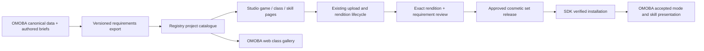

# Game asset requirements in Studio

Status: **proposal / TODO**, 2026-10-09. This draft defines a product direction
and an implementation backlog; it does not add endpoints, a schema migration or
runtime support. Start from OMOBA main `00cff781`. The separate Wildspark
[PR #77](https://github.com/o-moba/omoba-bevy/pull/77) is a useful art/motion
reference, not a prerequisite or an already merged contract.

## Product outcome

An artist opens **Studio → Games → OMOBA → Wildspark**, sees her skills and the
models each needs, rotates the current baseline models, downloads an authoring
reference and offers a replacement for a specific requirement. For the weapon
switch, the page shows **two distinct guns: repeater and launcher**. It explains
where each appears and which other skills reuse it. A class is gameplay; Anna
or another humanoid is an avatar appearance. They must remain independent.

A game owner publishes an immutable, game-owned requirements catalogue. Studio
makes it discoverable and manages contributions against it. The OMOBA website
reads the same published revision and links directly to the relevant Studio
brief. Artists should not have to inspect Rust, guess file names or upload an
arbitrary weapon before learning what a game needs.

## Source audit: existing foundations and gaps

Local source inspection, not a fresh hosted-service verification. These are
repository HEADs inspected on 2026-10-09; web surfaces may be deployed elsewhere.
The landing checkout also contains local edits; its inspection is a working-tree
snapshot, not a claim that all observed content belongs to the listed commit.

| Source / revision | Evidence and present behavior | Gap relevant to this proposal |
| --- | --- | --- |
| OMOBA `00cff781179e448c34835fa93f39e24901e7e328` | [heroes](../../shared/assets/catalog/heroes.json), [skills](../../shared/assets/catalog/skills.json), [resolver](../../shared/src/loadout.rs), [skill presentation](../../client/assets/config/skills.skillfx), [projectile presentation](../../client/assets/config/combat_visuals.json) | Gameplay and presentation data exist, but there is no exported artist-facing graph of requirements and their baselines. Model-path inventory alone cannot reveal semantic usage or procedural effects. |
| OMOBA equipment | [HandheldSelection](../../shared/src/handheld.rs), [attachment](../../client/src/held_weapons.rs), [profile](../profiles/handheld-glb-v1.json), [weapon manifest](../../client/assets/weapons/manifest.json) | Class-default Wildspark switches guns; an explicitly selected single item stays selected in both modes. There is no approved two-gun cosmetic-set selection. |
| Registry / Studio `90e7850bed638c81f65e11b8c9449b4c0981da7d` | `backend/app/api/integration.py`, `backend/app/services/integration.py`, `web/app/lib/studio.ts`, `web/app/components/games.tsx` | Existing Games view, profiles, creator submissions and owner review operate at project/profile/rendition level. No class → skill → requirement graph or requirement-targeted contribution. Current typed kinds are avatar and weapon. |
| Studio preview, same revision | `web/app/components/3d/WeaponGripPreview.tsx`, `web/app/components/games.tsx` | There is already a weapon grip preview using rest-pose reference proportions. Extend it; do not treat older roadmap wording about generic-only previews as current. It is not a complete OMOBA combat animation/VFX simulator. |
| Bevy SDK `a9a253cba110bcb308a7f81f6dfb5a4b2243f545` | `src/assets.rs`, `src/catalog.rs` | Existing typed asset selection, exact-size/hash verification and installation can be reused. Skill requirement bindings and cosmetic sets are additional concepts. |
| Player portal `c16934cab8fc309f77d383ace295078e60658dea` | `omoba-web/src/lib/types.ts`, `src/components/portal.tsx`, `README.md`; game `account-api/src/read.rs` | Portal consumes account/career data, including class aggregates. That is not a requirements catalogue. No shared skill/model requirements feed was found in the inspected portal source. |
| Marketing site `b697317a6dc295923758f7f90a7388aae0977eb6` | `landing-v2/apps/omoba/src/components/section-creators.tsx`, `src/lib/links.ts`, `public/media/beta/manifest.json` | Landing and gameplay media are separate from the portal. No import of the shared skill catalogue was found in its source. Decide which surface hosts the future class gallery; both should consume the same export. |

The cross-repository documents `ARCHITECTURE.md` and
`adr/0001-web2-first-asset-lifecycle.md` identify Registry as the publication owner
and OMOBA as a consumer. The [existing creator roadmap](creator-loop-and-class-builder.md)
remains the parent backlog. Its older unchecked items are not proof that a
feature is still missing; audit each owner before implementing it.

## Proposed contract: describe demand separately from supplied assets

Use a **versioned requirements manifest**, not a new combat protocol carrying
model URLs. Publish class/skill descriptions from the game's canonical catalogue;
add a small authored presentation-requirements layer for information the runtime
cannot infer. Generate and validate the combined export deterministically.

| Entity | Proposed responsibility |
| --- | --- |
| Catalogue revision | `projectId`, schema version, immutable revision, source commit, gameplay/presentation revisions, content digest and supported consumer/profile versions. Keep schema version separate from content revision. |
| Class view | Stable class ID, localized name/description keys, default recipe and basic attack. It is a navigation view over skills, not the owner of every model. |
| Skill / basic attack | Stable semantic ID and usage edges to requirements. Q/W/E/R are current recipe placements, not identity: a moved or reused skill retains the same brief. Include passive/status assets where applicable. |
| Requirement | Stable game-scoped ID, role (held weapon, projectile, world prop, animation reference, engine effect), usage conditions, required/optional status, technical profile/version, art brief and capabilities. One requirement can serve several skills or classes. |
| Baseline reference | Current in-game appearance: immutable file/hash/size, thumbnail, optional source/template and preview recipe, author/license/attribution. Distinguish bundled baseline from Studio asset identity. A procedural effect explicitly says it has no replaceable GLB. |
| Contribution binding | Catalogue revision + requirement ID + exact asset/revision/rendition/hash/profile version, creator and review state. It points to the existing Registry lifecycle rather than creating another upload store. |
| Cosmetic set release | Immutable map of compatible requirement IDs to approved renditions. A coordinated two-gun skin can reuse two independent assets; do not force both guns into one GLB or confuse a set with an avatar. |

Requirements specify metres, axes/origin, normalization bounds, palm/socket and
muzzle anchors, silhouette constraints, material/texture/geometry budgets and
mobile targets. Required mechanical capabilities (rotor, recoil slide, trap
jaws) need named semantic anchors/pivots and bounded motion parameters. OMOBA
owns the allowed motions; uploads never contain executable skill logic.

The current `handheld-glb-v1` profile is **static-only**, with one scene, ≤8 MiB,
≤64 nodes, ≤16 meshes and embedded grip metadata. It is not permission to upload
arbitrary animations, projectiles or trap logic. Static nodes can be animated by
the consumer, but their semantic bindings still need a validated contract.
Define new/versioned capability profiles only where needed, preserving v1.
Do not silently widen its validator or relabel every prop as `weapon`.

### Wildspark vertical slice

The following IDs and roles are proposed, not existing Registry records.
The baseline files below exist on the audited main; a configured file is not
necessarily the rendered representation, as the basic-rocket row shows. Re-export against the chosen
main revision after #77 lands instead of copying its assets into this draft.

| Requirement | Where the artist sees it used | Main baseline / extension boundary |
| --- | --- | --- |
| `wildspark.handheld.repeater` | Repeater basic attack; Q switch into repeater | `weapons/wild-repeater.glb`; a single approved handheld is supported today |
| `wildspark.handheld.launcher` | Rocket basic attack; Q switch into rockets; proposed W/R pose reuse | `weapons/wild-launcher.glb`; two-slot set selection is new |
| `wildspark.projectile.basic-rocket` | Rocket-mode basic attack | Main declares `weapons/wild-rocket.glb`, but its `form: tumbler` presentation takes precedence. Export the effective procedural baseline; the GLB path alone is misleading. |
| `wildspark.projectile.ultimate` | `wild_rocket` flight | `cosmetics/standard/rocket.glb`; a dedicated projectile profile/binding is future work |
| `wildspark.prop.trap` | `wild_traps`: placed → arming → armed → triggered | `cosmetics/standard/trap.glb`; three instances reuse one asset, not three uploads |
| `wildspark.effect.shockline` | `wild_zap` flight and hit | Engine-owned presentation; begin with a visual reference, not an invented GLB upload slot |
| `wildspark.effect.explosion` | Confirmed ultimate impact | Engine-owned flash/ring/debris/embers; approved shape/budget semantics cannot alter damage radius |

Q is a mode switch, not itself a third gun. W can initially reuse the launcher
if the game-owned presentation binding says so; a dedicated W model is an
explicit future requirement, not inferred by Studio. R uses a held launcher and
a separate flying model. An explosion, animation clip and held gun have different
contracts even when they are shown together on the skill page.

Illustrative requirement excerpt (not a complete upload payload or an implemented
schema; the exporter will populate actual immutable baseline descriptors):

```json
{
  "schema": "omoba.asset-requirements.proposal.v1",
  "projectId": "omoba",
  "requirementId": "wildspark.handheld.launcher",
  "role": "held_weapon",
  "profile": {"platform": "desktop", "id": "handheld-glb-v1", "version": 1},
  "uses": [
    {"skillId": "wild_switch", "state": "rockets", "phase": "equipped"},
    {"basicAttackId": "wildspark", "state": "rockets", "phase": "attack"}
  ],
  "baselineSource": "client/assets/weapons/wild-launcher.glb",
  "setRole": "launcher",
  "required": true
}
```

`baselineSource` is exporter input, never a public URL or path received in a
combat packet. Public output needs a resolvable immutable descriptor and license.
W/R reuse is intentionally outside this minimal excerpt until its presentation
binding is selected and verified.

## Publication, API and runtime direction



Recommended first transport: game owner uploads a validated manifest and baseline
files through the Registry project-owner surface. Static immutable JSON is enough
for the exporter; OMOBA does not need a new always-on service just to describe its
assets. Registry publishes read-only selected revisions for Studio and the web.
Later automation can use the same authenticated publication route. A URL-pull
import is a separate decision with origin/size/hash limits; no arbitrary fetcher.

Proposed API resources, names **subject to Registry review**:

- Public `GET /v1/projects/{projectId}/asset-requirements` resolves the selected
  catalogue revision; a revision-qualified resource serves immutable contents.
  Use ETags, bounded responses and explicit unsupported-schema errors.
- Owner-only creation/selection of catalogue revisions validates stable IDs,
  references, profiles and baseline files; selection is atomic and auditable.
- Requirement-targeted submission adds revision/requirement context to the
  existing rendition submission and owner review. Exact mapping may be a new
  association/resource: the current request contains only `projectId`, so do not
  claim that it already accepts requirement IDs or multiple bindings.
- A set-release resource composes exact approved bindings; the public selected
  release is independent of the latest uploaded revision. Preserve existing
  `/v2/assets`, `/v2/avatars` and project/profile approval semantics.

A technical pass, publication, game approval and active game binding are distinct
states. A generic approved weapon is not automatically suitable for every slot.
Changing any approved bytes, grip or binding requires a new reviewed revision.
Repeated submission is idempotent; stale catalogue conflicts are visible. Retired
requirements keep historical IDs and releases; never recycle them for another use.
Catalogue schema, gameplay revision and asset profile evolve independently.

Initially show the two requirements and accept individual contributions. Equip a
**complete set atomically** only in a later runtime slice. Recommended fallback:
if any required member is unavailable/incompatible, use the complete packaged
class default; never silently mix an old/new gun pair. Optional effects use their
explicit built-in fallback. Preserve legacy single-item and empty-hand choices;
set selection is a new explicit choice. Pin admitted set/binding revisions for a
match, resolve identical bytes on both peers and define revocation behavior for
new admissions versus ongoing matches. Reuse current healthy-empty vs outage
catalogue handling; do not convert network failure into mass revocation.

Remote asset identities and reviewed set IDs may eventually need additive shared
DTO/Join/snapshot changes with compatibility tests. Discovery pages alone do not
require a UDP protocol change. Damage, mana, acceleration, collision and blast
radius stay in authoritative game logic; a prettier rocket cannot change them.

## Artist and reviewer experience

1. **Game page:** classes, contribution opportunities, selected catalogue revision
   and supported platforms. Search by class, skill and asset role; show baselines,
   missing requirements, existing approved alternatives and retired briefs separately.
2. **Class/skill page:** avatar mannequin plus independent skill cards and required
   assets. Q previews both modes side by side. A reusable asset links to every use.
3. **Requirement page:** baseline 3D turntable, optional in-hand comparison,
   downloadable licensed template, clear limits and motion/pivot requirements.
   Fall back to thumbnail/video if the browser cannot preview a supported file.
   A Bevy reference clip explains timing/VFX that the web viewer cannot reproduce.
4. **Contribute:** upload a new asset or reuse one's existing revision, choose the
   requirement, see actionable validation issues, then submit the prepared version.
   Preserve context through login/upload/retry. Show author credit and license.
5. **Review and apply:** owner compares exact candidate and baseline in the required
   role, approves/rejects with a reason, and separately selects a complete release.
   Creator sees “accepted for this requirement” and “available in game” distinctly.

Do not promise a browser preview is equivalent to native combat proof. Keep the
real-game acceptance clip linked to the exact catalogue and asset revisions.

## Ordered TODO and acceptance

All tasks are open. This PR records them; it does not claim implementation.
Read-only discovery work can proceed alongside the creator-loop release gates.
Public contribution/runtime rollout must reuse and reverify those gates.

- [ ] **S0 — Agree ownership and wire vocabulary.** OMOBA + Registry/SDK owners:
  decide requirement/set identity, profile capabilities, baseline licensing,
  platform policy and public web surface. Acceptance: reviewed contract examples,
  explicit current/proposed boundary, no dependency on merging #77.
- [ ] **S1 — Export the Wildspark requirements graph.** OMOBA; depends S0. Generate
  from canonical skills/recipes and an authored binding layer, include basic attacks,
  both guns, projectiles, traps and explicit procedural-only effects. Acceptance:
  deterministic export, complete baseline hashes/licenses, unknown/duplicate/dangling
  IDs rejected; skill reassignment to another key/class preserves requirement identity.
- [ ] **S2 — Import and select catalogue revisions.** Registry backend; depends S1.
  Reuse project ownership, profile registry and file lifecycle. Acceptance: foreign
  owner denied, invalid/unsupported/oversized documents rejected, old selection
  survives failure, repeated import safe, revision history and retired IDs retained.
- [ ] **S3 — Studio discovery and baseline previews.** Registry web; depends S2.
  Extend Games view and existing model/grip viewers. Acceptance: an artist can find
  OMOBA → Wildspark → Q → both guns before uploading; each has role, baseline,
  limits and contribution action. Check loading/empty/unsupported-preview states.
- [ ] **S4 — Requirement-targeted contribution/review.** Registry backend/web;
  depends S2–S3 and current creator lifecycle readiness. Acceptance: artist uploads
  a fresh replacement via UI, owner reviews exact bytes in its role, rejection and
  revised resubmission work, no automatic eligibility from publication, baseline
  and credits remain visible. Compatible existing assets can be proposed again.
- [ ] **S5 — Two-gun set admission and rendering.** OMOBA + SDK + Registry; depends
  S4. Add versioned set selection without breaking single-item/empty hands.
  Acceptance: Q switches the two approved models on two independently cached
  clients; invalid/missing/revoked member follows documented fallback, stale clients
  cannot admit unsupported sets; combat numbers unchanged. Verify one desktop
  pilot first, then the declared phone profiles before advertising mobile support.
- [ ] **S6 — Projectile/prop capability profiles.** Same owners; depends S1/S4.
  Specify pivots, muzzle, rotor/slide/jaw semantics and bounded budgets; add typed
  support or an explicitly reviewed profile extension instead of overloading v1.
  Acceptance: native trap arming/trigger and rocket flight/impact match server events;
  malformed assets are rejected and procedural effects retain authority/budgets.
- [ ] **S7 — Web gallery from the same revision.** `omoba-web` owner, with landing
  owner for links; depends S2. Recommended full gallery in the portal, creator CTA
  on the marketing site. Acceptance: names/skills/baselines come from the same
  exported revision as Studio, no copied balance tables, stable deep links and
  visible stale/unavailable states, public baseline files have browser access.
- [ ] **S8 — Expand and document contributor success.** OMOBA/Registry; depends S5
  and relevant S6 profiles. Try another class with reused assets/skills and a purely
  procedural skill. Acceptance: no Wildspark-only UI branches, fresh artist can
  repeat the route unaided, catalogue coverage report, attribution and compatibility
  regression checks, before/after evidence tied to an admitted release.

MVP completion is S1–S4: discover the real need, see its baseline, contribute and
review an exact model. Playable coordinated two-gun skins require S5; replacing
traps/projectiles requires S6. Neither should be advertised as delivered by a
read-only catalogue. No paid marketplace, blockchain/IPFS migration, executable
skill editor, arbitrary animation graph or production deployment is in this plan.
