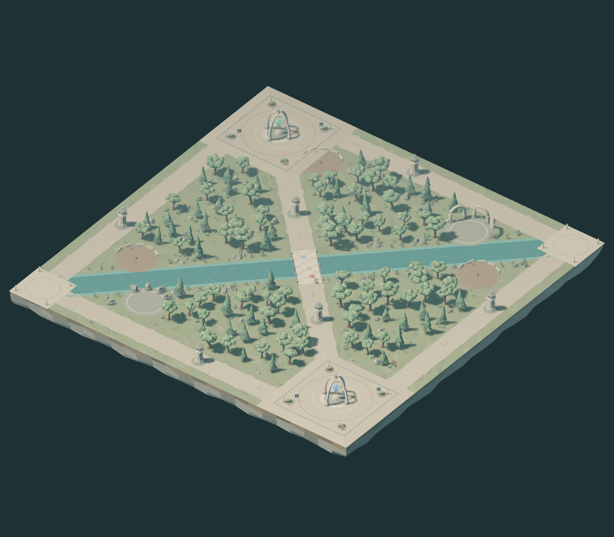
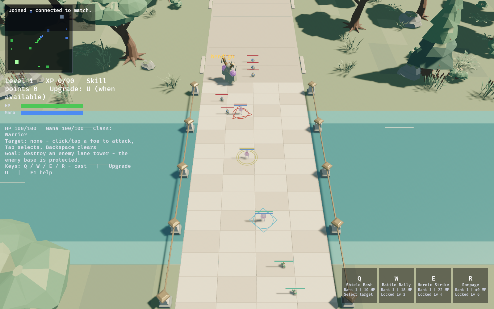

# Verdant Confluence runtime integration — 2026-09-05

Iteration 03, candidate **0.18.0-rc.2**, based on the preceding release work
(`f2a3359`). Task: `VERDANT-3D-RELEASE-2026-09-05`. The frozen acceptance criteria,
current command logs, geometry reports, native images and independent verdict
are retained in `.agent/tasks/VERDANT-3D-RELEASE-2026-09-05/` in the dedicated
`feature/verdant-3d-release-2026-09-05` worktree.

## Source and runtime composition

The 40-file authored scene from art commit `338dd2d` was imported byte-for-byte.
The original checkout and the user's open Blender scene were preserved. A
separate headless Blender process inspected the saved scene: 2,373 objects,
440 meshes and 22 materials. The supplied overview and river render define the
composition, palette and material direction.

`scripts/stage_verdant.py` derives six GLBs and a manifest from those saved
exports with Python's standard library. One source meter is one game unit;
the export already maps Blender `(x,y,z)` to Bevy `(x,z,-y)`. There is no second
runtime axis rotation. The environment and foliage have separate persistent
roots; four shared faction scene handles supply all six towers and two bases.
The eight baked structure roots are excluded from both static scenes. Their
live children inherit targeting/HP ownership, hide after destruction and
restore on rematch. F4 controls the existing foliage visibility layer.

The old primitive 3D terrain and scatter renderer were removed. The optional
2D projection, art and movement remain unchanged. Warm sun, cool ambient fill,
AgX tone mapping and cascaded shadows support the jade/sage forest, pale stone
routes and turquoise river. The normal 3D camera is wider to accommodate the
sanctuaries. Native image comparison drove a lower 11,000-lux sun and stronger
650-unit ambient fill to preserve color and reduce shadow contrast. No server route, objective, collision, combat or balance was changed.

## Grounding and asset adaptation

The source Blender scene remains an art source. Its playable derivatives have
explicit, recorded walking-surface changes. Flat roads use Y=0; meadow is
slightly below, and stone crossings slightly above, to separate overlapping
surfaces. River water is close to the flat traversable simulation surface.
Bridge pavers are flattened, keeping the stone detailing, original span and
12-meter walking deck. Parapets move 0.8 meters outward with their support
geometry to clear the lane. The upper base-pad bevel is squared to keep the
46-meter platform top aligned with the mitered ramps.
Base grounding follows the authored mitered ramps using the largest local X/Z
offset, rather than combining overlapping side ramps. Sanctuaries retain their
architecture while their floor is compressed; rotating them 45 degrees opens
the authoritative diagonal spawn paths. Runtime hashes and each adaptation
are recorded in `client/assets/verdant/manifest.json`.

`scripts/validate_verdant_assets.py` transforms actual exported triangles into
world space and samples base tops, side/corner ramps, bridge approaches/decks/
exits and spawn floors against the client grounding contract. It also verifies
source identity, deterministic regeneration, scene structure/materials and
Assimp imports. This is geometry evidence, not a collision subsystem or a
performance guarantee.

## Disputed models and package gate

The candidate excludes El Bueno, the two Mimic Slime models and Wendigo Hollow,
including six model/preview files and their active staging/manifest/config
references. The original permission evidence in the rc.1 distribution review
is preserved. No restrictive model metadata was changed to make it appear
permissive. Fifteen heroes and King Mutatio remain.

Original ivory/jade/azure/brass stone creatures now fill both minion roles;
the guardian uses a larger crystal/antler silhouette. Shared meshes/materials
and state-driven articulated parts keep their allocation bounded. Gameplay
identities, HP, rewards and respawn remain authoritative and unchanged.

`scripts/validate_candidate_assets.py` checks every actual candidate file for
known denied hashes/names and checks all model content against the reviewed
inventory. It verifies source/manifest metadata, embedded actor permissions,
required previews and environment hashes. Contradictory embedded permissions
fail even if a manifest says CC0. The package script runs the gate both before
building and against the copied package, including renamed-content rejection.
Its unconditional `--internal-review` guard has been replaced by that real
content check. Each successful package includes `ASSET-REVIEW.json`, attribution,
provenance, launchers, a current test guide and a hashed `BUILD.json`.

This clears the specific four-model conflict through exclusion. It does not
certify legal rights universally, close GitHub alerts, resolve the separate
HTTP/TLS/bytes dependency dispositions, or establish public-release readiness.

## Validation and delivery

The exported-geometry validator passes 2,123 world-space samples and 1,980
joins: maximum ground error 0.030000002 m and maximum join residual 0.020000002 m,
within the 0.05 m acceptance limit. All six runtime Assimp imports pass; a second
derivation reproduces every GLB and the manifest byte-for-byte. All 40 art input
hashes remain unchanged. The package gate passes 23 positive/negative tests,
including renamed denied content, forged CC0 metadata, missing references and
corruption during packaging. Retained avatar/animation validation passes for
15 heroes and the single imported boss (Bao Samurai retains its existing
optional-thumbnail warning); the minion manifest correctly contains zero
imported models and two original procedural roles.

Native admission testing found a real deferred-spawn race: the world fallback
could queue a second local player in the same frame as the first authoritative
snapshot. Ordering it after snapshot application fixes the panic; a focused
regression exercises the real admission pipeline and repeated snapshots. The
failed initial captures remain in raw evidence. Native HUD review also exposed
development buttons despite debug UI being disabled and missing separator
glyphs; the controls/hotkeys now honor the existing flag and text uses supported
ASCII. The remaining HUD layout and small-unit readability still need human
observation under the test guide's target resolutions.

The complete workspace passed 266 Rust tests and strict clippy before the last
presentation refinements. The updated client then passed all 148 tests, strict
clippy, a complete workspace build, formatting and diff checks. Final independent
workspace/package results are recorded in the delivery record below.

Root-operated native capture 05 completed in 42.89 seconds with client exit 0,
no missing-asset/panic/download errors, 13 loaded/instantiated scenes, eight
styled authoritative structures, three admitted network players and five
explicitly tagged display fixtures. These are actual macOS ARM64 Metal renders.
The earlier capture 04 produced images but timed out during shutdown; it is
preserved as a failed harness run. Capture 05 did not reproduce that timeout;
packaged capture verification is also required before final acceptance.





Compared with the supplied Blender overview/river references, the same four
forest regions, three lanes, continuous turquoise river, eight faction
structures and ruin groupings are visible. The runtime palette remains lighter
and its shadow edges harder than the offline render, but materials and modeled
detail are intact. Source overview capture extends shadow range to 650 m for
its distant camera; detail/normal views retain the production 360 m range.
The normal view shows local/friendly/enemy cue shapes and both minion colors.
The [river detail](2026-09-05-verdant-runtime/03-river-gameplay.png) and
[sanctuary detail](2026-09-05-verdant-runtime/02-sanctuary.png) show continuous
walking surfaces, grounded structures and no duplicated primitive geometry.

Reproduction commands:

```sh
python3 scripts/stage_verdant.py
python3 scripts/validate_verdant_assets.py
python3 scripts/validate_verdant_assets.py --self-test
python3 scripts/validate_candidate_assets.py
python3 -m unittest discover -s scripts -p 'test_candidate_assets.py'
python3 scripts/validate_avatar_assets.py --roster-min 15 --roster-max 15
python3 scripts/validate_avatar_assets.py --avatars-dir client/assets/bosses --roster-min 1 --roster-max 1
cargo build --workspace --locked
cargo test --workspace --locked -- --test-threads=1
cargo fmt --all -- --check
cargo clippy --workspace --all-targets --locked -- -D warnings
python3 scripts/package_native.py --output /tmp/omoba-0.18.0-rc.2
python3 scripts/capture_verdant.py --package /tmp/omoba-0.18.0-rc.2 --output /tmp/verdant-capture
```

The screenshot scenario is explicitly opt-in, disabled in normal play, and
uses the native Bevy GPU renderer after all required scenes load. Its source
cameras and tagged production creature fixtures make model/material quality
reviewable; normal network peers and local admission/movement exercise runtime
integration. It is separate from interactive playtesting.

## Remaining release work

Use the [current test guide](2026-09-05-verdant-test-guide.md) for human onboarding,
full 5v5 victory/rematch sessions, a measured 30-minute soak and declared
platform/network coverage. Automated render evidence cannot substitute for
those observations. The earlier dependency review remains applicable to the
unchanged dependency set. This branch prepares a controlled native playtest
candidate; it does not deploy a public service or publish a binary release.
