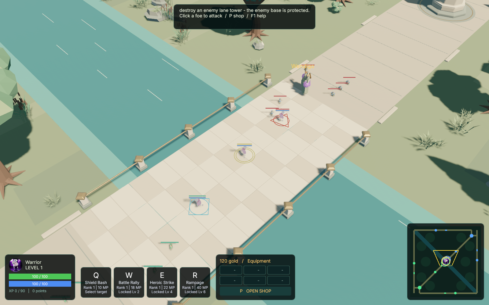
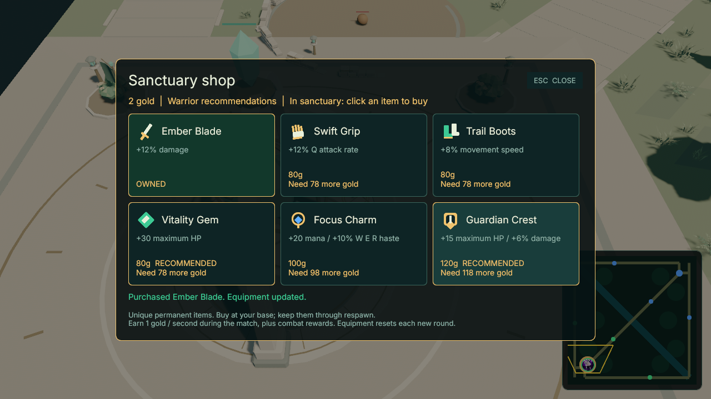
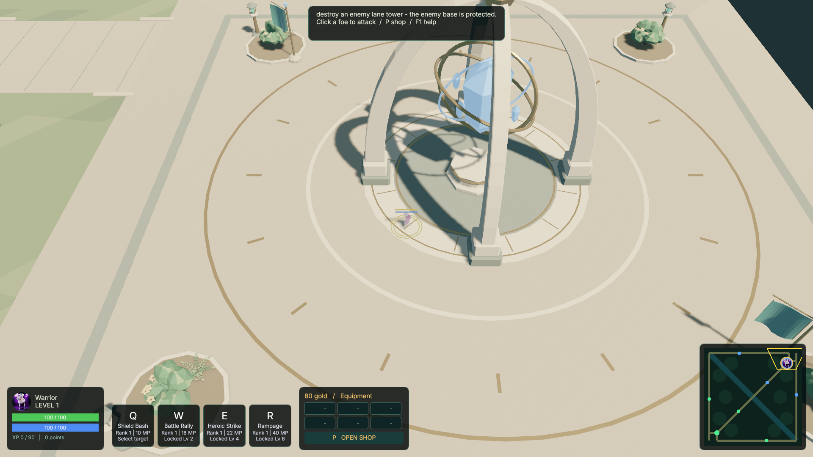

# Playtest iteration 05 — camera, HUD and item progression

Date: 2026-09-07. Candidate: 0.18.0-rc.4. Task: BETA-HUD-SHOP-2026-09-07.
The iteration is implemented, packaged and exercised through a complete match
and rematch. The dated record below identifies the changes and their evidence.

## Assessment of the previous playtest

The rc.3 baseline already completed two ordinary 5v5 matches and clean rematches.
The user's hands-on test confirmed that the Verdant arena and gameplay improved,
but the visual hierarchy and progression still obscured the experience. The next
iteration therefore concentrates on five concrete obstacles:

| Area | Finding | Iteration decision |
| --- | --- | --- |
| Hero readability | The 1.15 target height felt too small against large scene architecture; saved settings preserve that value. | Raise default to 1.45 and migrate only old defaults. Keep creatures and gameplay hit rules unchanged. |
| Spatial orientation | The camera looked along the diagonal midlane and flipped between teams; mid appeared vertical while the map was diagonal. | Fix the default azimuth for both teams; screen-right is +Z and screen-up is +X. Keep zoom/orbit and Space reset. |
| HUD/UX | A tall text slab competed with the scene and a separate hotbar; gold had no actionable purpose. | Use a coherent jade/ivory/gold dock with resources, four abilities, inventory and shop entry, plus compact objectives. Bundle licensed Inter for readable typography. |
| Tactical map | Heroes and mobs were small squares; all enemy heroes appeared without detection and camera coverage was absent. | Use circular portraits, team rings and a gold local halo, explicit missing-portrait fallback, radial team detection and actual yellow camera coverage. Derive input from computed UI bounds. |
| Match progression | Gold accumulated without a spending path; leveling was the only build decision. | Add six unique items with class recommendations, starter/passive gold and authoritative paid effects. Keep the beta economy small enough to understand in one match. |

The user's League reference informs map direction, readable hero emphasis and
the base-shop loop. Its official [How to Play](https://www.leagueoflegends.com/en-us/how-to-play/)
describes gold, equipment and the base shop. No Riot artwork or interface assets
are copied. Inter is distributed with its [OFL license](../../client/assets/ui/OFL-Inter.txt)
and asset provenance; no new production code dependencies are introduced.

## Architecture and code decisions

The existing authoritative runtime remains the owner of gold, purchase
eligibility, inventory, item effects and receipts. A shared catalog holds costs,
bonuses and recommendations, so the client and bots cannot silently drift from
server damage/cooldown rules. Each purchase carries a request ID, server epoch
and match ID; retries are idempotent and stale-round or pre-restart packets
cannot spend in the next match. Buying haste also updates an active local
cooldown deadline to match the server, preserving time already elapsed.
The client displays replicated equipment and confirmation, with a distinct
pending state. It does not grant optimistic items or subtract local currency.

Client input follows the existing modal precedence: Help, Shop, then Pause.
Shop browsing can happen away from base, but eligibility and purchase rejection
remain visible. HUD backgrounds block world clicks. The camera and minimap use
one world-axis convention; pointer coordinates use the actual computed panel
rectangle, including display scale, rather than old top-left constants.

Minimap detection is deliberately a limited UI feature. Living allied heroes
observe 32m, minions 22m, towers 28m and bases 34m; any observer reveals an enemy
hero marker. There is no obstacle line-of-sight model. Full world/network fog
requires a separate public roster, filtered snapshots and consistent casting,
projectile and visual cleanup rules; it is not claimed in this iteration.

## Shop tuning for the first beta

| Item | Gold | Effect |
| --- | ---: | --- |
| Ember Blade | 80 | +12% damage |
| Swift Grip | 80 | +12% Q attack rate |
| Trail Boots | 80 | +8% movement speed |
| Vitality Gem | 80 | +30 maximum HP |
| Focus Charm | 100 | +20 maximum mana, +10% W/E/R haste |
| Guardian Crest | 120 | +15 maximum HP, +6% damage |

Start with 80 gold and earn one gold per second while the match is running,
including during death. Farming rewards remain available. Buy alive within 18m
of your own base; every class can own each item once. Different item percentage
bonuses add. Additional maximum resources grant the same live amount on purchase.
No recipes, selling, critical hits or armor are introduced. Bots buy at spawn and
respawn, using the same item effects; complete-match verification must include
paid purchases and an equipment reset, not only base destruction.

## Verification ledger

Task specification and raw results are kept under
`.agent/tasks/BETA-HUD-SHOP-2026-09-07/`.

- Fresh canonical `cargo test --workspace --locked`: all 308 Rust tests PASS
  (172 client, 74 server, 19 shared, 5 skills, 20 harness unit and 18 integration).
  This includes the corrected paid-item reconnect and framed snapshot tests.
- Fresh Python tests: 38 PASS. Fresh workspace clippy with warnings denied,
  locked workspace build, formatting, candidate content gate and Verdant geometry
  pass. The 15-avatar validation also passes. No production dependencies changed.
- Source-binary full match proof: two ordinary release 5v5 rounds in 461.23s and
  455.90s, 119 paid purchases, complete reset and 889 telemetry samples. These
  independently built binaries are identified in `raw/full-match-shop-03/`.
- Native source captures: seven real UI frames each at Green 720p and Blue 1080p,
  including an epoch-bound purchase and Escape dismissal. Five Verdant renderer
  views also pass, with a diagonal follow view and rotated/zoomed camera coverage.
  The two latter map captures include one ally, one detected enemy, the local
  portrait and distinct minions. Result UI is explicitly a synthetic fixture.

Verification corrected a Bevy UI/transform schedule cycle, a visibility test
fixture, stale purchase retries after restart, an invisible lobby Help flag,
active cooldown deadlines after buying haste, and incomplete growing log reads.
Reconnect coverage now purchases an item and accounts for passive income until
reservation. Full-roster equipment snapshots exceed macOS's measured 9,216-byte
legacy send ceiling; their populated/malformed-recovery regression now uses the
existing native <=1,200-byte framing. Small legacy compatibility and the actual
OS ceiling remain separately tested. No OS settings were changed.

## Packaged candidate and visual record

The macOS ARM64 package was built from clean, published code commit
`9483bb48717b8dde09f696c9f4b5ef71e8f00392` on
`feature/beta-hud-shop-2026-09-07`. Its archive is
`omoba-0.18.0-rc.4-macos-arm64.zip` (167,523,694 bytes), stored under this task's
`artifacts/` directory. SHA-256:
`ab0b12375f3067a50fcc6ead4b534fcc2ca313046b69b72ca978ab5b38a2926b`.
All 93 manifest files match their hashes; the ZIP contains those files plus
`BUILD.json`, and passes the archive integrity check. The package uses the
development Cargo profile with optimized dependencies, rather than claiming a
measured shipping performance budget. A subsequent documentation-only commit
does not change the tested runtime or assets.

Exact-package native checks produced 19 frames with successful client exits:
Green 720p (7), Blue 1080p (7), and Verdant views (5). The shop capture below
contains a real authoritative paid purchase. Gameplay captures include declared
render fixtures; the result-layout fixture is synthetic. These are actual Bevy
readbacks with scripted input, not a claim of manual human playtesting.
The independent verifier reran the packaged Green 720p flow: all seven frames,
the real purchase and modal dismissal passed again with client exit 0.

Extract the package and run `./practice.sh` to start a release-mode server,
nine bots and a client. Select a class and hero, then press Join. `P` opens the
shop; purchase a starter at your base, and use `Escape` to return to play.
`Space` restores the default camera. See the
[beta test guide](2026-09-07-beta-test-guide.md) for hosting and controls.

Exact-package normal release 5v5 proof passed with ten ordinary UDP bots:

| Round | Winner | Duration | Paid purchases |
| --- | --- | ---: | ---: |
| 1 | Green | 7:17.5 | 56 |
| 2 | Blue | 7:32.3 | 59 |

Both countdowns and the complete rematch reset passed. The trace contains 849
complete samples; maximum driver-observed peer snapshot age was 14ms on local
UDP. The clock and game rules were not accelerated. Both executable hashes were
checked again after the run. `raw/package-full-match/` contains the checker
result, metrics and telemetry; the wrapper exited 0.

The independent verifier reran the complete test/build/content checks, inspected
the current implementation and native PNGs, checked all ZIP contents against the
manifest, and repeated the real client purchase flow. Its command logs and
artifact checker are under `raw/fresh-verification/`; the acceptance decision
for AC1–AC9 is recorded in the task's `verdict.json`. The proof bundle contains
`spec.md`, `evidence.md`, `evidence.json` and raw artifacts, including retained
failed attempts and the corrections they prompted. Source and final workspace
package binaries are distinguished because workspace dependency feature
unification can change their hashes.

## Follow-up after this iteration

Human tests should decide whether starter recommendations and item prices create
useful choices, how often players return to shop, whether fights remain readable,
and whether the new camera is comfortable from both sides. Full fog of war,
larger item builds, richer ability/item illustrations, measured hardware budgets,
Internet loss/jitter coverage, other platforms and dependency review remain
separate work. The beta has a complete match loop; automated evidence does not
replace those human observations.
