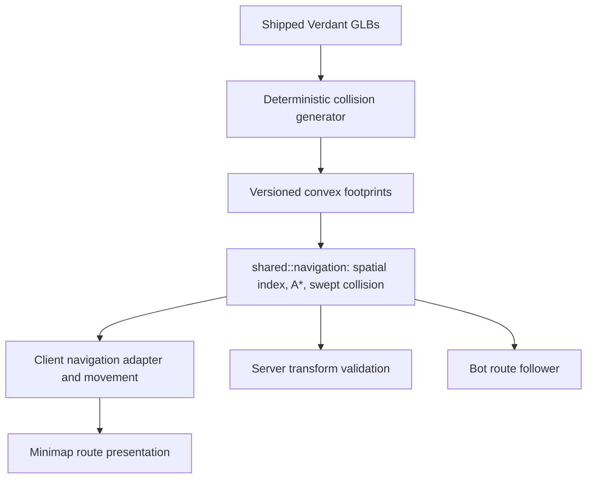
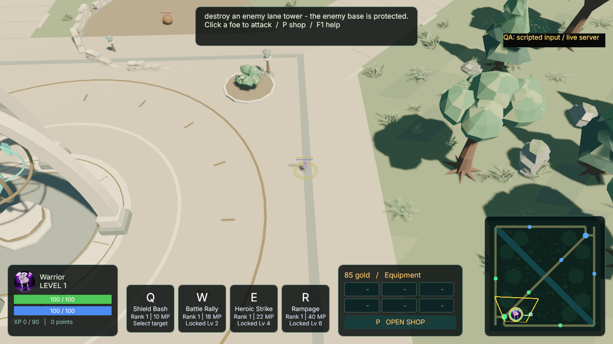
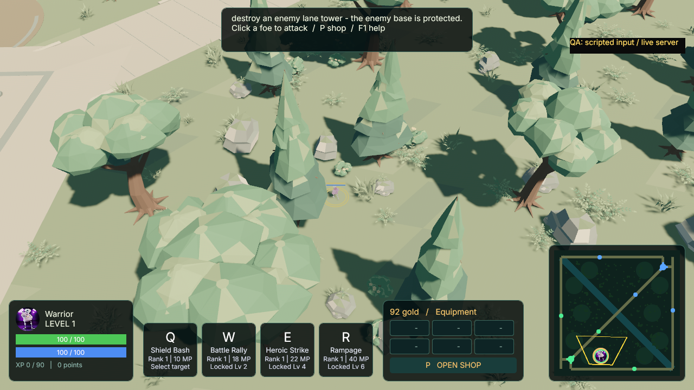

# Forest navigation and minimap routes — 2026-09-08

## Behavior
Right-click the ground or minimap to order a persistent route around trees,
solid rocks/walls and live structures. Only the local hero's remaining path
and destination appear on the minimap, as a mint line/ring above the obstacle
mask and camera outline, below hero portraits. The 3D world stays free of path
gizmos. Arrival, cancellation, death and session reset clear the route.

The previous Dijkstra planner knew only about structure discs. The new obstacle
map comes from shipped GLB geometry, so forest detours and actual movement agree.
Both client and server sweep movement segments, preventing a large frame or
malformed/direct movement packet from crossing a trunk. Fill bots use the same
route search and retain their existing tactical decisions and legal speed.

## Module boundaries

- `scripts/generate_verdant_collision.py` selects semantic asset/material data,
  composes GLB transforms, clips the bark slab and emits stable footprint IDs.
  `--check` verifies deterministic output, source hashes and map clearances.
- `shared/assets/verdant-collision.json` is the runtime collision contract:
  113 trunk footprints and 123 boulder/outcrop/wall footprints. Trunks use
  conservative circumscribed polygons around bark at body height, not canopies.
  Grass, flowers, bridge decks and base/lane paving are excluded.
- `shared/src/navigation/` owns pure geometry, immutable spatial bins, cached
  grid occupancy/edges and bounded deterministic A*. Search adds hero radius
  and planning clearance, tests continuous edges and smooths only clear
  segments. Blocked destinations resolve to reachable clearance; invalid or
  unreachable orders fail safely. Static geometry is initialized once.
- `client/src/navigation.rs` adapts Bevy coordinates and live structure discs.
  Movement intent remains in `player.rs`; the route cache also tracks the live
  structure set so destruction does not retain obsolete detours.
- `harness/src/navigation.rs` caches bot routes separately from strategic AI.
- `client/src/minimap_route.rs` owns a raster collision overlay and reused UI
  line nodes. It uses the existing minimap projection in both render modes.

No extra production dependency, wire-format change, terrain physics engine or
Blender-source modification is introduced. The canonical version is rc.6.

## Verification and delivery
The frozen task, exact checks, native captures, evidence and independent verdict
are under `.agent/tasks/FOREST-NAVIGATION-2026-09-08/` in the dedicated worktree.
Geometry checks preserve all 12m lanes and connect both spawns, camps, bosses and
tower approaches. Native evidence drives ordinary input from spawn into a real
forest crossing, uses a separate hello-only UDP observer, and checks continuous
segments against the polygon artifact. Actual screenshots verify the minimap
route and clear world view. Scripted input is labeled; human input is not claimed.

Fresh verification passed a locked workspace build, 340 Rust tests against the
rebuilt server, 54 Python tests, strict clippy, formatting and deterministic
geometry checks. Native Green 720p and Blue 1080p captures confirm a 30m blocked
forest order becomes a short detour (31.04m / 30.44m), stays at least 0.66m from
solid footprints for a 0.5m hero, and clears the minimap route at arrival.

An ordinary 25-second release-mode 5v5 startup also passes: all ten bots leave
base and advance 39.75–89.98m, with stable IDs and no unexpected process exit.
This check caught a strategic resync assumption: bots targeted their solid own
base center. Resync now starts at the first forward lane waypoint, retaining
base collision. A regression covers both teams, all three lanes and respawns.
The speed-authority test now validates an open lane before comparing speeds;
its original assertions remain unchanged. Failed evidence and successful fresh
reruns are retained in the task directory.

The final branch is integrated into the original `omoba-bevy` beta checkout so
`make play-bots` launches this iteration. The original edited `.blend` is
preserved by hash. The deferred local-play launcher draft is outside this task.

## Scope limits
The map contains fixed trunk/stone footprints. Trees are not destructible;
projectile occlusion, fog of war, crowd avoidance and navmesh elevation are
separate systems. Lane minions and leashed neutral AI keep their existing paths;
this change governs human and fill-bot heroes. The legacy 2D art is not rebuilt,
but its minimap displays the same solid forest mask and simulation rules.
This iteration verifies navigation and bot match startup, not a fresh full-match
balance, platform or release certification.

## Captured views

