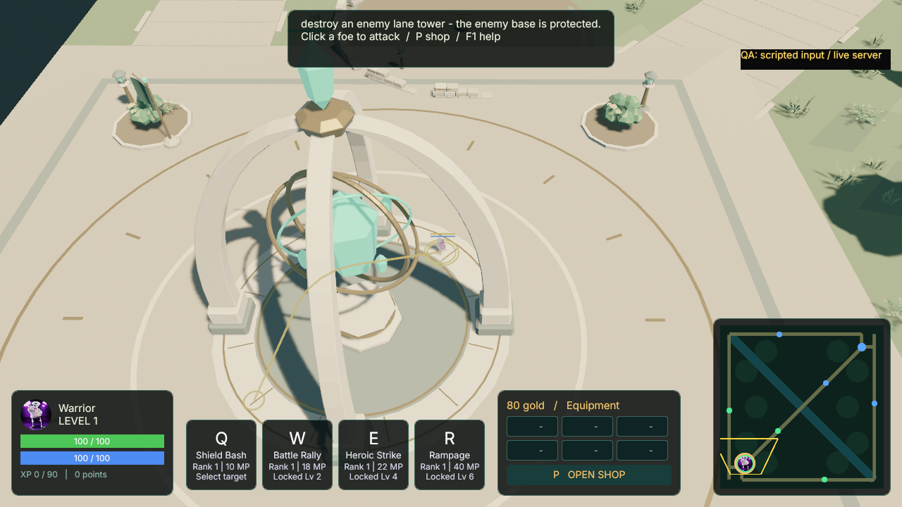
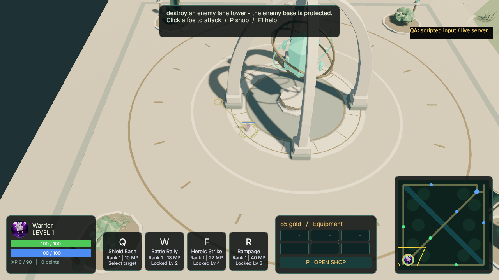

# Right-click navigation — iteration 06

Date: 2026-09-08. Version: 0.18.0-rc.5. Task: MINIMAP-MOVE-2026-09-07
(started before the local date changed).

## Behavior

Right-click ground or the minimap to set a destination. The hero follows the
route after button release and stops at arrival; another order replaces it and
cancels a queued attack approach or cast. A golden local route and destination
ring show the order. Left-click/touch controls retain their previous behavior:
minimap camera pan, ground movement, and hostile selection/attack. Alt with
right-click still orbits; Help, Shop, Pause, debug flight, non-running sessions
and dead/unadmitted heroes cannot issue a new order.

## Navigation boundary and implementation

The previous client steered straight toward MovementTarget and could stall at
solid structures. A small deterministic visibility graph now plans against the
same inflated tower/base collision discs and map bounds, with 0.15m extra
clearance. Destinations inside a structure are projected to reachable clearance.
Invalid/unreachable requests stop safely with visible feedback. The route is
cached per destination, so normal traversal does not rebuild a graph each frame.
Waypoint consumption waits for the actual collision-resolved position.

This is navigation for the existing collision model. Decorative trees, rocks,
river scenery and other art do not gain a walkability mask. Moving heroes retain
the existing overlap resolver; no crowd planner or full terrain navmesh is
introduced. Server protocol, authoritative speed limits and combat balance are
unchanged. Both 3D and orthographic 2D input use the existing simulation projection.

## Verification

The frozen specification, evidence and raw results live under
`.agent/tasks/MINIMAP-MOVE-2026-09-07/`. Current integration checks and a bounded
native input scenario pass; the independent acceptance record is kept beside
the raw evidence in `verdict.json`.
The native scenario injects real button input/window cursor coordinates and
uses a separate read-only UDP observer to confirm authoritative arrival. It
never inserts movement intent directly or teleports the hero. Scripted input is
reported as scripted; no manual human input or complete terrain navigation is
claimed. The previous rc.4 distribution remains a separately identified artifact.

## Measured result and retained findings

- Fresh full workspace run: 324 Rust tests PASS (188 client); Python: 44 PASS.
  Formatting, strict workspace clippy and locked build pass. A final scoped
  rerun covers the route cue and delayed capture changes.
- Corrected Green 720p native run: all four images, real input isolation checks
  and independent UDP arrival checks PASS; client exit 0 in 10.59s. The planned
  base detour is 16.20m, with 16.03m observed authoritative traversal, 3.851m minimum
  distance from the base center (physical collision radius 3.7m), and 13 server
  snapshots confirming each destination. The clock and movement speed are normal.
- The first capture revealed an unacceptable 150m detour for a 14m order. A 1mm
  graph-node margin fixes floating-point tangent disconnections at real base
  coordinates. The exact eight-structure case, both bases and translated layouts
  now have a route-length regression. The strengthened native oracle rejects the
  retained old capture as a negative control.
- The local cue uses a dedicated three-pixel gizmo group and a foreground depth
  with near-clip headroom. Traveling captures wait eight frames while movement
  continues, so they show the rendered cue rather than its first-frame setup.

No server or item/combat changes required another full economy match run for
this navigation iteration. Ordinary match and rematch evidence for rc.4 remains
in its dated HUD/shop record; this iteration adds focused client/server route
proof. Human path-feel, terrain collision expansion and crowd navigation remain
separate follow-up work.
