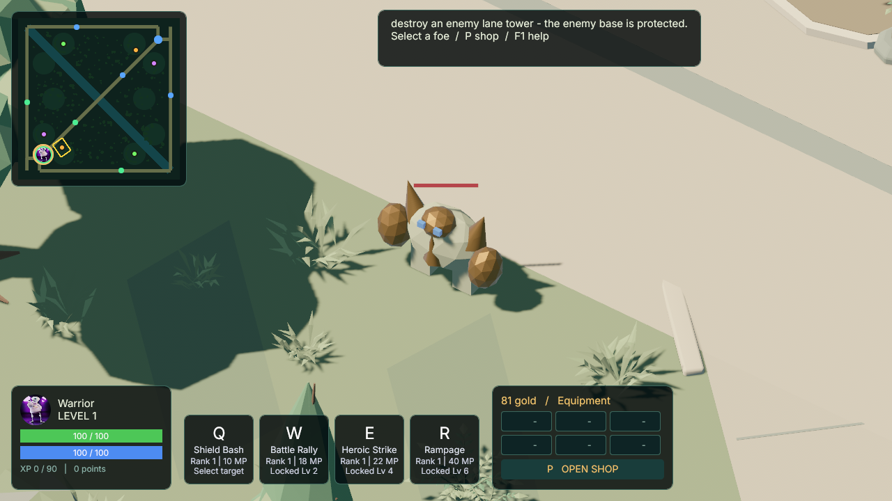
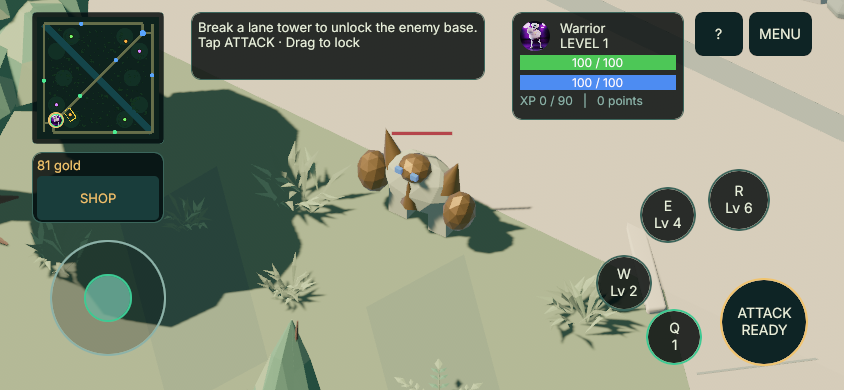

# Jungle farming — 2026-09-11

Version: 0.19.0-rc.2. Six ordinary single-creature camps share authoritative
anchors with both client maps: a skirmisher, bruiser and spitter on each side,
paired by a half-turn. This extends the former three isolated brown spheres.
No external models or production dependencies were introduced.

| Creature | HP | Gold | XP |
| --- | ---: | ---: | ---: |
| Skirmisher | 72 | 28 | 50 |
| Bruiser | 130 | 52 | 85 |
| Spitter | 58 | 35 | 55 |

Anyone can farm with the existing mouse/touch target, basic attack and skills.
Last-hit gold and XP are awarded once on the server. An ordinary last hit also
restores 20% maximum HP to its living killer, capped at maximum; it cannot revive
a dead player and does not change boss rewards. Three camps yield 115 gold and
190 XP, reaching level 2 with 100 XP carried forward. A normal camp respawns at
its anchor with full HP 40 seconds after death. Rematch rebuilds all six camps.

Mobs reset to their camp and full HP when a target dies, disconnects, leaves or
exits the leash. Ordinary chase uses the shared static collision sweep; blocked
steps reset the encounter instead of passing through trees. This is not full
monster pathfinding. Boss schedules and movement remain unchanged.

The three original stone/plant/crystal silhouettes reuse the procedural creature
cache, animate limbs, and ground their feet. Minimap camps persist while depleted:
colored centres are alive, dark centres with muted outlines are depleted. No
client-side guessed respawn countdown or extra input binding is introduced.
The new positions use existing clear ground; the Verdant GLB's historical
three-clearing authoring metadata is not regenerated by this gameplay change.

Verification artifacts are under `.agent/tasks/JUNGLE-CAMPS-2026-09-11/`.
The opt-in `capture_verdant.py --scenario jungle --bots 0` captures actual server
creatures and independent snapshots, with no synthetic creature fixtures.
Desktop and phone preview captures are native macOS rendering, not physical
Android/iOS testing. Public-server deployment and human balance testing remain
separate release work.

## Verification results

- Fresh locked/offline native client and server build passed.
- `cargo test --workspace --all-targets --locked --offline`: 427 passed,
  zero failed or ignored. This includes two real UDP players farming mirrored
  camps, observing the same IDs return after 40 seconds, and gaining level 2.
- All four classes survive a three-camp starter clear with basic attacks and
  available skills in deterministic server regressions.
- Python capture regressions: 25 passed; world2D validator self-tests: 6 passed.
  Current manifest pixel/reference/topology/budget validation passed. The full
  archival art-provenance validator additionally requires a historical ignored
  generation report absent from this worktree; no replacement was fabricated.
- Native desktop 1280×720 and phone preview 844×390 each produced four verified
  images from actual server entities. Six mob IDs, kinds, HP and anchors match
  independently observed UDP snapshots. All six camp markers are present.
  Phone evidence confirms actual window focus, enabled gameplay, and visible
  joystick, ATTACK and four skill buttons fitting the viewport.
- Rust formatting and whitespace checks passed. An independent final source
  review found no substantive integration blocker.

The bruiser pair was moved to an open spot after visual review found that a
nearby tree canopy obscured the original position. Both new camps preserve
physical clearance, team symmetry and routes from both bases.

