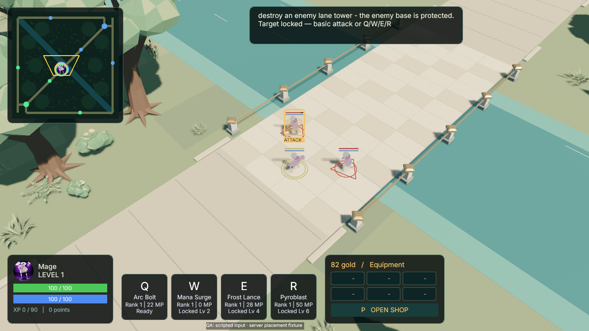
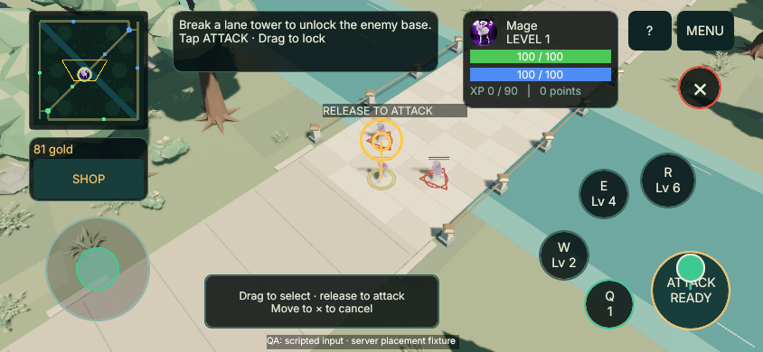
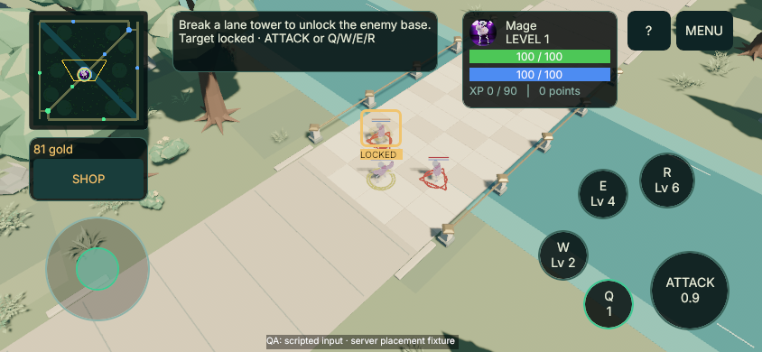
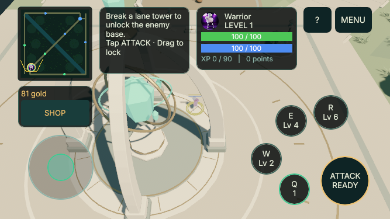

# 2026-09-11 — Mouse targeting and phone attack lock

Candidate: `0.18.0-rc.9`, based on `8663fd6`. Worktree branch:
`feature/targeting-2026-09-11`.

The old ATTACK button and hostile left click both invoked Q. Basic attacks are
now a separate action: no mana, no skill-point requirement, independent cooldown,
with class and equipment values validated by the authoritative server.
Q/W/E/R keep their existing effects and balance. Swift Grip still speeds Q and
now also speeds basic attacks; other skill haste keeps its previous behavior.

## Controls

| Platform | Input | Result |
| --- | --- | --- |
| Desktop | Left click hostile | Select that exact target, without moving/casting |
| Desktop | Right click hostile | Approach through normal navigation, then repeat basic attacks |
| Desktop | Right click ground/minimap | Cancel attack and move to the new destination |
| Desktop | S / Backspace | Stop movement/attacks and clear target selection |
| Phone | Tap ATTACK | One basic attack; use the existing lock or choose a nearby hostile |
| Phone | Stationary hold ATTACK | Repeat at the actual basic cooldown |
| Phone | Drag ATTACK | Grow reticle, preview a specific foe; release locks and attacks once |
| Phone | Drag to X / OS cancellation | Discard gesture and queued attack |
| Phone | Q/W/E/R around ATTACK | Independent skills; tap uses the lock, drag aims the skill |

The left movement finger remains independent. A skill aim/release takes priority
before a held basic attack. Phone attacks do not move the hero automatically.
The target preview distinguishes an attack-ready foe from a lock that requires
moving closer. Releasing commits the exact candidate previewed for that finger
press: if it dies, becomes invalid or leaves the reticle, the client rejects the
strike instead of silently switching to another unit. Invalid actors are removed
before desktop/mobile candidate ranking and rechecked before skill/attack send.
UI presses and Alt+RMB camera gestures remain isolated from world orders.
A persistent gold frame and LOCKED/ATTACK label identify the selected foe after
release; the temporary circular reticle and vector only describe the current aim.

## Multiplayer compatibility

Wire protocol **2** requires rebuilding client and server together; compatibility
checks reject older peers explicitly. A basic strike carries server epoch, match
ID and a monotonically increasing request ID. Replays and stale-round packets
cannot become attacks later. Snapshots expose basic cooldown timing and the
processed request high-water mark, including reconnect recovery. Client repeat
and chase are input conveniences; damage, cadence, legality and range remain
server-owned. Rejected same-round request IDs are also consumed, so a delayed
replay cannot become legal later. Client cooldown prediction waits for the
request acknowledgment before accepting a replacement timer, including rejected
strikes and changed equipment timing. Network fog of war is not introduced by
this change.

## Verification and capture provenance

Current logs and frozen acceptance criteria are under
`.agent/tasks/TARGETING-2026-09-11/`. The targeting capture scenario uses actual
Bevy mouse/TouchInput and production network commands. A separately gated local
development fixture places two passive enemies and disables ambient AI to make
server damage attribution unambiguous. It never fabricates strikes or damage.
An independent hello-only UDP observer records the authoritative HP, mana and
basic-action metadata. Skill cooldown separation is checked in server tests and
with the client cooldown readback; server snapshots do not contain a QWER timer
array. Mobile images are a desktop development preview, not a physical phone
playtest. Human feel, balance and physical device validation remain beta work.

All five final native scenarios passed (26 PNGs): desktop targeting at
1280×720, phone targeting at 844×390, phone entry/help/gameplay/shop at 667×375,
desktop UI at 960×540, and world/minimap navigation at 1280×720. Exported images
and exact source/binary/image hashes are in
[`2026-09-11-targeting/captures.json`](2026-09-11-targeting/captures.json).

The desktop observer recorded two basic requests and target HP 100→92→84;
the phone observer recorded one release request and HP 100→92 on the previewed
foe. The second foe was untouched. Each preview interval had 11 snapshots and
each canceled interval had 35 snapshots without further damage. Native
navigation recorded 241 authoritative samples, both destination arrivals and
clearance around obstacles. Out-of-range and moving-target attack chase are
covered by production-system ECS tests; the targeting image fixture starts
inside attack range.

The full workspace/all-target suite passed 399 Rust tests. After the final
visual/QA adjustments, the rebuilt client passed all 240 client tests,
workspace/all-target Clippy with warnings denied, rustfmt, and 22 Python tests.
Server/shared sources still match the full workspace pass. Independent code and
image reviewers checked current hashes and the final native artifacts.

One earlier native desktop capture failed its first LMB selection without input
gate telemetry. It did not recur in two instrumented runs, and its cause remains
unproven. The raw failure is preserved; no production focus or UI gate was
bypassed. A separate narrow-phone capture failure came from omitting the new
ATTACK node in the QA inventory; correcting that inventory resolved it.

## Delivery status

This change is prepared on the local targeting branch for fast-forward into the
cumulative `feature/mobile-beta-2026-09-11` branch. No external push, deployment
or downloadable phone package is part of this verification. Client and server
must be updated together for protocol 2.

## Control references

The interaction follows the requested LoL/Wild Rift conventions, adapted to
Omoba's existing class kits. Riot describes champion priority for attack-button
taps and tuning accidental drag sensitivity in [Wild Rift 2.5 control notes](https://wildrift.leagueoflegends.com/en-us/news/game-updates/wild-rift-patch-notes-2-5/),
and target-lock filtering in [Wild Rift 2.4 control notes](https://wildrift.leagueoflegends.com/en-us/news/game-updates/wild-rift-patch-notes-2-4/).
These are design references, not claims of identical gameplay or UI assets.
