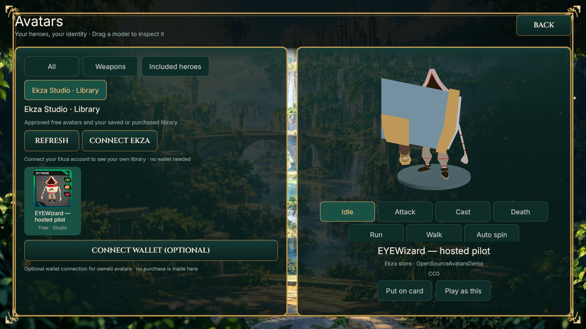
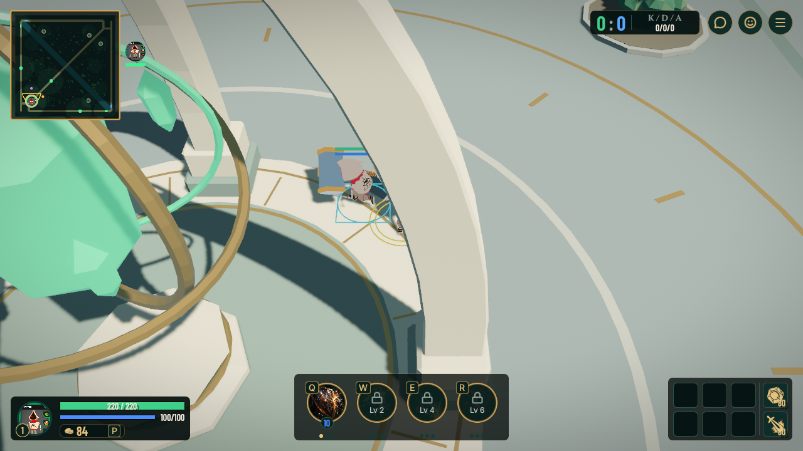

# Hosted asset lifecycle acceptance — 2026-10-02

**PASS for the desktop demo route.** Tested clean game source `518f982adf4bfd49b67091d048a720a16315064d` (0.33), including combat-UI main `b17b73c`. Registry application `970c9b6` is deployed; SDK main `927fc0d` (0.8.0) is pinned. This evidence commit only adds documentation.

The real hosted EYEWizard avatar and newly published Forge Hammer were independently downloaded and SHA-256/size verified by two native clients. The first client selected the weapon through the ordinary collection UI. Both clients rendered advancing animation, moved with real OS focus, and observed the other player's matching held weapon. The authoritative server admitted approved assets and rejected unknown avatar and weapon IDs. A fresh server/client relaunch reused identical verified model files.

- [Cold two-client evidence](cold.json), [client A](client-a.json), [client B](client-b.json).
- [Cached relaunch evidence](warm.json): exact same source/binaries; unchanged file hashes, inode and modification time. HTTP requests were not instrumented; this does not claim zero network requests or independently verify saved loadout preference persistence.
- Integrated production gate: **1,265 tests passed, 4 ignored** (826 client, 304 server, 105 shared, 30 passport). Formatting and diff checks passed. QA-only focus changes were compiled and exercised by the recorded native runs.
- Hosted publication/game review used the ordinary Studio UI; initial upload and repeated negative-path setup used the authenticated public API. Pending, rejection, resubmission, approval, revocation/HTTP404 and restoration were checked separately. No database edit granted approval.

## Visual evidence and limits

The hammer is oversized on this small avatar, and base geometry can occlude heroes at close zoom. Attachment error is zero, but these screenshots do not certify polished proportions. Adjusting the hammer requires a new reviewed asset revision. Desktop development binaries, English, 1280×720; phones, public server capacity, public signup email and IPFS publication remain separate work. The processor still runs on the operator Mac.

Local raw logs/cache/evidence are retained under `/Users/wotori/git/ekza/.agent/tasks/EKZA-ASSET-LIFECYCLE-20261001/`. Paths in JSON identify the original capture environment; the temporary source worktree may subsequently be removed. No credentials are included here.
