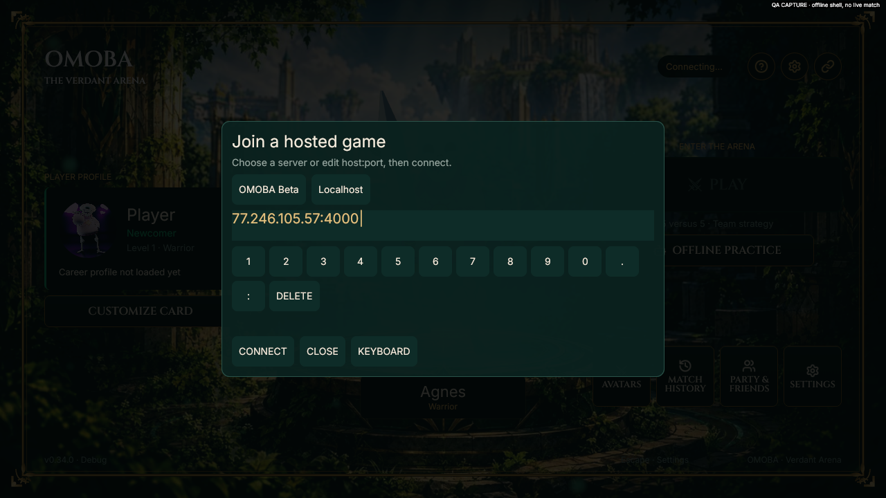

# VPS beta and server presets — 2026-10-02

Version0.34.0. Task proof: `.agent/tasks/OMOBA-VPS-BETA-20261002/`.

The user authorized a real OMOBA service on `ssh vds-eternal`, a default endpoint in the client and editable manual/preset selection. The deployment uses existing PostgreSQL16 with a separate `omoba` database, owner/runtime roles, scoped grants and private credentials. No existing database/secret or Studio/API service was replaced. The account API binary only executes its versioned schema migrations; no new HTTP account service is exposed.

Linux server is a release build using the pinned Rust1.94.1 toolchain and SDK927fc0d, built locally in Docker into shared cargo cacheA (`target/linux-docker`). macOS client uses the same source/protocol4. No renderer is built or shipped for the server. `omoba-lobby.service` bounds the whole process group to700MiB and150% CPU, with at most two worker rooms.

The shared address editor now opens from Home on desktop as well as mobile. It preserves custom addresses, offers Beta/Localhost prefills, validates before connecting and reuses existing persistence/reconnect. A closed editor does not take IME control from another field. Desktop party-lobby editing remains available.

Validation results and exact source/binary identities are recorded in the final task evidence and [permanent evidence](vps-beta-demo/build-identity.json). The first sandboxed client test run had15 socket PermissionDenied failures; rerunning with local network access passed828 tests (one ignored). New preset/manual/invalid-address tests passed. Public two-room and native checks are reported separately, with no physical-phone or production load SLA claim.

## Completed acceptance

- Final client gate: **829 passed, 1 ignored**. Escape consumes the frontmost modal's back event; valid presets only prefill, manual edits connect, invalid input keeps the editor open. IME ownership and persisted-lobby/worker-handoff regressions pass.
- Real remote public protocol: two signed clients entered distinct5v5 bot rooms on41000/41001 with the approved EYEWizard and Forge Hammer. Third client remained in capacity wait. Thirty-second observation at20Hz stationary signed inputs: snapshot-gap p95≈88/91ms; not a full combat/load SLA.
- Point observation during those rooms: workers≈13MiB RSS each, lobby≈10.5MiB RSS; host available RAM1064MiB. RSS includes shared pages; cgroup memory accounting differs. CPU ps averages since startup≈3.3/3.4% per worker, not peak measurements. Limit remains two rooms.
- Fresh native client with **no server environment override** connected to77.246.105.57:4000, was assigned41000, completed draft/countdown/loading and reached Running with a local hero. Native flow was automated through real UI buttons; no manual-play, movement quality or second-match/rejoin claim. The first-run guide was visible in the match screenshot.
- Native English1280×720 server editor capture passed; Beta/Localhost buttons and editable address fit. A separate restart with saved custom127.0.0.1:4999 proved saved-address priority. This custom preference was injected into an isolated QA config; normal UI Connect/persistence is covered by focused tests.

The Linux server remains supervised and enabled at boot on `vds-eternal`. Deployment binaries live in `/opt/omoba/releases/0.34.0-beta-20261002`; runtime details and rollback are in [ops/vps](../../ops/vps/README.md). No phone hardware tests or public account HTTP service were added.
